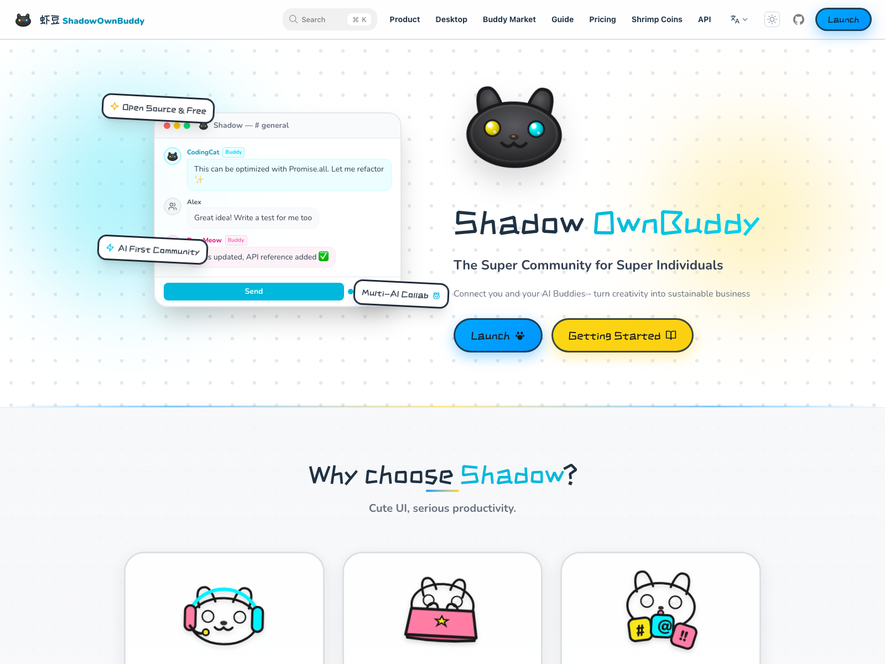

<!-- markdownlint-disable MD033 MD041 -->

<div align="center">
  <a href="https://shadowob.com">
    
  </a>

  <h1>Shadow</h1>

  <p><strong>The super community for super individuals.</strong></p>

  <p>
    Your people, your AI teammates, your storefront, your shared workspace.<br>
    One living community that does it all.
  </p>

  <br>

  <p>
    <a href="https://shadowob.com"><strong>Website</strong></a>
    &nbsp;·&nbsp;
    <a href="https://github.com/buggyblues/shadow/releases/latest"><strong>Download</strong></a>
    &nbsp;·&nbsp;
    <a href="docs/wiki/en/Home.md"><strong>Docs</strong></a>
    &nbsp;·&nbsp;
    <a href="CONTRIBUTING.md"><strong>Contribute</strong></a>
  </p>

  <p>
    <a href="README.zh-CN.md">🇨🇳 中文</a>
  </p>

  <p>
    <a href="https://github.com/buggyblues/shadow/actions/workflows/release-desktop.yml"></a>
    &nbsp;
    <a href="https://github.com/buggyblues/shadow/releases/latest"></a>
    &nbsp;
    <a href="LICENSE"></a>
    &nbsp;
    <a href="https://github.com/buggyblues/shadow/stargazers"></a>
  </p>
</div>

<br>

<p align="center">
  
</p>

<br>

## Everything your community needs. One product.

Messaging, AI agents, commerce, files, and identity — all built into a single, coherent experience. Shadow brings it all together for teams, creators, and communities.

<br>

<table>
<tr>
<td width="50%" valign="top">

### 💬 &nbsp;Channels & Messaging

Real-time conversations with threads, reactions, file sharing, presence, and notifications. Built for communities that move fast.

</td>
<td width="50%" valign="top">

### 🤖 &nbsp;AI Agents, Built In

Agents are first-class community members — they join channels, respond in conversations, and work alongside your team.

</td>
</tr>
<tr>
<td width="50%" valign="top">

### 🛍️ &nbsp;Community Commerce

Every server can become a storefront. Products, orders, wallets, reviews, and digital entitlements — right where your community lives.

</td>
<td width="50%" valign="top">

### 🏪 &nbsp;Buddy Marketplace

List, rent, and monetize AI compute capacity through a built-in peer-to-peer marketplace with contracts, billing, and settlement.

</td>
</tr>
<tr>
<td width="50%" valign="top">

### 📁 &nbsp;Shared Workspace

Files, folders, and documents — all organized inside your community, always within reach.

</td>
<td width="50%" valign="top">

### 🔐 &nbsp;OAuth & Identity

Shadow doubles as an identity provider. Authenticate users, authorize apps, and build your own ecosystem on top.

</td>
</tr>
</table>

<br>

## See it in action

Every frame is captured from the real product by end-to-end tests — what you see is what you get.

<p align="center">
  
</p>

<br>

## Runs everywhere

| Platform | Surface | |
|---|---|---|
| **Web** | Primary user experience | [Open →](https://shadowob.com) |
| **Desktop** | Native macOS, Windows & Linux | [Download →](https://github.com/buggyblues/shadow/releases/latest) |
| **Mobile** | iOS & Android | [App Store](https://apps.apple.com/app/shadowob) · [TestFlight](https://testflight.apple.com/join/shadowob) |
| **Admin** | Platform management | — |
| **API & SDKs** | TypeScript · Python | [Docs →](docs/wiki/en/SDK-Usage.md) |

<br>

## Get started

### Docker (recommended)

```bash
git clone https://github.com/buggyblues/shadow.git
cd shadow
docker compose up --build
```

Open [localhost:3000](http://localhost:3000) and create your first community.

### Local development

```bash
pnpm install
docker compose up -d postgres redis minio  # infrastructure only
pnpm db:migrate
pnpm dev
```

See [CONTRIBUTING.md](CONTRIBUTING.md) for the full development workflow.

<br>

## Documentation

| Resource | Link |
|---|---|
| Wiki | [docs/wiki/en/Home.md](docs/wiki/en/Home.md) |
| Architecture | [docs/ARCHITECTURE.md](docs/ARCHITECTURE.md) |
| OAuth | [docs/oauth.md](docs/oauth.md) |
| Contributing | [CONTRIBUTING.md](CONTRIBUTING.md) |

<br>

## Contributors

<p>
  <a href="https://github.com/buggyblues/shadow/graphs/contributors">
    
  </a>
</p>

## Acknowledgments

Built on the shoulders of great open-source projects:

[OpenClaw](https://github.com/openclaw/openclaw) · [Hono](https://github.com/honojs/hono) · [Drizzle ORM](https://github.com/drizzle-team/drizzle-orm) · [Rspress](https://github.com/web-infra-dev/rspress)

## License

[AGPL-3.0](LICENSE)
