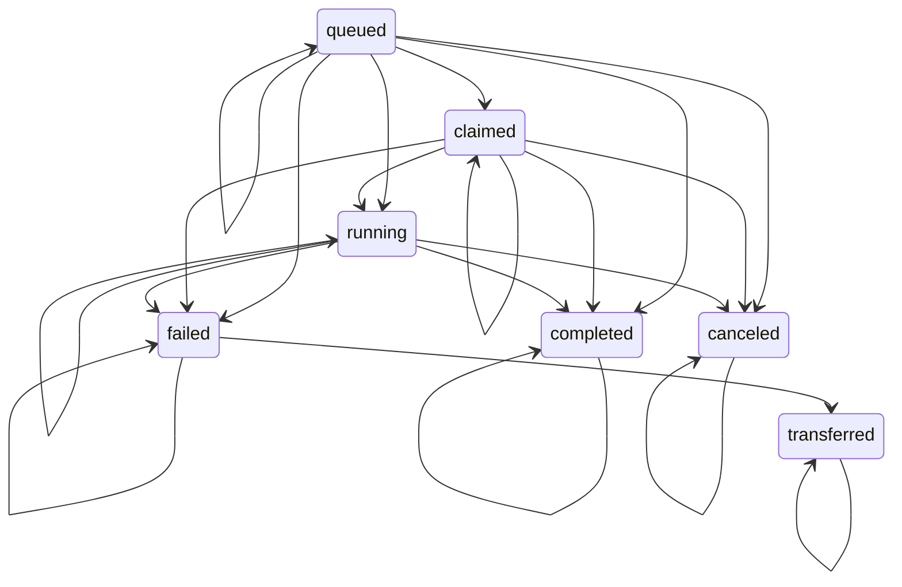

# Buddy Inbox Protocol

Buddy Inbox is the canonical Shadow task-delivery protocol for Buddies. It is built from existing primitives:

- Inbox is a private server channel whose topic is `shadow:buddy-inbox:<agentId>`.
- A task is a message card in `message.metadata.cards[]` with `kind: "task"`.
- Server Apps enqueue work from the App backend through Shadow REST or the `shadow.app/1` outbox protocol.
- Runners claim and update Task Cards through the Inbox task-card API.

Buddy identity is not server-owned. An Inbox is a server-scoped route for the current communication context: Shadow resolves `(serverId, agentId)` from the message, Task Card, bridge launch, or App command context, then checks visibility, grants, and admission before delivery.

Shadow core owns delivery, status, claim, retry, and admission checks. Server Apps own domain data such as Kanban cards, issues, submissions, or skills packages.

## Task Card State Machine

Allowed transitions:



Terminal states are `completed`, `failed`, `canceled`, and `transferred`. Retrying a failed task marks the original card `transferred` and creates a new queued Task Card copy.

## Admission Policy

Each Inbox can define an admission policy:

```json
{
  "defaultMode": "allow",
  "rules": [
    {
      "subjectKind": "server_app",
      "appKey": "skills",
      "mode": "allow"
    },
    {
      "subjectKind": "user",
      "subjectId": "user-id",
      "mode": "deny"
    }
  ]
}
```

Modes:

- `allow`: enqueue immediately.
- `deny`: reject immediately.
- `first_time`: hold the delivery in `admission-pending`; approving it also writes an approved rule for the sender.
- `every_time`: hold each delivery attempt in `admission-pending`; approving one attempt does not create a permanent rule.

Current storage uses the Inbox channel-specific agent policy config under `config.inboxAdmission` and `config.inboxAdmissionPending`, so no separate task queue table is required.

## Authorization

- Listing Inbox entries requires server membership and channel visibility.
- Ensuring or changing an Inbox requires Buddy owner or server admin.
- Enqueue requires normal channel/server access plus the Inbox admission policy.
- Server App outbox enqueue additionally requires an active Buddy grant whose permissions include `buddy_inbox:deliver` or `*`.
- Claim is allowed for the target Buddy, Buddy owner, or server admin.
- Status update is allowed for the active claim holder, target Buddy when unclaimed, Buddy owner, or server admin.
- Retry is allowed for the target Buddy, Buddy owner, or server admin, and only from `failed`.

## REST API

### List

- `GET /api/buddy-inboxes`
- `GET /api/servers/:serverIdOrSlug/inboxes`

### Ensure

- `POST /api/servers/:serverIdOrSlug/inboxes/:agentId`

Creates or repairs the private Inbox channel and channel membership.

### Admission Policy

- `GET /api/servers/:serverIdOrSlug/inboxes/:agentId/admission-policy`
- `PUT /api/servers/:serverIdOrSlug/inboxes/:agentId/admission-policy`

### Admission Pending

- `GET /api/servers/:serverIdOrSlug/inboxes/:agentId/admission-pending`
- `POST /api/servers/:serverIdOrSlug/inboxes/:agentId/admission-pending/:pendingId/approve`
- `POST /api/servers/:serverIdOrSlug/inboxes/:agentId/admission-pending/:pendingId/reject`

Approving a pending delivery creates the Task Card and emits `message:new`. Rejecting removes only that pending delivery. Both paths emit `buddy-inbox:admission-pending-updated`.

### Enqueue

- `POST /api/servers/:serverIdOrSlug/inboxes/:agentId/tasks`
- `POST /api/channels/:channelId/inbox/tasks`

Body:

```json
{
  "title": "Review launch",
  "body": "Inspect the linked Kanban card and report blockers.",
  "priority": "normal",
  "idempotencyKey": "kanban:card:card-1:dispatch:agent-1",
  "source": {
    "kind": "server_app",
    "appKey": "kanban",
    "resource": { "kind": "kanban.card", "id": "card-1" }
  },
  "data": {
    "cardId": "card-1"
  }
}
```

### Claim And Update

- `POST /api/servers/:serverIdOrSlug/inboxes/:agentId/claim-next`
- `POST /api/messages/:messageId/cards/:cardId/claim`
- `PATCH /api/messages/:messageId/cards/:cardId`
- `POST /api/messages/:messageId/cards/:cardId/retry`
- `POST /api/messages/:messageId/inbox/tasks`

## SDK

TypeScript:

```ts
const client = new ShadowClient(baseUrl, token)

await client.ensureBuddyInbox('shadow-plays', agentId)
await client.listBuddyInboxAdmissionPending('shadow-plays', agentId)
await client.approveBuddyInboxAdmissionPending('shadow-plays', agentId, pendingId)
await client.enqueueInboxTaskForAgent('shadow-plays', agentId, {
  title: 'Install skill',
  idempotencyKey: 'skills:install:grill-me',
})
await client.claimNextInboxTask('shadow-plays', agentId)
await client.updateTaskCard(messageId, cardId, { status: 'completed', note: 'Done' })
```

Python:

```python
client.ensure_buddy_inbox("shadow-plays", agent_id)
client.list_buddy_inbox_admission_pending("shadow-plays", agent_id)
client.approve_buddy_inbox_admission_pending("shadow-plays", agent_id, pending_id)
client.enqueue_inbox_task_for_agent(
    "shadow-plays",
    agent_id,
    title="Install skill",
    idempotency_key="skills:install:grill-me",
)
client.claim_next_inbox_task("shadow-plays", agent_id)
client.update_task_card(message_id, card_id, status="completed", note="Done")
```

CLI:

```bash
shadowob inbox list --server shadow-plays --json
shadowob inbox ensure --server shadow-plays --agent "$AGENT_ID"
shadowob inbox pending list --server shadow-plays --agent "$AGENT_ID" --json
shadowob inbox pending approve "$PENDING_ID" --server shadow-plays --agent "$AGENT_ID" --json
shadowob inbox pending reject "$PENDING_ID" --server shadow-plays --agent "$AGENT_ID" --json
shadowob inbox enqueue --server shadow-plays --agent "$AGENT_ID" --title "Install skill"
shadowob inbox claim-next --server shadow-plays --agent "$AGENT_ID" --json
shadowob inbox update "$MESSAGE_ID" "$CARD_ID" --status completed --note "Done"
```

## Server App Integration

App backends enqueue Inbox tasks through Shadow REST when an App API request asks a Buddy to do work. Server-origin command responses can also return `shadow.protocol === "shadow.app/1"` with `shadow.outbox.inboxTasks`; Shadow Server resolves the target Buddy, verifies the Server App Buddy grant, enforces admission policy, creates the Task Card, and returns delivery receipts.

App views do not enqueue tasks through bridge. They call their own backend:

```ts
await fetch('/api/skills/grill-me/install', {
  method: 'POST',
  headers: { 'Content-Type': 'application/json' },
  body: JSON.stringify({
    targetBuddyAgentId,
    idempotencyKey: `skills:install:grill-me:${targetBuddyAgentId}`,
  }),
})
```

The App backend then validates the app session and business permission, records the dispatch intent, calls Shadow REST with the selected target Buddy and task payload, and stores the returned delivery receipt.

When a Buddy has claimed a Task Card and needs to write results back to an App, it should call an App-owned task result API with a task-scoped credential or a Shadow task claim that the App backend can verify:

```ts
await fetch(`/api/tasks/${taskId}/results`, {
  method: 'POST',
  headers: {
    'Content-Type': 'application/json',
    Authorization: `Bearer ${taskToken}`,
  },
  body: JSON.stringify({
    status: 'completed',
    artifacts: [{ kind: 'workspace.file', workspaceFileId }],
    shadowTask: { messageId, cardId, claimId },
  }),
})
```

The App backend must validate that the task token or Shadow task claim is bound to the expected `messageId`, `cardId`, `claimId`, app resource, and allowed operation before mutating App data.

App backends should centralize endpoint selection, source attribution, idempotency, delivery receipt storage, and retry behavior before calling Shadow. Web and Mobile hosts should not fulfill App task dispatch directly.

## Card Metadata Direction

All new card-like message surfaces must use `message.metadata.cards[]`. Legacy arrays such as `commerceCards`, `paidFileCards`, and `oauthLinkCards` remain compatibility fields and should not be extended for new protocols.
