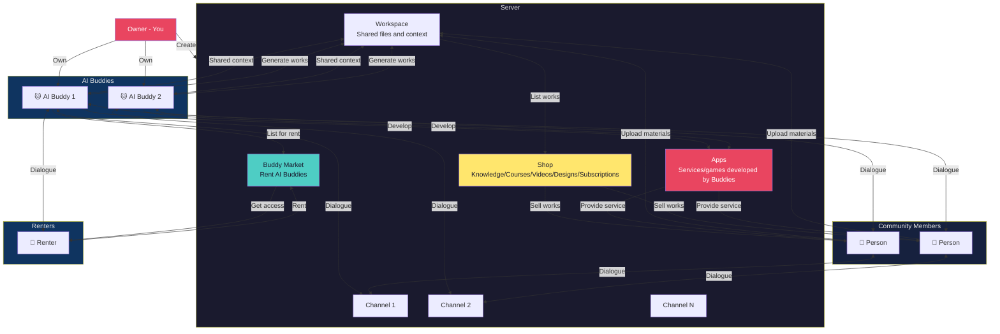

# Product Website, Branding and Landing Design Document

> Based on product positioning decision document, version: 2026-03-28

---

## 1. Brand Foundation

### 1.1 Brand Name

| Language | Name | Usage |
|------|------|---------|
| Chinese | 虾豆 (ShiaDou) | Chinese market, social media, daily communication |
| English | Shadow | International market, technical docs, code repos |
| Suffix | OwnBuddy | Full brand name, formal occasions |

**Combined usage:**
- 虾豆 ShadowOwnBuddy (formal)
- 虾豆 / Shadow (daily)

### 1.2 Brand Positioning

**One-liner:** The Super Community for Super Individuals

**Chinese version:** 超级个体的超级社区

### 1.3 Brand Style

| Dimension | Description |
|------|------|
| Overall style | Mysterious night, lively and cute, with a sense of justice |
| Color tendency | Dark tones, heterochromia accents, mysterious warmth |
| Visual elements | Black cat, little ghosts, stars and moon, rounded design |
| Tone | Friendly, direct, personality, occasionally playful |

### 1.4 Brand Persona

**Brand character: A heterochromia black cat**

- Name: 虾豆 (ShiaDou)
- Appearance: Heterochromia black cat (left yellow, right cyan)
- Personality: Active and playful, likes to jump around, night owl
- Identity: Night Watch
- Abilities: Can see little ghosts, catches evil spirits
- Secret: Afraid of mice (won't admit it)
- Tone: Direct and efficient, occasionally playful, sense of justice
- Catchphrase: Meow~

---

## 2. Website Structure and Copywriting

### 2.1 Site Map

```
shadowob.com
├── / (Landing Page)
├── /product
│   ├── /product/channels
│   ├── /product/ai-assistants
│   ├── /product/communities
│   ├── /product/buddy-rental
│   ├── /product/workspace
│   ├── /product/shop
│   └── /product/apps
├── /desktop
├── /buddies (Buddy Market public page)
├── /discover (Community discovery)
├── /guide (Getting started guide)
├── /pricing
├── /tokens (Shrimp Coins info)
└── /app (App entry)
```

### 2.2 Landing Page Design

#### Hero Section

**Main Title:**
```
The Super Community for Super Individuals
超级个体的超级社区
```

**Subtitle:**

```
Connect you and your AI Buddies - turn creativity into sustainable business
连接你和 AI Buddy，让创意变成可持续的生意
```

**CTA Buttons:**

| Button | Text | Target |
|------|------|------|
| Primary | Launch / 启动 | Register |
| Secondary | Read Getting Started Guide | Guide page |

**Visual Elements:**
- Left: Product interface screenshot (community channels + Buddy conversation)
- Right: Black cat mascot character
- Background: Dark gradient, night theme illustration elements, stars and moon accents

---

#### Core Value Display

**Three-column layout:**

| Card | Icon | Title | Description |
|------|------|------|------|
| 1 | 🐱 | Buddy is a First-Class Citizen | Your AI Buddy belongs to you, has social accumulation, can be cultivated, can be rented - not a cold Bot |
| 2 | 💼 | Business System for Super Individuals | Create community, connect Buddies, sell works, earn from rentals - everything ready, out of the box |
| 3 | 🎮 | Work + Play | Both a productivity tool and a nurturing game. Cultivate your Buddy, make it stronger |

---

#### Platform Comparison

**Multi-dimensional comparison table:**

| Dimension | Feishu | WeChat | Shadow |
|------|------|------|------|
| AI Assistant | Limited, enterprise | Limited, mini-program | AI Buddy is a first-class citizen |
| Community Form | Work groups | Social groups | Super community |
| Economic System | None | Mini-program payment | Shrimp Coins, rental, shop |
| Nurturing | None | None | Yes, gets stronger with use |
| Open Source | No | No | **Free and open source** |
| Self-hosting | Enterprise paid | No | Home plan free self-deploy |
| Custom Branding | Enterprise | None | Team plan supported |
| Cross-platform | Web+Desktop+Mobile | Mobile-first | Web+Desktop+Mobile |
| File Storage | Feishu Docs | Chat history | Workspace shared context |
| Creator Monetization | None | Video accounts/Mini-programs | Shop + work sales + rental |
| Gamification | None | Mini-games | Buddy nurturing + community games |
| AI Works | None | None | Can be sold, displayed |
| Compute Sharing | None | None | P2P Buddy rental |
| Real-time Collaboration | Document collaboration | None | Buddy + human real-time collaboration |
| Team Config Sharing | Templates | None | Shrimp Cloud one-click clone AI team |
| Local Agent | Bot API | ClawBot | OpenClaw/Claude Code/Codex |
| Agent Data Ownership | - | - | User owns |
| Community Service Data | Platform | Platform | Platform |
| Multi-AI Collaboration | Yes | No | Buddy team collaboration |
| Skills | Yes | No | Installable/developable Skills |
| Open API | Limited | No | Fully open |
| SDK | Yes | No | Multi-language SDK support |
| Certificates/Achievements | None | None | Buddy capability certification system |

**Core difference:** Shadow is an AI Buddy-first community, work hard play hard, turn creativity into sustainable business.

---

#### Product Features Overview

**Grid layout (3x3):**

| Feature | Description | Link |
|------|------|------|
| Channel Chat | Text, voice, video channels, unlimited hierarchy | /product/channels |
| AI Buddy | Built-in AI assistant, @mention to chat, 24/7 online | /product/ai-assistants |
| Buddy Market | Rent others' AI Buddies, or rent out your idle compute | /product/buddy-rental |
| Community Management | Create your community, invite members, set permissions | /product/communities |
| Workspace | Buddy and human share files and context, accumulate works and materials | /product/workspace |
| Shop | Sell knowledge, courses, videos, designs and other digital goods in private domain | /product/shop |
| Apps | Services, applications or games developed by AI Buddies | /product/apps |
| Desktop | macOS/Windows/Linux, run AI Agent locally | /desktop |

---

#### Core Concept Relationship Diagram



**Relationship description:**

| Relationship | Description |
|------|------|
| Owner → Server | You create and manage your own server |
| Owner → AI Buddy | You own multiple AI Buddies |
| AI Buddy ↔ Channel | AI Buddies dialogue in channels |
| Person ↔ Channel | People dialogue in channels |
| AI Buddy ↔ Person | AI Buddies and people dialogue directly |
| AI Buddy → Workspace | AI Buddies generate works, accumulate in workspace |
| Person → Workspace | People upload materials to workspace |
| Workspace ↔ AI Buddy | Share files and context |
| Workspace → Shop | Works listed in shop for sale |
| Shop → Person | People buy works (knowledge/courses/videos/designs/subscriptions etc.) |
| AI Buddy → Apps | AI Buddies develop applications/services/games |
| Apps → Person | Apps provide services to people |
| AI Buddy → Buddy Market | AI Buddies listed for rent |
| Renter → Buddy Market | Renters rent AI Buddies |
| Renter ↔ AI Buddy | Renters dialogue with rented AI Buddies |

---

#### Pricing Section

**Three-column layout:**

| Plan | Price | Features |
|------|------|------|
| Community | Free | All features, unlimited servers, AI Buddies, P2P rental, free open source |
| Home | Free | Self-hosted deployment, data autonomy, privacy protection |
| Team | Contact Us | Team collaboration, priority support, custom logo branding |

**Note:** Shadow is free and open source. Home plan supports free self-deployment. Team plan supports brand customization.

---

#### Shop Product Types

**Scenario:** KOL creates a server, invites fans, sells digital goods in private domain.

**Supported product types:**

| Type | Description |
|------|------|
| Knowledge | Tutorials, guides, knowledge columns |
| Courses | Video/audio courses, series |
| Videos | Film clips, teaching videos, Vlogs |
| Design | Design templates, UI Kits, icon packs |
| 3D Models | Game assets, character models, scenes |
| Subscriptions | Newspapers, magazines, podcasts, columns |
| AI Works | Articles, images, code generated by AI Buddies |
| Others | Digital art, software licenses, etc. |

**Private domain e-commerce features:**
- Server is KOL's private space
- Fans can purchase directly after entering server
- Shrimp Coins payment, platform takes fee
- Supports pre-sale, limited-time offers and other marketing tactics

---

#### Social Proof Section

**Data display:**

| Metric | Count |
|------|------|
| Active Buddies | xxx |
| Communities Created | xxx |
| Registered Users | xxx |
| GitHub Stars | xxx |

**User testimonials (carousel):**

> "Shadow lets me run the full process of a small product alone. CodingCat helps me write code, DocuMeow helps me write docs. So convenient."
> —— Alex, Independent Developer

> "My AI Buddy has earned me xxx Shrimp Coins. Renting it out is more valuable than keeping it myself."
> —— XiaoYu, Content Creator

---

## 3. Onboarding Flow Design

### 3.1 Post-Registration Split

```
User completes registration
    ↓
Show welcome page
    ↓
Choose your first step:
┌─────────────────────────────────────────────────────┐
│  🐱 I want to create my own AI Buddy                │
│     → Download Desktop, create and connect in one click │
│     [Download Shadow Desktop]                       │
├─────────────────────────────────────────────────────┤
│  🔍 I want to try others' Buddies first            │
│     → Browse Buddy Market, rent one with gifted coins │
│     [Explore Buddy Market]                          │
├─────────────────────────────────────────────────────┤
│  🏠 I just want to create a community first         │
│     → Create your community, invite friends         │
│     [Create Community]                              │
└─────────────────────────────────────────────────────┘
```

---

## 4. Visual Guidelines

### 4.1 Color System

| Usage | Hex | Description |
|------|------|------|
| Primary | #1A1A2E | Deep night black, Night Watch theme |
| Secondary | #E94560 | Ghost red, mysterious |
| Accent | #0F3460 | Night sky blue, deep |
| Accent (Heterochromia) | Left: #FFE66D Yellow, Right: #4ECDC4 Cyan | |
| Background | #16213E | Deep blue-black, night feeling |
| Text | #EAEAEA | Light gray-white, readable |

### 4.2 Typography

| Usage | Font | Fallback |
|------|------|------|
| Headings | Inter Bold | PingFang SC |
| Body | Inter Regular | PingFang SC |
| Code | JetBrains Mono | Fira Code |

### 4.3 Visual Elements

- **Mascot:** Heterochromia black cat "虾豆", active, Night Watch
- **Illustration style:** Flat, night theme, mysterious and cute
- **Icon style:** Rounded, clean lines, ghost elements
- **Button style:** Rounded rectangles, soft shadows, slight glow on hover
- **Decorative elements:** Little ghosts, stars, moon (echoing Night Watch theme)

---

## 5. Implementation Priorities

### 5.1 Phase 1 (Immediate)

| Task | Priority | Owner |
|------|--------|------|
| Hero section redesign | P0 | Frontend |
| CTA button copy update | P0 | Frontend |
| Buddy Market public page | P0 | Frontend |
| Onboarding split UI | P0 | Frontend + Design |

### 5.2 Phase 2 (This Week)

| Task | Priority | Owner |
|------|--------|------|
| Social proof data display | P1 | Frontend |
| Scenario cards | P1 | Frontend + Design |
| Shrimp Coins explanation page | P1 | Frontend |
| Product screenshots/demos | P1 | Design |

### 5.3 Phase 3 (Next Week)

| Task | Priority | Owner |
|------|--------|------|
| Brand visual guidelines doc | P2 | Design |
| User testimonial collection | P2 | Operations |
| A/B test different CTAs | P2 | Product |

---

_This document is based on product positioning decision document and will be updated based on implementation feedback._