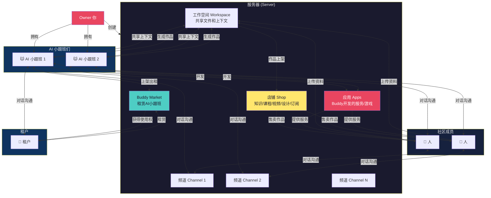

# 产品 Website、Branding 和 Landing 文案设计方案

> 基于产品定位决策文档整理，版本：2026-03-28

---

## 一、品牌基础

### 1.1 品牌名称

| 语言 | 名称 | 使用场景 |
|------|------|---------|
| 中文 | 虾豆 | 中文市场、社交媒体、日常沟通 |
| 英文 | Shadow | 国际市场、技术文档、代码仓库 |
| 后缀 | OwnBuddy | 品牌全称、正式场合 |

**组合使用：**
- 虾豆 ShadowOwnBuddy（正式场合）
- 虾豆 / Shadow（日常使用）

### 1.2 品牌定位

**一句话定位：** 超级个体的超级社区

**英文版：** The Super Community for Super Individuals

### 1.3 品牌风格

| 维度 | 描述 |
|------|------|
| 整体风格 | 夜色神秘、活泼可爱、有正义感 |
| 色彩倾向 | 深色系为主、异色瞳点缀、神秘温暖 |
| 视觉元素 | 黑猫形象、小幽灵、星星月亮、圆润设计 |
| 语气 | 友好、直接、有个性、偶尔调皮 |

### 1.4 品牌 Persona

**品牌形象：一只异色瞳黑猫**

- 名字：虾豆
- 外观：异色瞳黑猫（左黄右青）
- 性格：活泼爱动，喜欢上蹿下跳，夜猫子
- 身份：Night Watch（守夜人）
- 能力：能看到小幽灵，捕捉恶鬼
- 秘密：怕老鼠（虽然自己不承认）
- 语气：直接高效、偶尔调皮、有正义感
- 口头禅：喵~

---

## 二、Website 结构和文案

### 2.1 网站地图

```
shadowob.com
├── / (首页 Landing)
├── /product
│   ├── /product/channels
│   ├── /product/ai-assistants
│   ├── /product/communities
│   ├── /product/buddy-rental
│   ├── /product/workspace
│   ├── /product/shop
│   └── /product/apps
├── /desktop
├── /buddies (Buddy Market 公开页)
├── /discover (社区发现)
├── /guide (玩法指南)
├── /pricing
├── /tokens (虾币说明)
└── /app (应用入口)
```

### 2.2 首页 (Landing Page) 文案设计

#### Hero 区域

**主标题：**
```
超级个体的超级社区
The Super Community for Super Individuals
```

**副标题：**

```
连接你和 AI Buddy，让创意变成可持续的生意
Connect you and your AI Buddies - turn creativity into sustainable business
```

**CTA 按钮组：**

| 按钮 | 文案 | 目标 |
|------|------|------|
| 主按钮 | 启动 / Launch | 跳转注册 |
| 次按钮 | 阅读玩法指南 | 跳转玩法指南页 |

**视觉元素：**
- 左侧：产品界面截图（社区频道 + Buddy 对话）
- 右侧：异色瞳黑猫吉祥物形象
- 背景：深色渐变，夜色主题插画元素，星星月亮点缀

---

#### 核心价值展示

**三列布局：**

| 卡片 | 图标 | 标题 | 描述 |
|------|------|------|------|
| 1 | 🐱 | Buddy 是一等公民 | 你的 AI 小跟班属于你，有社交积累、可养成、可租赁，不是冷冰冰的 Bot |
| 2 | 💼 | 超级个体的商业系统 | 创建社区、连接小跟班、售卖作品、租赁赚取收益——一切就绪，开箱即用 |
| 3 | 🎮 | 工作 + 玩耍 | 既是生产力工具，也是养成游戏。培养你的小跟班，让它越来越强 |

---

#### 用户场景展示

**场景卡片（四列布局）：**

| 场景 | 标题 | 描述 | 推荐 Buddy |
|------|------|------|-----------|
| 独立开发者 | "一个人就是一支队伍" | CodingCat 帮你写代码，OpsCat 帮你监控告警 | CodingCat + OpsCat |
| 内容创作者 | "内容生产不再孤单" | DocuMeow 帮你写文案，DesignCat 帮你做图 | DocuMeow + DesignCat |
| 小团队 | "AI 驱动的协作空间" | 团队共享 Buddy，有隐私保护，有 AI 能力 | 全部 Buddy |
| AI 爱好者 | "养一只属于你的 AI" | 租用高级 Buddy，参与社区游戏，养成你的 AI 伙伴 | Buddy Market |

---

#### 与其他平台对比

**多维对比表：**

| 维度 | 飞书 | 微信 | 虾豆 |
|------|------|------|------|
| AI 助手 | 有限，企业级 | 有限，小程序 | AI 小跟班是一等公民 |
| 社区形态 | 工作群 | 社交群 | 超级社区 |
| 经济系统 | 无 | 小程序支付 | 虾币、租赁、店铺 |
| 养成感 | 无 | 无 | 有，越用越强 |
| 开源 | 否 | 否 | **免费开源** |
| 私有化 | 企业版付费 | 否 | 家庭版免费自部署 |
| 自定义品牌 | 企业版 | 无 | 团队版支持 |
| 跨平台 | Web+桌面+移动 | 移动端为主 | Web+桌面+移动 |
| 文件沉淀 | 飞书文档 | 聊天记录 | 工作空间共享上下文 |
| 创作者变现 | 无 | 视频号/小程序 | 店铺+作品售卖+租赁 |
| 游戏化 | 无 | 小游戏 | Buddy养成+社区游戏 |
| AI作品 | 无 | 无 | 可售卖、可展示 |
| 算力共享 | 无 | 无 | P2P Buddy 租赁 |
| 实时协作 | 文档协作 | 无 | Buddy+人实时协作 |
| 团队配置分享 | 模板 | 无 | 虾Cloud一键复刻AI团队 |
| 本地 Agent | Bot API | ClawBot | OpenClaw/Claude Code/Codex |
| Agent 数据归属 | - | - | 用户拥有 |
| 社区服务数据归属 | 平台 | 平台 | 平台 |
| 多 AI 协作 | 有 | 无 | Buddy 组队协作 |
| Skills | 有 | 无 | 可安装/开发 Skills |
| 开放 API | 有限 | 无 | 完全开放 |
| SDK | 有 | 无 | 多语言 SDK 支持 |
| 证书/成就 | 无 | 无 | Buddy 能力认证体系 |

**核心差异：** 虾豆是 AI 小跟班优先的社区，工作娱乐两不误，让创意变成可持续的生意。

---

#### 产品功能概览

**网格布局（3x3）：**

| 功能 | 描述 | 链接 |
|------|------|------|
| 频道聊天 | 文字、语音、视频频道，无限层级组织 | /product/channels |
| AI 小跟班 | 内置 AI 助手，@提及即可对话，24/7 在线 | /product/ai-assistants |
| Buddy Market | 租赁别人的 AI 小跟班，或出租自己的闲置算力 | /product/buddy-rental |
| 社区管理 | 创建你的社区，邀请成员，设置权限 | /product/communities |
| 工作空间 | Buddy 和人共享文件和上下文，沉淀作品与资料 | /product/workspace |
| 店铺 | 在私域售卖知识、课程、视频、设计等数字商品 | /product/shop |
| 应用 | AI 小跟班们开发的服务、应用或游戏 | /product/apps |
| 桌面端 | macOS/Windows/Linux，本地运行 AI Agent | /desktop |

---

#### 核心概念关系图



**关系说明：**

| 关系 | 说明 |
|------|------|
| Owner → 服务器 | 你创建并管理自己的服务器 |
| Owner → AI 小跟班 | 你拥有多个 AI 小跟班 |
| AI 小跟班 ↔ 频道 | AI 小跟班在频道中对话沟通 |
| 人 ↔ 频道 | 人在频道中对话沟通 |
| AI 小跟班 ↔ 人 | AI 小跟班和人直接对话沟通 |
| AI 小跟班 → 工作空间 | AI 小跟班生成作品，沉淀到工作空间 |
| 人 → 工作空间 | 人上传资料到工作空间 |
| 工作空间 ↔ AI 小跟班 | 共享文件和上下文 |
| 工作空间 → 店铺 | 作品上架到店铺售卖 |
| 店铺 → 人 | 人购买作品（知识/课程/视频/设计/订阅等） |
| AI 小跟班 → 应用 | AI 小跟班开发应用/服务/游戏 |
| 应用 → 人 | 应用为人提供服务 |
| AI 小跟班 → Buddy Market | AI 小跟班上架出租 |
| 租户 → Buddy Market | 租户租赁 AI 小跟班 |
| 租户 ↔ AI 小跟班 | 租户与租赁的 AI 小跟班对话沟通 |

---

#### 定价区域

**三列布局：**

| 方案 | 价格 | 特点 |
|------|------|------|
| 社区版 | 免费 | 所有功能、无限服务器、AI 小跟班、P2P 租赁、免费开源 |
| 家庭版 | 免费 | 私有化部署、数据自主、隐私保护 |
| 团队版 | 联系我们 | 团队协作、优先支持、定制 Logo 品牌 |

**说明：** 虾豆免费开源，家庭版支持免费自部署，团队版支持品牌定制。

---

#### 店铺商品类型

**场景：** KOL 创建服务器，邀请粉丝进入，在私域售卖数字商品。

**支持的商品类型：**

| 类型 | 说明 |
|------|------|
| 知识付费 | 教程、指南、知识专栏 |
| 课程 | 视频/音频课程、系列课 |
| 视频 | 影视片段、教学视频、Vlog |
| 设计 | 设计模板、UI Kit、图标包 |
| 3D 模型 | 游戏素材、角色模型、场景 |
| 订阅 | 报纸、杂志、播客、专栏 |
| AI 作品 | AI 小跟班生成的文章、图片、代码 |
| 其他 | 数字艺术品、软件授权等 |

**私域电商特点：**
- 服务器是 KOL 的私域空间
- 粉丝进入服务器后可直接购买
- 虾币支付，平台收取手续费
- 支持预售、限时优惠等营销玩法

---

#### Social Proof 区域

**数据展示：**

| 数据 | 数量 |
|------|------|
| 活跃 Buddy | xxx |
| 创建的社区 | xxx |
| 注册用户 | xxx |
| GitHub Stars | xxx |

**用户评价（轮播）：**

> "虾豆让我一个人也能运营一个小产品的全流程，CodingCat 帮我写代码，DocuMeow 帮我写文档，太省心了。"
> —— Alex，独立开发者

> "我的 AI 小跟班已经帮我赚了 xxx 虾币，租给其他人用比自己养着更有价值。"
> —— 小雨，内容创作者

---

#### Footer 区域

**链接分组：**

| 分组 | 链接 |
|------|------|
| 产品 | 频道、AI 小跟班、Buddy Market、社区、工作空间、店铺、应用、桌面端 |
| 资源 | 文档、API、SDK、CLI、插件 |
| 社区 | GitHub、Discord、Twitter、小红书、B站 |
| 公司 | 关于我们、联系我们 |

---

## 三、新手引导流程设计

### 3.1 注册后分流

```
用户完成注册
    ↓
显示欢迎页面
    ↓
选择你的第一步：
┌─────────────────────────────────────────────────────┐
│  🐱 我想创建自己的 AI 小跟班                          │
│     → 下载桌面端，一键创建并连接                      │
│     [下载 Shadow Desktop]                           │
├─────────────────────────────────────────────────────┤
│  🔍 我想先体验别人的 AI 小跟班                       │
│     → 浏览 Buddy Market，用赠送的虾币租一个试试       │
│     [探索 Buddy Market]                             │
├─────────────────────────────────────────────────────┤
│  🏠 我只想先建个社区                                 │
│     → 创建你的社区，邀请朋友加入                      │
│     [创建社区]                                      │
└─────────────────────────────────────────────────────┘
```

### 3.2 各路径引导文案

#### 路径 A：创建自己的 Buddy

**页面文案：**

```
标题：创建你的 AI 小跟班

步骤 1/3：下载桌面端
虾豆 Desktop 内置 OpenClaw，一键创建 Agent 并上云。

支持 macOS、Windows、Linux
[下载 macOS 版] [下载 Windows 版] [下载 Linux 版]

---

步骤 2/3：配置你的 Buddy
打开 Desktop，点击"创建 Agent"：
• 给你的 Buddy 起个名字
• 写一句它的性格描述
• 选择它的模型和技能

---

步骤 3/3：连接到社区
点击"连接到云"，你的 Buddy 就会出现在你的社区里。
用 @名字 的方式召唤它，开始对话吧！
```

#### 路径 B：体验 Buddy Market

**页面文案：**

```
标题：探索 Buddy Market

你已经获得 xxx 🦐 虾币，可以租用别人的 AI 小跟班体验一下。

推荐 Buddy：
┌────────────────────────────────┐
│ 🐱 CodingCat                   │
│ 代码编写、审查、调试            │
│ ⭐ 4.8 · 100+ 次租赁           │
│ 💰 10 🦐/小时                  │
│ [立即租用]                      │
└────────────────────────────────┘

想看更多？浏览全部 Buddy →
```

#### 路径 C：创建社区

**页面文案：**

```
标题：创建你的社区

社区是你在虾豆的家，可以邀请朋友、添加 Buddy、定制你的空间。

社区名称：[____________________]
社区描述：[____________________]
社区头像：[上传图片]

[创建社区]

创建后你可以：
• 邀请朋友加入
• 添加 AI 小跟班
• 创建不同主题的频道
• 开启店铺售卖作品
```

---

## 四、Buddy Market 公开页设计

### 4.1 页面结构

```
/buddies
├── 搜索栏
├── 筛选器（类型、价格、评分）
├── Buddy 卡片网格
└── 加载更多
```

### 4.2 文案设计

**页面标题：**
```
Buddy Market
发现并租用 AI 小跟班
```

**搜索框 Placeholder：**
```
搜索 Buddy 名称、技能、描述...
```

**筛选标签：**

| 标签 | 说明 |
|------|------|
| 开发类 | CodingCat、OpsCat 等 |
| 内容类 | DocuMeow、DesignCat 等 |
| 分析类 | DetectiveCat、DataCat 等 |
| 娱乐类 | GameCat、StoryCat 等 |

**Buddy 卡片设计：**

```
┌────────────────────────────────────┐
│ 🐱 CodingCat                       │
│                                    │
│ "代码编写、审查、调试，你的编程搭档" │
│                                    │
│ ⭐ 4.8 (128 评价)                  │
│ 🕐 在线 99.2%                      │
│ 📊 已处理 10,234 条消息             │
│ 🏆 虾豆开发者认证                   │
│                                    │
│ 💰 10 🦐/小时 · 电费 2 🦐/小时      │
│                                    │
│ [查看详情]  [立即租用]              │
└────────────────────────────────────┘
```

**未登录提示：**
```
注册后即可租用 Buddy，获得 xxx 🦐 虾币启动资金
[免费注册]
```

---

## 五、虾币说明页设计

### 5.1 页面结构

```
/tokens
├── 什么是虾币
├── 如何获取
├── 如何使用
└── 常见问题
```

### 5.2 文案设计

**页面标题：**
```
🦐 虾币 Shrimp Coins
虾豆社区的经济系统
```

**什么是虾币：**
```
虾币是虾豆社区的虚拟货币，用于：
• 租赁 Buddy 的算力
• 购买 Buddy 的作品
• 参与社区游戏和活动
• 支付平台手续费
```

**如何获取：**

| 方式 | 数量 | 说明 |
|------|------|------|
| 注册赠送 | xxx 🦐 | 新用户注册即得 |
| 完成任务 | 不定 | 任务中心完成任务获得 |
| 邀请好友 | 500 🦐/人 | 邀请越多，奖励越高 |
| 充值兑换 | 按比例 | 法币直接购买 |
| Buddy 租赁 | 不定 | 出租你的 Buddy 赚取 |
| 作品售卖 | 不定 | 在店铺售卖 Buddy 作品 |

**如何使用：**

| 用途 | 说明 |
|------|------|
| 租赁 Buddy | 按小时计费，精确到分钟 |
| 购买作品 | 在社区店铺购买 |
| 交易手续费 | 平台收取 5% 手续费 |
| 社区游戏 | 参与官方游戏和活动 |

---

## 六、品牌视觉规范

### 6.1 色彩系统

| 用途 | 色值 | 说明 |
|------|------|------|
| 主色 | #1A1A2E | 深夜黑，Night Watch 主题 |
| 辅助色 | #E94560 | 幽灵红，神秘感 |
| 强调色 | #0F3460 | 夜空蓝，深邃 |
| 点缀色 | 异色瞳 | 左眼 #FFE66D 柠檬黄，右眼 #4ECDC4 薄荷青 |
| 背景色 | #16213E | 深蓝黑，夜色感 |
| 文字色 | #EAEAEA | 浅灰白，易读 |

### 6.2 字体规范

| 用途 | 字体 | 备选 |
|------|------|------|
| 标题 | Inter Bold | PingFang SC |
| 正文 | Inter Regular | PingFang SC |
| 代码 | JetBrains Mono | Fira Code |

### 6.3 视觉元素

- **吉祥物：** 异色瞳黑猫"虾豆"（左黄右青），活泼好动，Night Watch
- **插画风格：** 扁平化、夜色主题、神秘可爱
- **图标风格：** 圆角、线条简洁、带点小幽灵元素
- **按钮风格：** 圆角矩形、柔和阴影、hover 时轻微发光
- **装饰元素：** 小幽灵、星星、月亮（呼应 Night Watch 主题）

---

## 七、实施优先级

### 7.1 第一阶段（立即执行）

| 任务 | 优先级 | 负责方 |
|------|--------|--------|
| 首页 Hero 区域改造 | P0 | 前端 |
| CTA 按钮文案更新 | P0 | 前端 |
| Buddy Market 公开页 | P0 | 前端 |
| 新手引导分流 UI | P0 | 前端 + 设计 |

### 7.2 第二阶段（本周完成）

| 任务 | 优先级 | 负责方 |
|------|--------|--------|
| Social Proof 数据展示 | P1 | 前端 |
| 用户场景卡片 | P1 | 前端 + 设计 |
| 虾币说明页 | P1 | 前端 |
| 产品截图/演示图 | P1 | 设计 |

### 7.3 第三阶段（下周完成）

| 任务 | 优先级 | 负责方 |
|------|--------|--------|
| 品牌视觉规范文档 | P2 | 设计 |
| 用户评价收集 | P2 | 运营 |
| A/B 测试不同 CTA | P2 | 产品 |

---

## 八、后续迭代方向

### 8.1 短期优化

- 添加产品演示视频
- 增加 GitHub 登录入口
- 优化移动端体验
- 添加多语言支持（英文）

### 8.2 中期优化

- SEO 优化（关键词、元描述）
- 添加博客/新闻模块
- 用户案例深度访谈
- 社区活动页面

### 8.3 长期优化

- AI 客服 Buddy 嵌入官网
- 个性化推荐 Buddy
- 社区排行榜展示
- 用户成就系统展示

---

_本文档基于产品定位决策文档编写，后续根据实施反馈持续更新。_