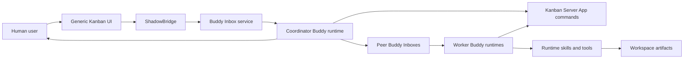
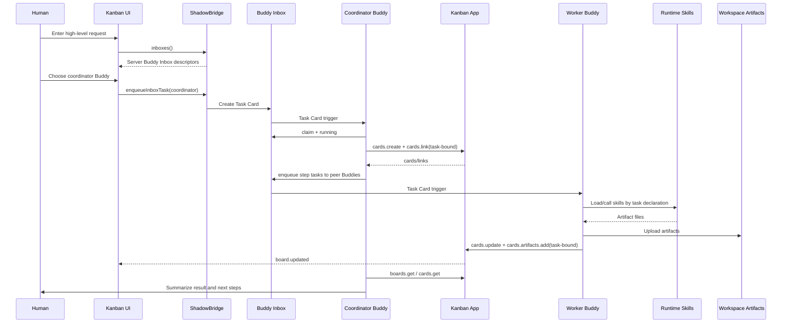
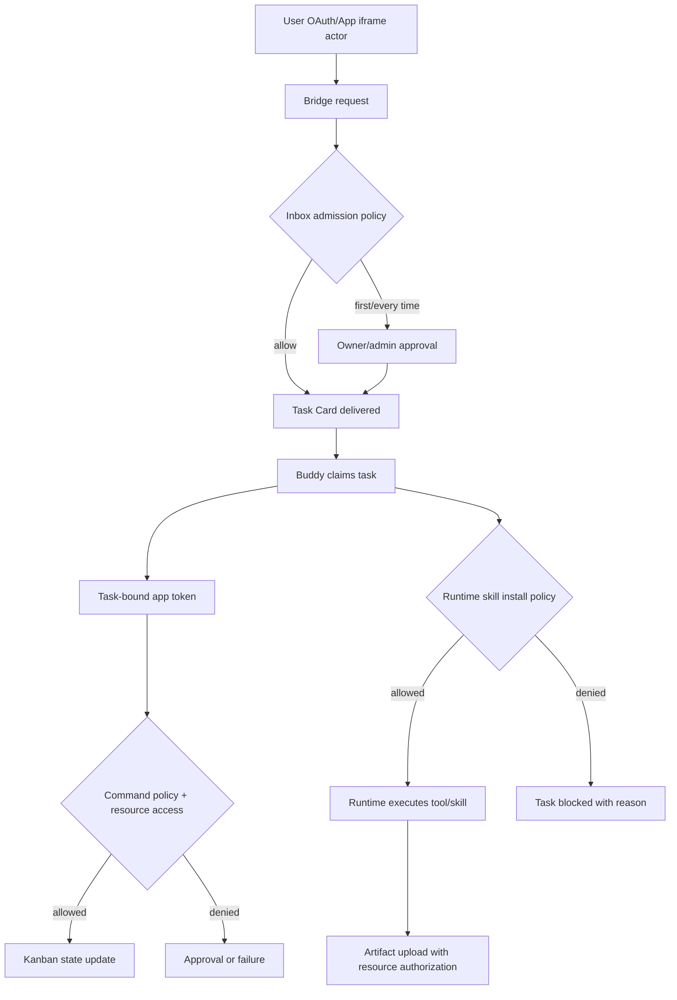
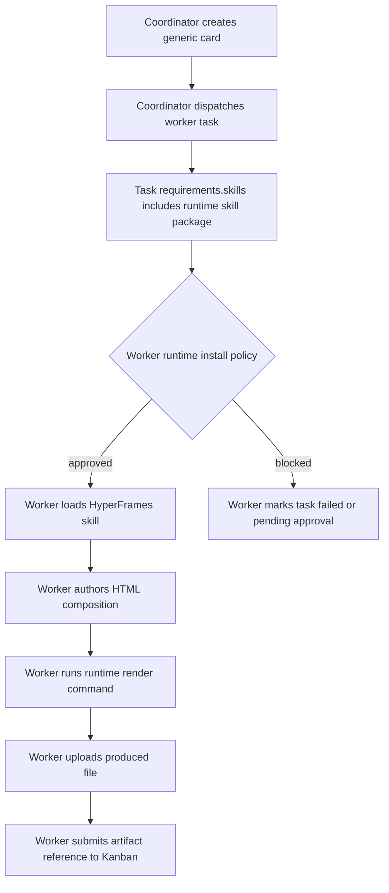

# Buddy Coordinator, Generic Kanban, And Runtime Skills Research Plan

Status: accepted; implementation is split by layer.
Date: 2026-06-05

This document records the top-level system design and implementation boundaries.

## Target Conclusion

This capability should be split into three layers. Business scenarios, video-generation tools,
and concrete Buddy roles must not be hard-coded into Kanban or the Shadowob skill:

- **Shadow core / Buddy Inbox**: generic communication, Task Cards, authorization, claim,
  task-bound command tokens, and artifact audit.
- **Kanban Server App**: generic card/link/status/comment/artifact-reference management only. It
  does not understand industries, customer material, video tools, or Buddy team roles.
- **Buddy runtime / skills**: Buddies decide which skills to load, which tools to call, and which
  artifacts to produce. HyperFrames is only an example runtime skill/tool; it is not part of
  Kanban and not part of the Shadowob skill.

The human user should only send a high-level request to a coordinator Buddy. The coordinator
gets the server context from the current message, Inbox task, or App command context; discovers
same-server Buddies through Buddy Inbox descriptors; maintains the Kanban task graph with atomic
card/link commands; dispatches subtasks; tracks state; handles retry; and replies with the final
summary. Kanban is a visual task-state board, not a business orchestration engine.

## Research Basis

### Current Repository State

- `packages/sdk/src/bridge.ts` already has iframe bridge capabilities: `command()`,
  `inboxes()`, and `enqueueInboxTask()`. This is suitable for Kanban UI to read the server's
  Buddy list and enqueue a task into a selected Inbox.
- `apps/server/src/services/buddy-inbox.service.ts` models Inbox as a server-private channel plus
  `metadata.cards[]` Task Cards. No new business queue table is required for the core path.
- `packages/cli/src/commands/app.ts` supports App command task binding with
  `--task-message-id`, `--task-card-id`, and `--task-claim-id`.
- `packages/openclaw-shadowob/src/monitor/channel-message.ts` and
  `packages/connector/hermes-shadowob-plugin/adapter.py` inject task id / claim id after a Buddy
  receives a Task Card, letting the Buddy call Server App commands with a task-bound token.
- `integrations/kanban/shadow-app.local.json` exposes atomic card commands only:
  `boards.get`, `cards.get`, `cards.create`, `cards.update`, `cards.link`, `cards.move`,
  `cards.assign`, `cards.comment`, `cards.rerun`, and `cards.artifacts.add`. It no longer exposes
  `issues.create` or `issue.steps.*`.
- The current Kanban data compatibility layer still reads legacy `workflow` data. That should
  remain migration compatibility only, not the new public model.

### HyperFrames Research

The correct integration point for HyperFrames is a Buddy runtime skill/tool, not Shadow core,
the Shadowob skill, or Kanban:

- HyperFrames treats HTML as a video timeline. It takes HTML as input and produces deterministic
  MP4 output for people and agents that can author HTML. See
  [HyperFrames Introduction](https://hyperframes.video/docs/getting-started/introduction).
- The official CLI supports commands such as `init`, `preview`, `lint`, and `render`; `render`
  can produce MP4 and target a specific composition. See
  [HyperFrames CLI](https://hyperframes.heygen.com/packages/cli).
- The render pipeline is frame-by-frame and seek-driven. It uses headless Chrome to seek to each
  frame and capture it, avoiding wall-clock screen-recording nondeterminism. See
  [HyperFrames Rendering](https://hyperframes.heygen.com/guides/rendering) and
  [@hyperframes/engine](https://hyperframes.heygen.com/packages/engine).
- HyperFrames is also packaged as an agent skill, for example `heygen-com/hyperframes`. That
  confirms it belongs in the runtime skill system instead of the Shadowob skill. See
  [HeyGen HyperFrames](https://www.heygen.com/hyperframes) and the
  [HyperFrames skill](https://github.com/heygen-com/hyperframes/blob/main/skills/hyperframes/SKILL.md).
- OpenClaw skills have their own loading, installation, allowlist, install-policy, and sandbox
  environment boundaries. Shadow can state that a task requires a capability or skill package, but
  it cannot bypass runtime skill security policy. See
  [OpenClaw Skills config](https://docs.openclaw.ai/tools/skills-config).

## Non-Goals

- Do not introduce a new business `Workflow` model.
- Do not hard-code video production, marketing, brand work, renderers, HyperFrames, concrete Buddy
  names, or default Buddies into Kanban.
- Do not add HyperFrames to the Shadowob skill. The Shadowob skill only covers generic Shadow
  operations: servers, channels, Inbox, App commands, workspace, files, and related APIs.
- Do not let tests, admins, or Kanban replace the coordinator Buddy for card creation, task
  decomposition, or artifact production.
- Do not expose customer URLs, reviews, sales points, or other private input in demo seeds, docs
  examples, or test fixtures.

## Top-Level Components



Responsibilities:

- **ShadowBridge**: generic bridge between App UI and Shadow host. It reads Buddy Inbox
  descriptors, enqueues Inbox Tasks, and calls Server App commands.
- **Coordinator Buddy**: converts high-level requests into generic cards/links and dispatches work
  according to Buddy capability.
- **Worker Buddy**: executes assigned tasks, uses runtime skills/tools according to task
  declarations, and writes back status and artifacts.
- **Kanban App**: stores cards, links, status, comments, artifact references, and renders a
  Trello-style UI.
- **Runtime skill system**: installs, loads, audits, and runs concrete capabilities such as
  HTML-to-video, scraping, QA, or document skills.

## Main Flow



Only the coordinator Buddy calls `cards.create` and `cards.link` based on task semantics. Humans,
admins, E2E drivers, and the Kanban UI should not cross the boundary and decompose tasks on
behalf of the coordinator.

## Data And Protocol Recommendations

### Inbox

Inbox remains a special Channel:

- Each Inbox binds to one Buddy agent.
- Inbox is a server-private channel.
- Normal chat and Task Cards share the message system, while UI can offer Chat and Task modes.
- Inbox admission policy decides who may dispatch a task; it does not imply access to source
  resources.

### Task Card Extensions

Task Cards remain generic. The existing `metadata.cards[]` task card should gain optional generic
declarations:

```ts
type InboxTaskCardData = {
  coordination?: {
    role?: 'coordinator' | 'executor' | 'reviewer'
    parentTaskId?: string
    workGraphId?: string
    cardId?: string
  }
  requirements?: {
    capabilities?: string[]
    skills?: Array<{
      kind: 'runtime-skill'
      package: string
      version?: string
      required?: boolean
    }>
    tools?: Array<{
      kind: string
      name: string
      required?: boolean
    }>
  }
  outputContract?: {
    expectedArtifacts?: Array<{
      kind: string
      mimeTypes?: string[]
      maxBytes?: number
    }>
    submitCommand?: {
      appKey: string
      command: string
    }
  }
  privacy?: {
    dataClass: 'public' | 'server-private' | 'channel-private' | 'secret' | 'cloud-secret'
    redactionRequired?: boolean
  }
}
```

These fields describe capability requirements and where outputs should be returned. They do not
describe a business workflow. In a video scenario, `requirements.skills[].package` may reference
a HyperFrames skill package, but the field itself remains a generic runtime skill contract.

### Kanban Issue/Card

Kanban stores:

- issue title, summary, creator, and timestamps
- cards, columns, assignees, comments, and progress
- step prompt or checklist, but only when provided by coordinator input, not an App template
- artifact references: workspace file id, URL, MIME type, summary, producer, and submission time

Kanban must not store:

- raw customer URLs, reviews, or private material text
- runtime secrets
- concrete tool execution scripts
- fixed Buddy team roles
- fixed business steps

## Authorization And Security Model



Required boundaries:

- **OAuth/PAT scope is not resource authorization**: Server App commands must also check app
  grant, actor, server membership, and resource access.
- **Inbox discovery reads descriptors only**: a coordinator may discover same-server Buddy Inbox
  descriptors and capability summaries, but it cannot read peer Inbox messages.
- **Inbox enqueue is controlled by admission policy**: peer Buddy dispatch still goes through
  `allow`, `first_time`, `every_time`, or `deny`.
- **Task-bound tokens only let claim holders operate on bound task resources**: a worker Buddy can
  write back to its claimed card; it should not manage the full board.
- **Artifacts must not use public bare links**: outputs belong in workspace/media storage and keep
  server, channel, app, authorization, and audit checks.
- **Runtime skill installation belongs to runtime policy**: Shadow can declare `requirements.skills`
  but cannot bypass OpenClaw/Hermes allowlists, install policy, sandbox env, or secret-injection
  policy.
- **Minimize private data**: Kanban should show redacted summaries and state. Raw input belongs in
  controlled workspace nodes, private attachments, or task bodies governed by `dataClass`.

## Bridge Boundary

The existing Bridge direction is correct, but it should become a stable contract:

- `inboxes()`: returns Buddy Inbox descriptors the current server can dispatch to. UI must not set
  a default Buddy; it only presents choices.
- `enqueueInboxTask()`: creates a generic Task Card in the selected Buddy Inbox. It supports
  `requirements`, `outputContract`, `privacy`, `source`, `data`, and `idempotencyKey`.
- `command()`: calls the current Server App command. Buddy runtimes must use CLI/SDK task binding
  when calling commands.
- `capabilities()`: declares whether the host supports Inbox, copilot, file handoff, and realtime.
- `openCopilot(delivery)`: an App explicitly asks the host to open a collaboration context.
  `enqueueInboxTask()` itself should no longer imply opening Copilot.

## Kanban UI Boundary

Trello-style Kanban should keep:

- horizontal columns: Backlog, Todo, In Progress, In Review, Done
- a generic request entry only: text input, Buddy select, send
- Buddy select data from `bridge.inboxes()`, with no default Buddy and no fixed role names
- card detail manual dispatch: the user selects a Buddy, Kanban uses Bridge to enqueue an Inbox
  Task, then opens Copilot

It should not show fixed team panels, fixed business metrics, fixed video-production steps, or
customer data.

## Buddy Coordination Model

Coordinator Buddy responsibilities:

1. Claim the high-level Task Card delivered by the human.
2. Read current server Buddy Inbox descriptors and Kanban App command capabilities.
3. Use task-bound commands to create generic cards/links.
4. Dispatch Task Cards according to task requirements and peer Buddy capability.
5. Read Kanban state and worker output.
6. Retry failed steps or ask the human for missing information.
7. Summarize final results to the human.

Worker Buddy responsibilities:

1. Claim the Task Card in its own Inbox.
2. Read task `requirements`, `outputContract`, and `privacy`.
3. Load or install authorized skills/tools in its own runtime.
4. Produce files or structured output.
5. Upload artifacts or reply with attachments.
6. Use task-bound commands to write `cards.update` and `cards.artifacts.add`.

The Shadowob skill is limited to Shadow operations:

- read servers, channels, members, apps, inboxes, and workspace
- send messages, enqueue Inbox Tasks, claim/update Task Cards
- call Server App commands
- upload/read workspace files

The Shadowob skill must not contain HyperFrames, video, marketing, brand, or other business
skill instructions.

## How HyperFrames Enters The System

HyperFrames can enter only through a Worker Buddy runtime task declaration:



This is not a Kanban feature and not a Shadowob skill feature. Kanban only sees an artifact:

```json
{
  "kind": "media.video",
  "title": "Generated deliverable",
  "mimeType": "video/mp4",
  "workspaceFileId": "file_...",
  "summary": "Produced by worker Buddy runtime",
  "metadata": {
    "renderer": "runtime-skill",
    "skillPackage": "heygen-com/hyperframes"
  }
}
```

`metadata.renderer` should remain optional audit metadata. It must not drive Kanban business
logic.

## Implementation Layers

### Layer 1: Protocol

- Define Task Card `requirements`, `outputContract`, and `privacy` extensions.
- Define the minimum Inbox discovery fields: agent id, display name, avatar, presence/status,
  capability summary, `canEnqueue`, and `requiresApproval`.
- Define the artifact reference schema.

Tests:

- shared type unit tests
- admission policy and task-bound token integration tests
- privacy redaction, max-size, and JSON depth tests

### Layer 2: Bridge / Host

- `inboxes()` returns server Buddy descriptors, not Inbox messages.
- `enqueueInboxTask()` supports generic `requirements` and `outputContract`.
- `openCopilot(delivery)` explicitly opens collaboration context and replaces implicit host
  behavior after `enqueueInboxTask()`.

Tests:

- SDK bridge unit tests
- web/mobile host bridge contract tests
- iframe fallback tests

### Layer 3: Kanban App

- Keep the Trello-style UI.
- The request entry only accepts a request, selects a Buddy, enqueues a Task, and optionally opens
  Copilot.
- Card dispatch only selects a Buddy, sends card context, and opens Copilot.
- Expose only atomic generic commands such as `cards.create`, `cards.link`, `cards.update`, and
  `cards.artifacts.add`; the coordinator maintains the task graph or issue relationship.

Tests:

- command unit tests
- data migration tests to ensure legacy `workflow` is read-only compatibility
- browser E2E verifying no default Buddy, no business hard-coding, and dispatch into Copilot

### Layer 4: Buddy Runtime

- Coordinator Buddy discovers peer Inboxes through Shadow CLI/SDK, calls Kanban commands, and
  dispatches Tasks.
- Worker Buddies use the runtime skill system for concrete skills, not the Shadowob skill.
- HyperFrames-like skills are installed and loaded by runtime policy.

Tests:

- OpenClaw/Hermes connector task trigger tests
- runtime skill install approval tests
- task-bound command actor tests

### Layer 5: Real E2E

The E2E driver may only:

- create a server, install apps, create Buddies, and configure permissions as an admin
- dispatch one high-level task to the coordinator Inbox from the human point of view
- observe state and screenshots

The E2E driver must not:

- call `cards.create` or `cards.link` on behalf of the coordinator
- generate files on behalf of workers
- call `cards.update` or `cards.artifacts.add` on behalf of workers

Acceptance criteria:

- Kanban UI is generic Trello style.
- Buddy list comes from Bridge.
- Coordinator discovers same-server Buddies.
- Cards are created by the coordinator Buddy.
- Subtasks are dispatched by the coordinator Buddy to peer Inboxes.
- Artifacts are uploaded by worker Buddy runtime.
- Kanban stores only artifact references.
- Failed steps can be rerun by the coordinator or human.
- Customer private data does not leak into demo seeds, logs, public URLs, or ordinary card
  summaries.

## Real E2E Acceptance Log

### 2026-06-05 polish9: Failed, Coordinator Completed The Work Alone

Input:

- Admin delivered one high-level task to Coordinator Inbox:
  `Generate a publishable marketing video for small-team growth and content marketers based on https://www.capcut.com/.`
- The E2E driver did not call `cards.create` or `cards.dispatch`, and did not create cards or
  artifacts for the coordinator.

Observed evidence:

- Six cloud Buddies were deployed and online: Coordinator, BrandScout, ReviewMiner, ScriptSmith,
  VideoForge, and FrameQA.
- Coordinator received the Task Card, created one Kanban card, and wrote a workspace Markdown
  artifact reference.
- BrandScout, ReviewMiner, ScriptSmith, VideoForge, and FrameQA received no subtasks in their
  Inboxes.
- The Kanban card stayed in `review`; the artifact was a Markdown production plan, not
  `video/mp4`.
- Coordinator told the human the task was complete, but did not dispatch to peer Buddies and did
  not satisfy the final video output contract.

Conclusion:

- Inbox, Kanban command, and workspace artifact writeback paths work.
- The coordinator cloud template did not constrain the protocol enough, so the Buddy chose to
  complete the task by itself instead of discovering peers, dispatching, waiting for workers, and
  accepting outputs.
- This is not a business-flow fix for Kanban. The Coordinator cloud template should define a
  generic coordination protocol while Kanban remains a generic card and artifact-reference
  manager.

Next acceptance gate:

- For every high-level task, Coordinator must first read `shadowob inbox list --server ... --json`
  and the Kanban board.
- If dispatchable peer Buddies exist in the same Server and the task contains execution work,
  Coordinator must dispatch at least one Task Card to a peer Inbox.
- If a task or output contract requires a concrete artifact, Coordinator must not treat a plan
  document as the final artifact. If capability is missing, it should mark the task blocked.
- Before final reply, Coordinator must verify board/card/artifact state. It must not claim
  completion while unexplained running, failed, or blocked cards remain.

### 2026-06-05 polish10: Failed, Runtime Did Not Inject Peer Buddy Directory

Input:

- Admin delivered one sentence to Coordinator Inbox:
  `Generate a publishable marketing video for small-team growth and content marketers based on https://www.capcut.com/.`
- The Task Card `outputContract` explicitly required `video/mp4`.
- The E2E driver did not create cards, dispatch tasks, or generate artifacts for the Coordinator.

Observed evidence:

- A fresh polish10 server had six cloud Buddies deployed and running.
- Admin SDK `listServerBuddyInboxes()` returned six Inboxes. Running
  `shadowob inbox list --server ... --json` inside the Coordinator pod also returned six Inboxes.
- Coordinator did not call `shadowob inbox list`; it inferred from remote runtime config or
  monitored channel context that it was the only Buddy in the current server.
- Coordinator created only one Kanban card, left it in `review`, and did not dispatch Task Cards
  to BrandScout, ReviewMiner, ScriptSmith, VideoForge, or FrameQA.
- It still submitted a Markdown plan artifact, which did not satisfy the `video/mp4` output
  contract.

Conclusion:

- It is not enough to tell the cloud template to discover peer Buddies first. The lower-level
  Buddy runtime must automatically inject same-server Buddy Inbox descriptors into Shadow
  communication context.
- Injection must be descriptor-only: agent id, display name, status, Inbox channel descriptor,
  server ref, `canManage`, and similar metadata. It must not include peer Inbox message content.
- `canManage=false` must not mean "not dispatchable"; it only describes whether the actor can
  manage the Inbox. Actual dispatch remains governed by Inbox admission policy.

Implemented fixes:

- OpenClaw Shadow inbound message context now includes `Shadow server Buddy Inbox directory`.
- `BodyForAgent` states that remote-config monitored channels are not the complete server Buddy
  directory and shows the generic `shadowob inbox enqueue --server ... --agent ...` dispatch path.
- `ctxPayload` now includes structured `ServerBuddyInboxes`, `ServerBuddyInboxCount`, and
  `ServerBuddyInboxSummary` fields.
- Unit tests cover descriptor injection and verify that peer Inbox `messages[].content` outside
  the summary schema is not leaked into `BodyForAgent`.

### 2026-06-05 React Select Smoke: Passed

Scope:

- Validates the chat interactive select frontend control only. It does not change the Coordinator
  / Kanban main-chain conclusion.
- A test message with `metadata.interactive.kind = select` was written into the polish10
  `general` channel.

Chrome verification:

- DOM `selectCount = 0`, so no native `<select>` was rendered.
- Page contains one `role="combobox"`; expanding it creates one `role="listbox"`.
- Listbox options are `Research`, `Draft`, and `Review`.
- Selecting `Draft` writes back `Draft (draft)` into the channel.
- Opening the Kanban iframe URL directly also shows `selectCount = 0`; Buddy selector is exposed
  as one `role="combobox"`.

### 2026-06-06 Kanban ReactSelect: Passed

Scope:

- Extracted the Kanban Buddy dropdown into a generic React listbox component named `ReactSelect`.
- `BuddySelect` only renders Buddy avatar, display name, and online status; it no longer owns the
  generic select behavior.
- Kanban remains generic Trello style and does not hard-code video scenarios or customer data.

Validation:

- `ReactSelect` server-render tests assert `role="combobox"`, `role="listbox"`, `role="option"`,
  and no native `<select>` / `<option>`.
- `pnpm -C integrations/kanban test`: 2 test files, 15 tests passed.
- `pnpm -C integrations/kanban typecheck`: passed.
- `pnpm biome check integrations/kanban/src/client/react-select.tsx integrations/kanban/src/client/react-select.test.tsx integrations/kanban/src/client/main.tsx integrations/kanban/src/client/styles.css`: passed.
- `pnpm -C integrations/kanban build`: passed and refreshed `dist/client`.
- Current `http://localhost:4211/assets/app.js` artifact contains `reactSelect`; no native select
  fallback was found.

## Accepted Decisions

1. Add generic `requirements`, `outputContract`, and `privacy` extensions to the Task Card top
   level.
2. Let `bridge.enqueueInboxTask()` accept those extensions directly instead of hiding them under
   `task.data`.
3. Add explicit `bridge.openCopilot(delivery)` and remove implicit host-side Copilot opening from
   `enqueueInboxTask()`.
4. Keep only atomic Kanban commands such as `cards.create`, `cards.link`, `cards.update`, and
   `cards.artifacts.add`; the coordinator maintains issue relationships.
5. Prefer workspace uploads for worker artifacts. Kanban stores only workspace artifact
   references.
6. Runtime skill installation is handled by Buddies through their runtime mechanism, such as
   `npx skills`; Kanban and the cloud runtime manager do not install business skills on their
   behalf.

## Implementation Order

Minimum closed loop:

1. Protocol layer: add `requirements`, `outputContract`, and `privacy` to shared Task Card types,
   SDK, CLI, and server handler.
2. Bridge and Kanban UI: generic Buddy selection, Task dispatch, explicit Copilot open, and card
   dispatch.
3. Server: strengthen peer Inbox discovery authorization and tests.
4. Coordinator / Worker runtime: use Shadow CLI only for Shadow operations; do not add business
   skills to the Shadowob skill.
5. HyperFrames: use it only as a runtime skill E2E scenario, install/call it inside the runtime,
   and write back an artifact reference to Kanban.
