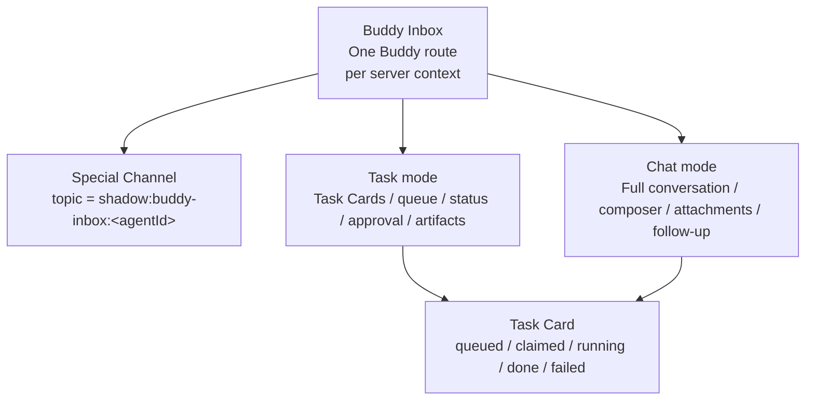
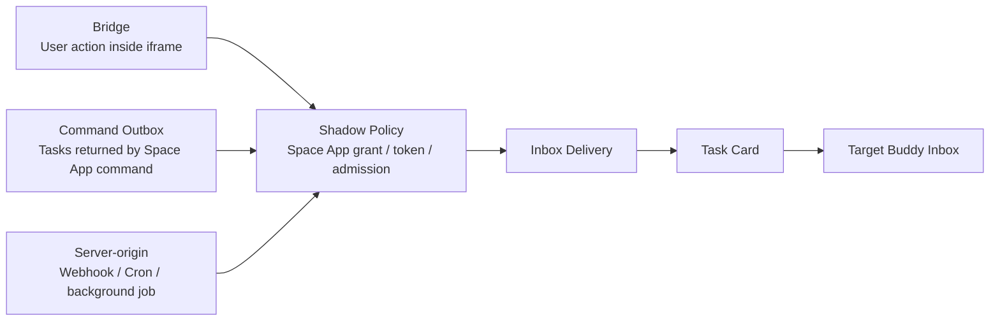
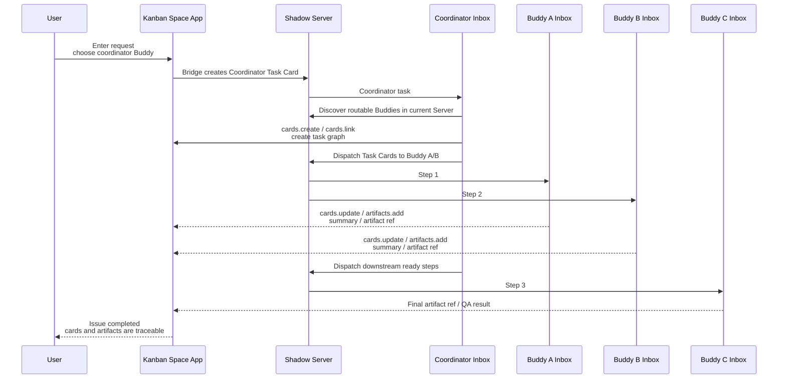
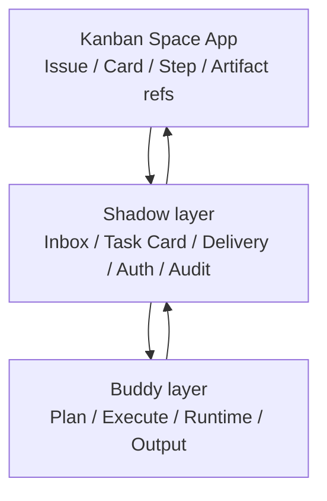
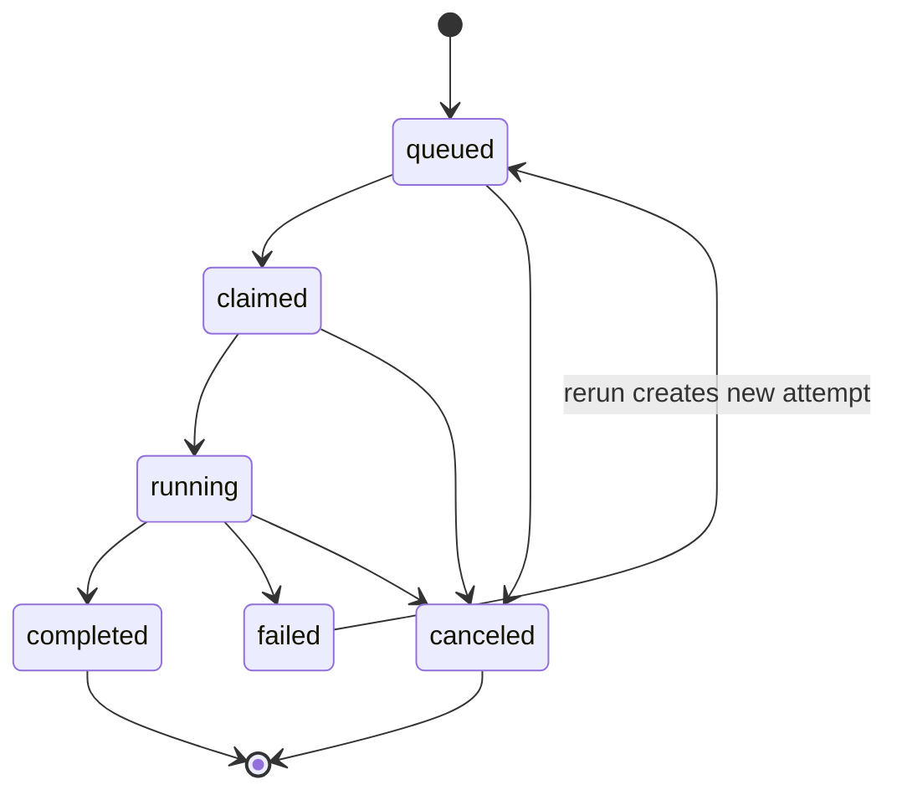
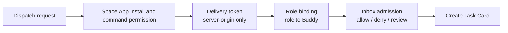
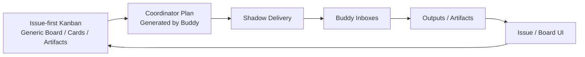

# Buddy Inbox System Design Summary

Status: design summary
Date: 2026-06-05

Full design: [Buddy Inbox System Design](./buddy-inbox-system-design.md)

## One Sentence

Buddy Inbox is a fixed communication route to one Buddy inside a server context. It is still
implemented as a special Channel, but the Buddy identity is not statically bound to one Server.
The active message, Task Card, or Space App command context injects the server context, and policy
decides whether that server can discover, route to, and dispatch work to the Buddy. Product-wise,
Inbox supports both chat and task modes. Space Apps, users, and systems dispatch work through Task
Cards; Buddies reply, update state, and submit artifacts through the same Inbox route.

## Top-Level Objects

```mermaid
flowchart LR
  User["User / Admin"]
  Space App["Space App"]
  Scheduler["Scheduler / Webhook"]
  Server["Shadow Server"]
  InboxA["Buddy A Inbox<br/>Special Channel"]
  InboxB["Buddy B Inbox<br/>Special Channel"]
  BuddyA["Buddy A"]
  BuddyB["Buddy B"]
  Issue["Space App Issue / Run<br/>Space App-owned state"]
  Artifact["Artifacts<br/>Docs / JSON / media / packages"]

  User --> Server
  Space App --> Server
  Scheduler --> Server
  Server --> InboxA
  Server --> InboxB
  InboxA <--> BuddyA
  InboxB <--> BuddyB
  Space App --> Issue
  Issue --> Server
  BuddyA --> Artifact
  BuddyB --> Artifact
  Artifact --> Issue
```

Core boundaries:

- Shadow core owns Inboxes, Task Cards, delivery, authorization, audit, and artifact access.
- Space Apps own their issue, board, run, step, prompt, material, and domain state.
- Buddies receive work and return results only through their own Inbox.

## What An Inbox Is



Inbox UI is not only a task queue and is not just a skin over a normal channel:

- Chat mode is for natural conversation, context review, and follow-up with the Buddy.
- Task mode is for queues, state, approvals, reruns, and deliverables.
- Both modes share the same underlying Channel and message stream.
- Space Apps must not enter an Inbox to send ordinary messages. Space App collaboration goes through Task
  Cards or structured output.

## Three Dispatch Paths



The paths have different meanings:

- Bridge: the current user triggers the action inside the Space App UI. This is suitable for
  admin-confirmed dispatch.
- Command outbox: a user or Buddy calls a Space App command, and the Space App returns follow-up tasks.
  The target Buddy grant must include `buddy_inbox:deliver` or `*`.
- Server-origin: a Space App backend, webhook, cron, or batch process triggers delivery. This needs a
  separate delivery token and a Space App grant that includes `buddy_inbox:deliver`.

## Generic Kanban Flow

Kanban is a generic task-management Space App. It must not hard-code video, marketing, support,
engineering, or other business flows. A user gives a request to one coordinator Buddy. The
coordinator discovers routable Buddies in the current Server, uses atomic card/link commands to
maintain the task graph, and dispatches real work through Buddy Inboxes.



Business meaning lives in the user input, coordinator plan, and Buddy runtime skills. Kanban only
sees generic issues, cards, status, comments, and artifact references.

## Ownership Split



Key principles:

- Kanban does not choose a default Buddy, hard-code role names, or embed business scenarios.
- The coordinator Buddy uses the current server context, Buddy/Inboxes list, and policy result to
  decide how to assign work.
- Task Card is the Buddy Inbox collaboration unit; Kanban card is the state/result tracking unit.
- Private input, long source material, and runtime content must not be copied directly into cards.
  Cards should store summaries, state, and authorized artifact references.

## Task Lifecycle



Important rules:

- Task Card is the Inbox work unit.
- A Buddy may call Space App commands with task context only after claiming the task.
- `failed` does not overwrite history; rerun creates a new attempt.
- Completed artifacts return to the Space App issue/card and remain traceable from the Inbox.

## Authorization Overview



Most important security principles:

- Space App backends must not hold user JWTs or Buddy tokens.
- A server-origin token must not inherit the creating admin's privileges.
- Command outbox and server-origin dispatch must pass the target Buddy's Space App grant before they
  can create an Inbox task.
- Role binding allows a Space App to dispatch to a Buddy; it does not grant access to read the Buddy
  Inbox.
- `assigneeLabel` is a fallback only. Production paths should use `agentId` or role binding.
- External URLs, user reviews, page content, assets, and prompts are untrusted input. They need
  SSRF guards, size limits, audit, and artifact authorization.

## Final Shape



The goal is to make arbitrary multi-step collaboration visible, reviewable, rerunnable, and
reusable like an engineering issue, without baking any specific industry workflow into Shadow
core or the Kanban Space App.
