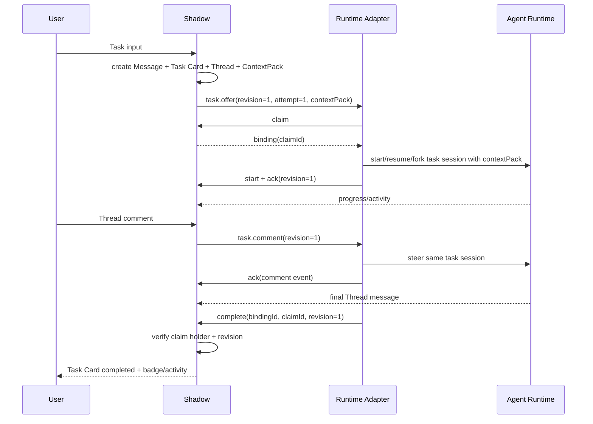
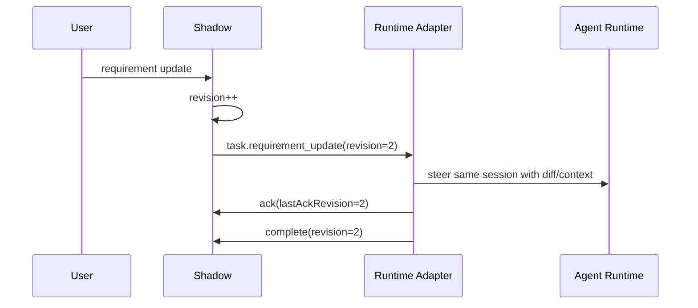
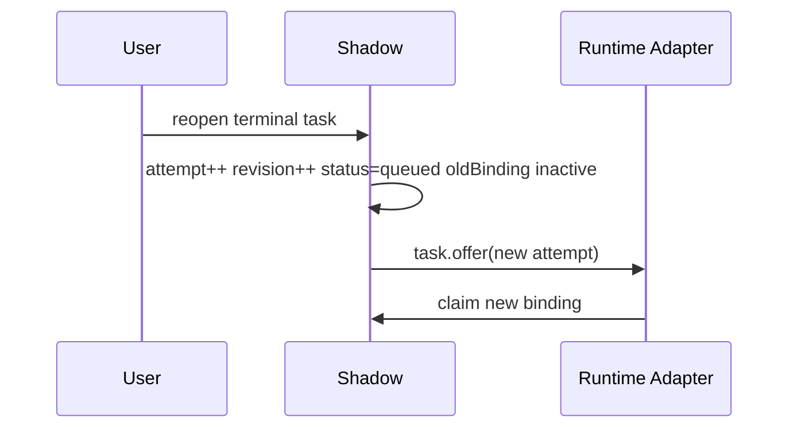
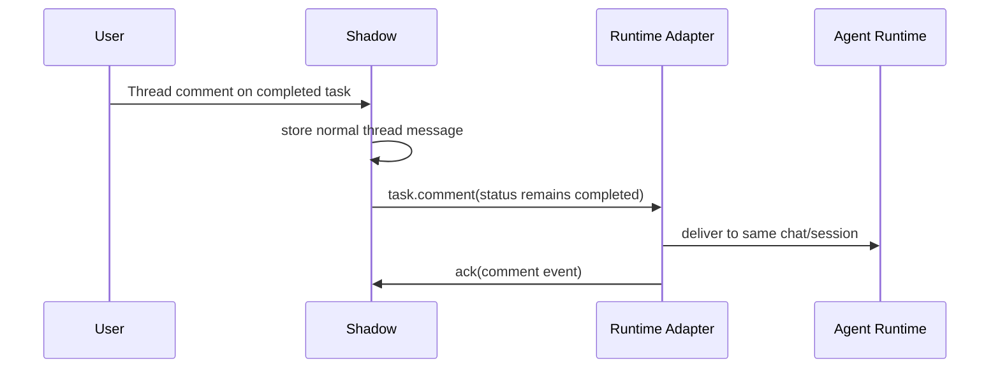

# Buddy Inbox 任务模式与 Runtime 交互机制

Status: iteration proposal
Date: 2026-06-11

相关文档：

- [Buddy Inbox Protocol](../api/buddy-inbox.md)
- [Buddy 协作默认配置方案](./buddy-collaboration-defaults-plan.zh-CN.md)
- [Buddy 任务协作暂存方案](./buddy-task-collaboration-deferred-plan.zh-CN.md)
- [Buddy Inbox System Design](./buddy-inbox-system-design.md)
- [Buddy Inbox System Design Summary](./buddy-inbox-system-design-summary.md)

## 结论先行

本版方案把任务模式的重点从 IM 展示规则移到 Buddy Runtime 控制面：

- Chat / Task 切换只改变 `chat-input` 的创建语义，不改变 Channel / Thread 的展示过滤。
- 新任务固定为“一次 Task 输入 -> 一条 Message -> 一个 Task Card -> 一个标准 Thread -> 一个 Runtime Work”。
- Task Card 打开后使用标准 Thread 渲染；任务评论就是 Thread message，不再维护独立回复 UI。
- 从聊天中途创建 Task 时，Task 必须携带创建点之前的对话上下文包；Agent 不能从空白上下文开始。
- 人类普通 comment 不改变任务状态；终态任务仍可继续聊天并触达 runtime。
- Buddy 回复不自动完成任务。状态变更必须由显式 UI、授权 API 或 runtime control-plane 机制提交，并保留日志。
- 并发数不由 Shadow Inbox 写死，交给底层 runtime 决定：Hermes、OpenClaw、cc-connect 各自声明 capacity、session、fork 能力。
- Shadow 需要建立 Runtime 触达机制：创建、评论、编辑、reopen、取消都以 task event 送达对应 runtime session / fork，并要求 ack。
- 不在 Shadow 层处理资源冲突；runtime 自己决定是否排队、拒绝或并行。
- 不增加前端状态文案复杂度；capacity / backpressure 等 runtime 状态先保持现有 UI 表达。
- 旧的 Task mode 列表过滤、旧的 task reply notification 兼容、`reply_terminal` 自动完成路径应删除，不再作为新机制的一部分。

## 术语

### Task Card

任务的用户可见载体，仍放在 `message.metadata.cards[]`。新任务必须一条消息只有一个 Task Card。

Task Card 负责描述需求、状态、优先级、目标 Buddy、版本和最近 runtime activity；它不负责承载完整对话。

### Task Thread

任务的标准讨论空间。每个 Task Card 对应一个 Thread，打开任务卡就是打开 Thread。

Thread 中可以有人类 comment、Buddy 输出、系统 progress message。Web 和 Mobile 都应复用标准 Thread 渲染。

### Runtime Work

Task Card 对 Buddy Runtime 的工作意图。Runtime Work 不是普通 IM 消息，它需要被 runtime adapter claim、绑定 session、持续心跳、ack 更新，并最终显式 complete / fail / cancel。

### Runtime Binding

某个 runtime adapter 成功领取某个 Task Card 后产生的执行绑定。它是 Shadow 和 runtime 之间的权威执行记录。

建议新增或等价建模：

```ts
type TaskRuntimeBinding = {
  id: string
  messageId: string
  cardId: string
  buddyId: string
  workspaceId: string | null
  runtimeKind: 'openclaw' | 'hermes' | 'cc-connect'
  runtimeInstanceId: string
  adapterInstanceId: string | null
  claimId: string
  attempt: number
  status:
    | 'offered'
    | 'claimed'
    | 'starting'
    | 'running'
    | 'waiting_input'
    | 'completing'
    | 'completed'
    | 'failed'
    | 'canceled'
    | 'expired'
  session: {
    sessionKey?: string
    sessionId?: string
    parentSessionId?: string
    forkId?: string
    childAgentId?: string
    worktreeId?: string
  }
  capabilities: RuntimeTaskCapabilities
  lastAckRevision: number
  lastHeartbeatAt: string | null
  leaseExpiresAt: string
  createdAt: string
  updatedAt: string
}
```

### Claim Holder

Claim holder 指当前持有 `claimId` 的 Runtime Binding。Runtime 通过接口改任务状态时必须带当前有效 claim，避免过期 session 或另一个 runtime 覆盖结果。

这个概念不是“Buddy 在聊天里说了算”。普通聊天消息永远不直接改任务状态；任务状态只能由显式 UI 操作、授权接口调用或 runtime control-plane 机制修改。

## 产品行为边界

### Chat / Task 切换

Chat / Task 切换只影响输入框：

- Chat 输入：发送普通 channel message，或在 Thread 打开时发送普通 thread comment。
- Task 输入：创建 Task Card，并生成对应 Task Thread 和 Runtime Work。

切换不影响消息列表展示。Channel 仍展示标准顶层消息；Thread 仍展示 thread messages。

如果后续需要“任务队列”视图，应作为独立 Queue / Workbench surface，而不是让 Chat / Task 输入模式改变主时间线过滤规则。

### Task 创建上下文

从聊天中途切到 Task 时，Agent 必须知道前面在聊什么。新 Task 不应该继承整段任意 runtime session，但必须携带创建点的结构化上下文包。

规则：

- Task input 提交时，Shadow 生成 `TaskContextPack`。
- `TaskContextPack` 是 `task.offer` 的必填字段。
- Runtime 可以开新的执行 session，但初始 prompt 必须包含 `TaskContextPack`。
- 这意味着“执行 session 隔离”，但不是“从头开始”。

上下文来源按优先级：

- 用户在 Task input 中显式引用、选中、quote、reply 的消息或资源。
- 如果 Task 从某个 Thread 内创建，包含该 Thread 的 root、摘要和最近消息。
- 如果 Task 从 Channel root 创建，包含创建点之前的最近 channel messages。
- 与 Task 文本直接相关的附件、文件、app resource、旧 Task 结果摘要。
- Buddy profile、workspace memory、长期偏好等可被该 Buddy 访问的记忆。

上下文窗口：

- 默认注入固定数量的最近消息，数量由服务端配置控制。
- 初始建议值可以是最近 20 条 channel messages 或最近 30 条 thread messages，但这只是默认实现参数，不是产品语义。
- 显式引用、quote、reply、附件和资源引用优先保留原文，不被最近消息窗口挤掉。
- Runtime 需要更多历史时，不靠 Shadow 一次性塞满 prompt，而是通过 `shadowob` CLI 或 Shadow API 继续读取，例如 channel messages、thread messages、message search。
- 因此 `TaskContextPack` 是启动上下文，不是完整历史上限。

已验证的 `shadowob` CLI 历史读取入口：

- `shadowob channels messages <channel-id> --limit <n> --cursor <cursor> --json`
- `shadowob threads messages <thread-id> --limit <n> --cursor <cursor> --json`
- `shadowob search messages --query <text> --channel-id <id> --limit <n> --json`

这些命令足以支撑 runtime 在收到 `TaskContextPack` 后按需拉取更多历史，而不是把所有历史一次性注入 prompt。

建议类型：

```ts
type TaskContextPack = {
  snapshotAtMessageId: string | null
  sourceSurface: 'channel' | 'thread' | 'task-thread' | 'space_app'
  policy: 'auto_recent' | 'explicit_refs' | 'thread_context' | 'manual'
  summary: string | null
  items: Array<
    | {
        kind: 'message'
        messageId: string
        threadId?: string | null
        authorId: string
        createdAt: string
        text: string
      }
    | {
        kind: 'resource'
        resourceType: string
        resourceId: string
        title?: string
        summary?: string
      }
    | {
        kind: 'task_result'
        messageId: string
        cardId: string
        title: string
        summary: string
      }
  >
  omitted: {
    messageCount: number
    reason: 'token_budget' | 'permission' | 'privacy' | 'not_relevant'
  }[]
  tokenEstimate: number
}
```

默认策略：

- 最近消息窗口用服务端固定上限。
- 超出 token budget 时，Shadow 生成 summary，保留显式引用原文。
- UI 不新增复杂交互；如需提示，只用现有卡片信息区表达，不引入新的上下文编辑器。
- Runtime 收到 context pack 后，应先基于上下文理解任务，再决定是否需要进一步读取 Thread、Channel 或资源。

Session 选择：

- 普通新 Task：新 execution session + `TaskContextPack`。
- 同一个 Task 的 comment / requirement update：触达到同一个 task session。
- Follow-up Task：可以新 session + 旧任务摘要，也可以 fork / resume，由用户动作和 runtime capability 决定。
- Reopen：默认 resume 或 fork 原 task session，并带新 revision context。

### Channel 展示

顶层 Channel 时间线规则：

- 普通消息按普通消息渲染。
- Task root message 渲染为 Task Card。
- Thread messages 不在顶层重复展示。
- Task Card 的进度、未读、状态和最新 comment 可以作为卡片摘要展示，但完整内容进入 Thread。

### Task Thread 展示

打开任务卡后进入标准 Thread：

- 人类 comment：普通 thread message。
- Buddy 输出：普通 thread message，同时可关联 `runtimeBindingId`。
- Runtime progress：可以是系统 message，也可以是 Task Card activity 摘要；长内容应进入 Thread，短状态应进入卡片。
- 任务完成/失败：必须有 Task Card status update；是否同时发最终 Buddy message 由 runtime 决定，但普通 message 本身不等于完成。

### Comment 与需求修改

人类 comment 不改变任务状态：

- queued / running 任务收到 comment：作为新上下文触达给当前 runtime binding。
- waiting_input 任务收到 comment：仍是 comment；是否解除 waiting 由 runtime 明确 ack 或 update。
- completed / failed / canceled 任务收到 comment：仍是普通 Thread 消息，并继续触达同一个 runtime chat/session；任务状态结束不代表聊天和 session 结束。

需求修改需要显式动作：

- 非终态任务可以追加上下文或提交 requirement update，产生 `revision++`。
- Runtime 必须 ack 新 revision 后，才允许用该 revision 的结果完成任务。
- 终态任务也可以通过显式 UI / API 修改状态或需求，但必须保留编辑历史。普通聊天内容不直接改任务状态。

### 编辑历史和任务日志

任务需求、状态和 runtime 事件都要能回溯，不能只保留最新值。

建议新增或等价建模：

```ts
type TaskRevision = {
  messageId: string
  cardId: string
  revision: number
  actor: 'user' | 'buddy' | 'runtime' | 'system'
  actorId?: string
  action:
    | 'created'
    | 'requirement_updated'
    | 'status_updated'
    | 'context_added'
    | 'reopened'
    | 'runtime_ack'
  before?: unknown
  after?: unknown
  patch?: unknown
  threadMessageId?: string
  runtimeBindingId?: string
  createdAt: string
}
```

规则：

- 编辑需求正文、追加上下文、手动改状态、runtime 改状态都写 revision log。
- Task Card 上展示最新需求和最新状态；完整变更历史作为任务日志查看。
- Runtime complete/fail 时带 `revision`，用于说明结果基于哪个需求版本。
- 普通 Thread comment 不自动产生 requirement revision，除非用户明确把它提交为 requirement update。

### Reopen

Reopen 是终态任务重新进入 runtime 的显式动作，采用原地 reopen：

- `attempt++`
- `revision++`
- 旧 Runtime Binding 变为 inactive。
- Task Card 从 terminal 状态回到 `queued`。
- Shadow 发出新的 Runtime Work offer。

同一个 Task Card 原地 reopen，不创建新 Task Card。这样历史 Thread、产物、评论和新 attempt 在一个上下文里；这和之前“重试生成新卡”的逻辑不同。

## Runtime 控制面

Shadow 需要把 Task Card 转换为 Runtime Work，而不是只把它当成一条聊天消息。

### Runtime 能力声明

每个 Buddy Runtime adapter 启动或注册时声明能力：

```ts
type RuntimeTaskCapabilities = {
  supportsTaskCards: boolean
  supportsDedicatedTaskSession: boolean
  supportsSessionResume: boolean
  supportsSessionFork: boolean
  supportsChildAgents: boolean
  supportsAbort: boolean
  supportsSteer: boolean
  supportsHeartbeat: boolean
  maxActiveTaskSessions?: number
  maxChildSessionsPerTask?: number
  queueDepth?: number
}
```

Shadow 不应把并发数写死在 Inbox 里。Shadow 只负责：

- 原子 claim，避免同一 Task Card 被多个 runtime 同时领取。
- 记录 runtime binding、session/fork id、lease 和 heartbeat。
- 在 runtime backpressure 时保持 queued / deferred。
- 在 binding 过期时 redeliver 或标记 stale。

Runtime 负责：

- 判断自己是否有 capacity。
- 决定是新 session、resume session、fork session、child agent，还是进入自己的队列。
- 在可达时 ack task event。
- 在完成时显式提交 terminal update。

### Runtime Event

Shadow 向 runtime 发送幂等事件。每个事件都有 `eventId` 和 `revision`。

```ts
type TaskRuntimeEvent =
  | {
      type: 'task.offer'
      eventId: string
      messageId: string
      cardId: string
      revision: number
      attempt: number
      task: TaskMessageCard
      threadId: string
      contextPack: TaskContextPack
    }
  | {
      type: 'task.comment'
      eventId: string
      messageId: string
      cardId: string
      revision: number
      threadMessageId: string
      authorId: string
    }
  | {
      type: 'task.requirement_update'
      eventId: string
      messageId: string
      cardId: string
      revision: number
      patch: unknown
      threadMessageId?: string
    }
  | {
      type: 'task.reopen'
      eventId: string
      messageId: string
      cardId: string
      revision: number
      attempt: number
    }
  | {
      type: 'task.cancel'
      eventId: string
      messageId: string
      cardId: string
      revision: number
      reason?: string
    }
```

Runtime adapter 必须回写 ack：

```ts
type RuntimeTaskAck = {
  eventId: string
  bindingId: string
  action: 'accepted' | 'deferred' | 'ignored' | 'rejected'
  lastAckRevision: number
  reason?: string
}
```

### 建议 API

命名可以调整，但语义需要完整：

```http
POST /api/buddy-inbox/tasks/:messageId/:cardId/claim
POST /api/buddy-inbox/runtime-bindings/:bindingId/start
POST /api/buddy-inbox/runtime-bindings/:bindingId/heartbeat
POST /api/buddy-inbox/runtime-bindings/:bindingId/ack
POST /api/buddy-inbox/runtime-bindings/:bindingId/activity
POST /api/buddy-inbox/runtime-bindings/:bindingId/complete
POST /api/buddy-inbox/runtime-bindings/:bindingId/fail
POST /api/buddy-inbox/tasks/:messageId/:cardId/reopen
POST /api/buddy-inbox/tasks/:messageId/:cardId/cancel
```

Runtime complete / fail 接口必须校验：

- `binding.claimId` 仍有效。
- `binding.status` 是 active 状态。
- `binding.lastAckRevision >= card.revision`，避免 runtime 用旧需求完成新任务。
- actor 是目标 Buddy 对应 runtime adapter。

人工 UI / API 状态修改走单独的授权路径：

- 校验用户是否有任务管理权限。
- 写入 TaskRevision / activity。
- 不要求用户持有 runtime claim。
- 不由普通 Thread comment 触发。

### Activity 与可见提示

Task Card 上的圆点、数字、状态颜色来自 activity 和 read state，不来自聊天列表过滤。

建议 Task Activity：

```ts
type TaskActivity = {
  id: string
  at: string
  kind:
    | 'created'
    | 'offered'
    | 'claimed'
    | 'started'
    | 'heartbeat'
    | 'progress'
    | 'comment'
    | 'requirement_updated'
    | 'acknowledged'
    | 'completed'
    | 'failed'
    | 'canceled'
    | 'reopened'
    | 'expired'
  actor: 'user' | 'buddy' | 'runtime' | 'system'
  userId?: string
  buddyId?: string
  bindingId?: string
  threadMessageId?: string
  revision: number
  status?: string
  note?: string
}
```

未读提示规则：

- 当前用户自己产生的 comment / edit 不给自己生成未读 badge。
- 当前用户自己的事件仍会触达 runtime，只是不在自己的 UI 上显示“有新消息”。
- Runtime progress、Buddy 输出、其他人的 comment、requirement update 都可以让 Task Card 出现圆点或数字。
- 打开 Task Thread 后清除对应 thread comment 未读；查看卡片 activity 后清除 progress 未读。

这里的“排除自己事件”只影响 UI 未读，不影响 runtime 触达。

## 资源冲突

本机制不处理资源冲突问题。Shadow 不做 `source.resource` 串行、不提供强制锁，也不因为任务看起来指向同一资源而阻止 runtime 并行。

如果某个 runtime 需要避免冲突，由 runtime 自己在 session、fork、worktree 或工具层处理；Shadow 只保证同一个 Task Card 同一 attempt 不会被多个 runtime 同时 claim。

## 各 Runtime 策略

### OpenClaw

当前代码已经接近新模型：

- `packages/openclaw-shadowob/src/monitor/task-card-routing.ts` 会识别发给 Buddy 的 active Task Card。
- `packages/openclaw-shadowob/src/monitor/channel-message.ts` 会 claim Task Card，设置 running，并构造 task prompt。
- 当前 session key 已经使用 `route.sessionKey:task:<cardId>`，具备“一任务一 runtime session key”的雏形。
- 成功 dispatch 后仍保持 running，等待显式完成。

需要补齐：

- 把 claim 结果写成正式 Runtime Binding。
- 增加 heartbeat 和 ack revision。
- 对 `task.comment`、`task.requirement_update`、`task.reopen` 触达到同一个 task session key。
- runtime completion 走 Runtime Binding terminal API 或 `shadowob inbox update` 的 claim-holder 等价路径；人工状态修改走授权 UI / API。
- 明确 OpenClaw 的 capacity 来自 runtime 自身，而不是 Inbox 常量。

联网调研要点：

- OpenClaw 官方 session 文档说明消息会按来源路由到 session，DM、群、频道、cron、webhook 都有不同 session 策略：[Session Management](https://docs.openclaw.ai/concepts/session)。
- OpenClaw parallel specialist lanes 文档强调并发受 session locks、全局模型容量、tool capacity、context budget、ownership 等限制，且 per-session runs 会串行、全局通过 command queue 限制：[Parallel Specialist Lanes](https://docs.openclaw.ai/concepts/parallel-specialist-lanes)。
- OpenClaw command queue 文档明确 `runEmbeddedAgent` 按 session key 入队，保证同一 session 只有一个 active run；每个 session run 还会进入全局 lane，默认 main lane cap 为 4，subagent lane cap 为 8：[Command Queue](https://docs.openclaw.ai/concepts/queue)。
- OpenClaw queue 默认 mode 是 `steer`：running 中的新消息优先注入 active runtime，无法 steer 时才等待 active run 结束；这正好对应 Task comment 触达同一 task session 的策略：[Command Queue](https://docs.openclaw.ai/concepts/queue)。
- OpenClaw session tools 提供 `sessions_list`、`sessions_history`、`sessions_send`、`sessions_spawn` 等跨 session 能力；`sessions_spawn` 默认创建 isolated child session，也支持 `context: "fork"`：[Session Tools](https://docs.openclaw.ai/concepts/session-tool)。
- OpenClaw subagents 文档说明每个 agent session 的 active children 有 `maxChildrenPerAgent`，默认 5：[Subagents](https://docs.openclaw.ai/tools/subagents)。
- OpenClaw ACP 文档说明 `openclaw acp` 是 Gateway-backed ACP bridge，ACP sessions 映射到 Gateway session keys，并支持 session resume/close/list 等能力；但它不是完整 ACP-native editor runtime：[ACP](https://docs.openclaw.ai/cli/acp)。
- OpenClaw security 文档提醒 session identifier 是 routing selector，不是 auth token；权限仍要靠 Shadow actor / policy 校验：[Gateway Security](https://docs.openclaw.ai/gateway/security)。

安装与 smoke 验证：

- 已在 `ubuntu:24.04` 容器内运行官方 installer，使用 `--npm --no-onboard --no-prompt --verify`，安装成功。
- 容器内 `openclaw --version` 返回 `OpenClaw 2026.6.5 (5181e4f)`。
- `openclaw --help` 暴露 `acp`、`sessions`、`tasks`、`message`、`gateway` 等入口。
- `openclaw acp --help` 验证支持 `--session <key>`、`--session-label`、`--reset-session`、`--require-existing`、`--url`、`--token`、`--token-file`、`client` 子命令。
- 这证明 Task Card -> Gateway session key -> ACP bridge 的绑定路线可行；但尚未在真实 Gateway / model session 中跑完整 task offer、comment steer 和 complete/fail。

### Hermes

当前代码已有 Task Card 基础：

- `packages/connector/hermes-shadowob-plugin/adapter.py` 能识别目标 Task Card。
- Hermes adapter 会 claim queued / expired 任务，并把任务标记 running。
- 成功处理后会写 running progress，而不是自动 completed。
- 当前 adapter 文件头也说明第一版目标是 messaging gateway path；本地实现实际把 Task Card 包装成普通 `MessageEvent` 后交给 `handle_message(event)`，还没有 task-level Hermes session binding。

缺口：

- `_format_task_card_prompt` 需要加入和 OpenClaw 一致的显式完成规则：普通回复不完成任务，完成/失败必须调用 Shadow task update。
- 需要为每个 Task Card 建立可恢复的 Hermes task session，并把 session id 写入 Runtime Binding。
- `task.comment` 和 `task.requirement_update` 要触达到同一个 Hermes task session，而不是落到普通 channel session。
- Hermes 接入不应该只依赖当前 messaging gateway adapter。优先调研并接入 Hermes 的可编程 session 控制面。

推荐集成路径：

- 首选 TUI Gateway JSON-RPC：用 `session.create` 创建 task session，`prompt.submit` 启动任务，`session.steer` 注入 comment/update，`session.branch` 支持 fork，`session.history` 拉取历史，`session.interrupt` 支持 cancel。
- 可选 ACP：适合 IDE/agent-client 类集成，也暴露 session creation、prompt submission、streaming events、session fork、cancel、auth。
- API server 只作为备选：它是 OpenAI-compatible HTTP endpoint，适合普通 HTTP/SSE 调用；官方 endpoint 文档把 `/v1/chat/completions` 描述为 stateless，请求通过 `messages` 传入完整对话。因此它不应作为首选 Task Binding 控制面，除非进一步验证 session header、fork、steer 和 effective session id 行为足够稳定。
- 当前 ShadowOB Hermes plugin 可以作为 messaging surface 和工具层继续存在，但 Task Runtime Binding 应绑定 Hermes 原生 session，而不是只绑定 Shadow channel/thread。

Hermes session binding 建议：

```ts
type HermesTaskSessionBinding = {
  runtimeKind: 'hermes'
  hermesProtocol: 'tui-gateway-json-rpc' | 'acp' | 'api-server' | 'gateway-adapter'
  sessionId: string
  sessionKey: string
  parentSessionId?: string
  branchSessionId?: string
  shadowThreadId: string
  taskContextPackRevision: number
}
```

Hermes adapter capability 应真实声明：

- `supportsDedicatedTaskSession`: 只有接入 `session.create` / `X-Hermes-Session-Key` 等 session 控制后才为 true。
- `supportsSteer`: 只有能把 running 中的 comment/update 注入当前 run 时才为 true。
- `supportsSessionFork`: 只有接入 `session.branch`、ACP fork 或等价能力后才为 true。
- `maxActiveTaskSessions`: 来自 Hermes runtime / gateway 实际能同时运行的 session，而不是 Shadow 固定值。

联网调研要点：

- Hermes sessions 文档说明 Hermes 会自动保存会话，session 数据保存在 SQLite `~/.hermes/state.db`，包含 source platform/user、model、system prompt snapshot、history、parent session id 等信息：[Hermes Sessions](https://hermes-agent.nousresearch.com/docs/user-guide/sessions)。
- Hermes messaging gateway 文档说明 gateway 是后台进程，连接多个 messaging platform、处理 sessions、cron 和消息投递：[Hermes Messaging Gateway](https://hermes-agent.nousresearch.com/docs/user-guide/messaging)。
- Hermes session storage 文档说明 `state.db` 持久化 session metadata 和 full message history，支持 `parent_session_id` lineage、FTS5 搜索，以及并发 reader / 单 writer 的 WAL 模式：[Session Storage](https://hermes-agent.nousresearch.com/docs/developer-guide/session-storage)。
- Hermes programmatic integration 文档说明有三种外部驱动协议：ACP、TUI Gateway JSON-RPC、API server；TUI gateway 暴露 `session.create`、`session.history`、`session.branch`、`session.steer`、`session.interrupt` 等方法：[Programmatic Integration](https://hermes-agent.nousresearch.com/docs/developer-guide/programmatic-integration)。
- Hermes API server 文档说明它提供 OpenAI-compatible HTTP endpoint，但 `/v1/chat/completions` 是 stateless，完整 conversation 通过 `messages` 数组传入：[API Server](https://hermes-agent.nousresearch.com/docs/user-guide/features/api-server)。
- Hermes ACP internals 文档说明 ACP session lifecycle 包含 `new_session(cwd)`、`prompt(..., session_id)`，`cancel(session_id)` 会触发 interrupt，`fork_session()` 会深拷贝 message history 并生成新 session id/cwd：[ACP Internals](https://github.com/NousResearch/hermes-agent/blob/main/website/docs/developer-guide/acp-internals.md)。
- Hermes slash commands 文档说明 `/background` 可在单独后台 session 跑任务，`/queue`、`/steer` 可处理 busy agent 输入，`/branch`/`/fork` 可分支当前 session：[Slash Commands Reference](https://hermes-agent.nousresearch.com/docs/reference/slash-commands)。
- Hermes prompt assembly 文档说明 API-call-time overlay、gateway-derived session context overlay 不写入 cached system prompt，可用于注入 `TaskContextPack` 而不污染长期 prompt：[Prompt Assembly](https://hermes-agent.nousresearch.com/docs/developer-guide/prompt-assembly)。

本地验证：

- 当前仓库的 ShadowOB Hermes plugin 仍是 messaging gateway path：Task Card 被包装成普通 `MessageEvent` 后交给 `handle_message(event)`，没有原生 Hermes session binding。
- 已在 `ubuntu:24.04` 容器内运行官方 installer，使用 `--skip-setup --non-interactive --skip-browser`，安装成功。
- 容器内 `hermes --version` 返回 `Hermes Agent v0.16.0 (2026.6.5) · upstream 4829f8d2`。
- `hermes --help` 暴露 `sessions`、`acp`、`gateway`、`send`、`cron` 等入口。
- `hermes acp --help` 验证 ACP server 入口存在；`hermes gateway --help` 验证 `run/start/stop/restart/status/install/uninstall/list/setup/migrate-legacy` 存在。
- 这证明 Hermes 的本地安装和协议入口可用；但尚未在真实 provider/model session 中验证 `session.create`、`session.steer`、`session.branch` 和 terminal 后继续 comment。

### cc-connect

cc-connect 应作为 Shadow 和底层 CLI agent runtime 的 session bridge。对 Task Card 的原则：

- 一个 Task Card 对应一个 cc-connect session key。
- 生产建议优先通过 cc-connect Bridge external adapter 使用 adapter 自有 key，例如 `shadow-task:<workspaceId>:<messageId>:<cardId>` 或 `shadow-task:<threadId>:<cardId>`。
- 如果走 native ShadowOB platform，也可以使用 `shadowob:task:...`，但必须包含或可解析到 Task Thread：
  - 显式 key：`shadowob:task:channel:<channelId>:thread:<threadId>:message:<messageId>:card:<cardId>`。
  - Legacy key：`shadowob:task:<workspaceId>:<messageId>:<cardId>`，由 cc-connect 回查 `/api/messages/:messageId`，从 message/card metadata 解析 `threadId`。
- 本轮已在 `../cc-connect` 补齐 native `shadowob:task` reply context 重建逻辑，并增加单元测试。验证结果表明 proactive send / reply 可以回投到 Task Thread。
- Runtime Binding 记录 cc-connect session id、底层 agent session id、fork session id。
- 普通 task comment 触达到同一个 session。
- requirement update 触达同一个 session，并要求 ack 新 revision。
- reopen 创建新 attempt，可以 resume 原 session，也可以 fork 新 session；由 runtime 能力决定。
- Shadow adapter 优先使用 Bridge REST / WebSocket 来创建、查询、切换和发送 session，而不是只依赖 chat slash command。Bridge adapter 连接期间，agent reply 会回到 adapter，由 Shadow adapter 再写入标准 Task Thread。
- 禁止 Shadow / cc-connect 在运行时修改或注入 Codex CLI provider。Codex 作为底层 agent 时，只能使用用户已经预配置好的 provider；如果需要 provider 变更，应由用户在 Codex 自己的配置面完成，Task Runtime Binding 不承担这件事。

对 Claude Code agent：

- 常规任务可以新 session 或 resume task session。
- 需要并行探索、对照方案或避免污染上下文时，可以用 fork session。
- Claude Code 官方支持 `--resume <session-id>` 和 `--fork-session`；cc-connect engine 会把 live process 报告的新 agent session id 写回自己的 Session。
- cc-connect Bridge 的 `POST /bridge/sessions` 仍是创建新的 cc-connect 会话容器；真正带历史的 fork 走 `POST /bridge/sessions/fork`。ShadowOB fork `v1.5.0-beta.2-shadow.1` 已实现该 API：child session 会记录 parent session id、parent agent session id 和 pending fork source，首次运行时对 Claude Code 使用 `--resume <parent-agent-session-id> --fork-session`。

联网调研要点：

- Claude Code CLI 支持 start、continue、resume session，并支持 `--fork-session` 从 resume / continue 创建新 session id：[Claude Code CLI Reference](https://code.claude.com/docs/en/cli-reference)。
- Claude Code sessions 文档说明 branching 会复制当前 conversation，并且 CLI 可以通过 `--continue` / `--resume` 配合 `--fork-session` 分支会话：[Manage sessions](https://code.claude.com/docs/en/sessions)。
- Claude Code subagents 文档说明 subagent transcript 可独立持久化，forked subagents 可继承父 conversation 并后台运行：[Claude Code Subagents](https://code.claude.com/docs/en/sub-agents)。
- Claude Code Agent SDK 文档说明可以 capture session id 并 resume session：[Agent SDK Overview](https://code.claude.com/docs/en/agent-sdk/overview)。
- cc-connect docs 说明其支持 session 管理命令、多 workspace 隔离，并提供 WebSocket / REST bridge 与 sessions 交互：[cc-connect Usage](https://github.com/chenhg5/cc-connect/blob/main/docs/usage.md)。
- cc-connect Bridge protocol 文档说明 BridgePlatform 暴露 WebSocket endpoint，外部 adapter 连接后通过 bidirectional JSON messages 与 cc-connect engine 交换消息，并且连接需要 token 鉴权：[Bridge Protocol](https://github.com/chenhg5/cc-connect/blob/main/docs/bridge-protocol.md)。
- cc-connect usage 文档列出 Bridge REST endpoints：`GET /bridge/sessions`、`POST /bridge/sessions`、`GET /bridge/sessions/{id}`、`DELETE /bridge/sessions/{id}`、`POST /bridge/sessions/switch`：[cc-connect Usage](https://github.com/chenhg5/cc-connect/blob/main/docs/usage.md)。
- cc-connect Management API 文档说明它是 token-authenticated HTTP REST API，可管理和监控 cc-connect instances、projects、sessions、cron 等：[Management API](https://github.com/chenhg5/cc-connect/blob/main/docs/management-api.md)。
- Codex 官方配置文档说明 custom provider 不能复用 built-in provider id；本方案不再修改或注入 Codex CLI provider，只允许复用用户现有配置：[Codex Advanced Configuration](https://developers.openai.com/codex/config-advanced)。

本地验证：

- ShadowOB fork 已发布 `v1.5.0-beta.2-shadow.3`，commit `398af9c1`。
- Help 中暴露 `sessions list`、`sessions show <id>`、`send -m ... -p <project> -s <session>`、`agent-sid`，说明本地二进制至少具备 session 浏览和向 active session 发送消息的 operator 能力。
- 本机已有用户默认 cc-connect 实例运行，验证时没有使用 `--force`，改用 `.tmp/codex-runtime-smoke/` 下独立 config、独立 data dir 和独立端口。
- Bridge-only config 被当前 binary 拒绝：至少需要一个 `[[projects]]`。
- `[[projects.platforms]] type = "bridge"` 被拒绝：`bridge` 不是 platform 类型；Bridge 是全局 server + 每 project 内置 `BridgePlatform`。
- 使用本地假 Shadow HTTP 服务和 `type = "shadowob"` placeholder platform 启动成功。Management API `GET /api/v1/status` 返回 `connected_platforms=["shadowob","bridge"]`，Bridge enabled，projects count 为 1。
- Bridge REST 验证通过：`POST /bridge/sessions` 使用 `session_key=shadowob:channel:task-card-smoke:user-1`、`project=task-smoke` 创建 `s1`；随后 `GET /bridge/sessions` 返回 `active_session_id="s1"`。
- Bridge token 鉴权验证通过：错误 token 返回 `401 Unauthorized`。
- Bridge WebSocket 验证通过：外部 adapter 注册 `shadow-task-adapter` 后收到 `register_ack ok=true`，`ping` 收到 `pong`。
- 修改 `../cc-connect/platform/shadowob/shadowob.go` 后，native `shadowob:task:workspace-1:root-1:card-1` 可以通过假 Shadow HTTP 服务解析 root message/card metadata，并把 proactive send 投递到 `threadId="thread-1"`。
- `../cc-connect/platform/shadowob/shadowob_test.go` 已覆盖显式 thread key 和 legacy workspace key 两类 `shadowob:task` reply context。
- Bridge + Claude Code 真实 agent smoke 通过：外部 `shadow-task` adapter 发送 `shadow-task:workspace-1:root-1:card-3`，cc-connect 启动 Claude Code session，最终回包包含 `task-smoke-ok`。
- Bridge session 详情可读到 user/assistant history；Management session 详情可读到底层 `agent_session_id`。
- Bridge `POST /bridge/sessions` + `POST /bridge/sessions/switch` 验证通过，但创建的是空的新 cc-connect session，不是 fork 历史。
- Bridge `POST /bridge/sessions/fork` 已补齐 API 和单元测试，child session 能保留 parent / parent agent session 引用；Claude Code adapter 会在 pending fork 首次启动时追加 `--fork-session`。
- Codex CLI provider 注入 smoke 已停止并不再作为方案路径；后续 Codex 只允许使用用户已配置好的 provider。

## Runtime 能力验证矩阵

| Runtime | 已验证能力 | 证据 | 仍需验证 |
| --- | --- | --- | --- |
| OpenClaw | Task Card 识别、claim、running、per-task session key、成功回复后保持 running | 本地 `@shadowob/openclaw-shadowob` tests；代码中 `route.sessionKey:task:<cardId>` | live 多 task 并发；comment/update 触达到同一 task session；Runtime Binding API |
| OpenClaw | 同 session key 串行、不同 session 受 global lane cap 控制、默认 steer/followup/collect/interrupt queue modes | 官方 Command Queue 文档 | Shadow Task event 如何映射到 OpenClaw queue/steer API |
| OpenClaw | 官方 installer 在容器内可安装；ACP bridge 支持显式 `--session` key | `openclaw --version` = `2026.6.5 (5181e4f)`；`openclaw acp --help` | 真实 Gateway / model session 的 task offer、comment steer、complete/fail |
| Hermes | ShadowOB plugin 可识别 Task Card、claim、running、不自动 complete | 本地 Hermes plugin tests；`adapter.py` task-card flow | 原生 Hermes session binding、TUI Gateway JSON-RPC / ACP live smoke |
| Hermes | 原生 session 持久化、history、branch/fork、steer/cancel 的协议入口存在 | 官方 Sessions / Programmatic Integration / ACP Internals 文档 | 选定首选协议；验证 terminal 后 comment 继续触达同一 session |
| Hermes | 官方 installer 在容器内可安装；ACP / Gateway CLI 入口存在 | `hermes --version` = `v0.16.0 (2026.6.5)`；`hermes acp --help`；`hermes gateway --help` | 真实 provider/model session 的 create/steer/branch/cancel |
| cc-connect | 本机二进制可用，支持 session list/show/send/operator 能力 | ShadowOB fork release `v1.5.0-beta.2-shadow.3` | 多 Task 并发和 running 中 steer/comment 的 live smoke |
| cc-connect | Bridge REST / WebSocket session 管理可用；Management API 可观测 Bridge 和 platforms | 本地隔离 config + 假 Shadow HTTP；`POST /bridge/sessions` -> `s1`；WebSocket `register_ack` + `pong` | 真实 Shadow Task adapter 接入生产 Shadow API |
| cc-connect | native `shadowob:task` reply context 可回投 Task Thread | `../cc-connect` 源码补丁；`go test ./platform/shadowob`；假 Shadow HTTP 捕获 `threadId="thread-1"` | 真实 Shadow message/card schema 最终字段名是否完全一致 |
| cc-connect | Bridge + Claude Code 真实 agent 可收发、记录 history、写回 agent session id、切换空新 session；Bridge true fork API 已实现并有单元测试 | 本地 Bridge adapter live smoke；reply 包含 `task-smoke-ok`；`GET /bridge/sessions/{id}` 和 Management session detail；`go test ./core`、`go test ./agent/claudecode` | 真实 Claude `--fork-session` live smoke；多 Task 并发和 running 中 steer/comment 的 live smoke |
| Shadow CLI | channel/thread/search 历史读取入口存在 | `packages/cli/src/commands/channels.ts`、`threads.ts`、`search.ts`；CLI tests | runtime prompt 中明确指引何时用 CLI 拉更多历史 |

## 并发策略

### Shadow 层

Shadow 不配置固定“每个 Buddy 同时只能跑 N 个任务”的产品规则。

Shadow 做这些事：

- 同一 `(messageId, cardId, attempt)` 只能有一个 active claim。
- 同一 runtime 可以 claim 多个 Task Card，前提是 runtime adapter 声明有 capacity。
- Task 创建时生成 `TaskContextPack`，并作为 runtime offer 的必填输入。
- Runtime adapter 返回 `deferred` 时，Task Card 保持 queued，并记录下一次触达时间。
- Runtime heartbeat 超时后，binding 变 expired，Shadow 可以 redeliver 或要求人工处理。
- Shadow 可把 priority、deadline、workspace 等信息给 runtime，但不处理资源冲突。
- Runtime capacity / backpressure 暂不增加前端文案复杂度，沿用现有 queued / running / failed 等状态表达。

### Runtime 层

Runtime 决定：

- 是否立即领取任务。
- 是否为任务开新 session。
- 如何把 `TaskContextPack` 注入初始 prompt 或 runtime session。
- 是否 fork session。
- 是否创建 child agent / subagent。
- 是否把任务放入 runtime 自己的队列。
- 是否因为权限、上下文太大或自身 capacity 不足而拒绝或延后。

### 竞态规则

- Claim 必须原子化。
- Runtime completion 必须绑定当前 `claimId`；人工 UI/API 状态修改走授权路径。
- Runtime 对旧 revision 的 completion 默认拒绝。
- Reopen 后旧 binding 不能再写 terminal 状态。
- Cancel 后 runtime 可以追加最后 activity，但不能继续写 completed。
- 同一个 runtime 多 session 并发时，所有 terminal update 都按 binding 校验。

## 状态机

建议 Task Card status：

```text
queued
  -> claimed
  -> running
  -> waiting_input
  -> completed
  -> failed
  -> canceled
  -> expired
```

额外规则：

- `claimed` 表示 runtime 已拿到 lease，但还没真正开始 session。
- `running` 表示 runtime session / fork 已开始处理。
- `waiting_input` 表示 runtime 明确要求人类补充；comment 不自动解除，需要 runtime ack 或 update。
- `completed`、`failed`、`canceled` 是任务状态 terminal，但不是聊天/session terminal；Thread 和 runtime chat/session 仍可继续。
- `expired` 是 binding lease 过期，不一定是任务终态；Shadow 可以 redeliver。
- `reopen` 不是 status，而是 terminal -> queued 的动作，伴随 `attempt++`。
- 任何普通聊天消息都不直接改变 status；status 只能通过显式 UI、授权 API 或 runtime control-plane 修改。

## 端到端流程



Requirement update 变化：



Reopen 变化：



终态后继续聊天：



这条路径不修改任务状态。后续若要把任务从 completed 改回 running、failed 或其他状态，必须通过显式 UI / API / runtime control-plane status update，并写入任务日志。

## 实现拆分

### 当前代码状态（2026-06-11）

已落地：

- Web / Mobile 的 Inbox Task mode 不再改变消息列表过滤；Chat / Task 切换只改变输入语义。
- Task Card 的回复入口已改为打开标准 Thread，不再维护独立 task reply renderer。
- 普通 Buddy reply / Thread comment 不再自动 complete Task，也不再生成 `taskReplyNotification` 新消息。
- Task 创建时会生成 `TaskContextPack`，默认包含创建点之前最近 20 条可读顶层消息；如果任务来自已授权 source channel / promoted message，会从 source channel 取上下文。
- Task 创建后会立即 `ensureThreadForMessage`，并把 `threadId`、`revision=1`、`contextPack` 写入 `card.data.task`。
- 手动创建 Thread 的 server 方法已改为 parent message 幂等：已有 Thread 时复用，避免客户端漏收 `thread:created` 后重复创建。

仍未落地：

- Runtime Binding 存储、event / ack / heartbeat / terminal update API。
- TaskRevision / edit history / activity read state。
- Task comment / requirement update 到 OpenClaw、Hermes、cc-connect 同一个 runtime session 的触达。
- OpenClaw / Hermes / cc-connect 的完整 live smoke 和跨 runtime 并发 smoke。

### Phase 1: 协议与旧路径删除

- 保留“一条 Message 一个 Task Card”的创建形态。
- 已落地：Task input 生成 `TaskContextPack`，Agent 不能空上下文接收中途创建的任务。
- 已落地：默认注入固定数量最近消息，更多历史由 runtime 通过 `shadowob` CLI / API 主动读取。
- 已落地：删除 Task mode 改变列表过滤的产品假设。
- 已落地：删除 `taskReplyNotification` 作为新机制的一部分。
- 已落地：删除或禁用 `reply_terminal` 自动完成路径。
- 已落地：明确普通聊天永远不直接改任务状态；状态只能由显式 UI、授权 API 或 runtime control-plane 修改。

### Phase 2: Server Runtime Control Plane

- 新增 Runtime Binding 存储或等价结构。
- 新增 event / ack / heartbeat / terminal update API。
- 新增 `revision`、`attempt`、`lastAckRevision` 校验。
- 已落地：新增 Task Thread 创建规则：创建 Task Card 时即创建或确保 Thread。
- 部分落地：新增 TaskContextPack 生成、权限过滤和 token budget 策略；摘要策略仍待接入。
- 新增 TaskRevision / edit history，支撑任务日志查阅。
- 新增 task activity 统一事件模型。

### Phase 3: Runtime Adapter 对齐

OpenClaw：

- 把现有 `route.sessionKey:task:<cardId>` 升级为正式 Runtime Binding session key。
- 在 task prompt 中注入 `TaskContextPack`。
- 增加 heartbeat、ack、revision 校验。
- 将 comment / requirement update 送入同一个 task session。

Hermes：

- 补齐 task prompt 的显式完成规则。
- 在 Hermes task session 初始消息中注入 `TaskContextPack`。
- 优先接入 Hermes TUI Gateway JSON-RPC 或等价 session 控制面，为 Task Card 建立 Hermes task session binding。
- 将任何 task comment / update 触达到同一个 session，包括 terminal 后继续聊天。
- 声明实际支持的并发、resume、fork 能力。

cc-connect：

- 通过 Bridge adapter 为 Task Card 建立 cc-connect session key，优先使用 adapter 自有前缀；native ShadowOB platform 可用 `shadowob:task`，但必须确保 key 能解析到 Task Thread。
- 将 `TaskContextPack` 作为 cc-connect session 的初始上下文。
- 将底层 agent session / fork id 写入 Runtime Binding。
- 接入 cc-connect bridge 的 session 管理能力。
- 对 Claude Code agent 适配 resume / fork session。
- 不修改、不注入 Codex CLI provider；Codex agent 只能使用用户已有 provider 配置。

### Phase 4: Web / Mobile

- Chat / Task toggle 只改输入框。
- Task root message 渲染 Task Card。
- Task Card 打开标准 Thread。
- 卡片 badge 来自 activity / read state。
- Web 和 Mobile 不再各自维护独立 task reply renderer。

### Phase 5: Smoke Test Harness

需要建立跨 runtime smoke：

- 创建 3 个任务给同一 Buddy，确认 runtime 按自身 capacity claim，不由 Shadow 固定限制。
- 从已有聊天中途创建任务，确认 runtime 收到 `TaskContextPack` 并能引用前文。
- 每个任务产生不同 runtime session key / session id。
- 运行中 comment 会送达同一个 task session。
- requirement update 会 revision++，且 runtime 必须 ack 后才能 complete。
- completed 后 comment 仍触达 runtime chat/session，但不改变任务状态。
- reopen 后产生新 attempt 和新 binding。
- 两个 adapter 抢同一卡时只有一个 claim 成功。
- OpenClaw 多 task session、Hermes task session、cc-connect session / fork 都有最小验证。

本地当前已跑过的相关 smoke：

```text
rtk pnpm --filter @shadowob/openclaw-shadowob exec vitest run __tests__/plugin.test.ts __tests__/mentions.test.ts
2 files, 78 tests passed

rtk pnpm --filter @shadowob/connector exec vitest run __tests__/runtime-sessions.test.ts __tests__/plans.test.ts __tests__/config-writers.test.ts __tests__/runtime-catalog.test.ts
4 files, 37 tests passed

rtk pnpm --filter @shadowob/cli exec vitest run __tests__/inbox.test.ts __tests__/channels.test.ts __tests__/e2e/cli.e2e.test.ts
3 files, 14 tests passed

rtk python3 -m pytest packages/connector/hermes-shadowob-plugin/tests -q
53 tests passed
```

这些测试证明现有 OpenClaw task-card routing / running 保持、connector runtime session 扫描和 cc-connect config/plan、Shadow CLI inbox/channel 基础能力、Hermes adapter 基础测试可用；它们还不是完整跨 runtime 并发 smoke，需要 Phase 5 补。

本轮安装、协议入口和 cc-connect live smoke：

```text
rtk docker run --rm ubuntu:24.04 ... openclaw installer --npm --no-onboard --no-prompt --verify ...
OpenClaw 2026.6.5 (5181e4f)
openclaw acp --help includes --session, --reset-session, --require-existing, --url, --token

rtk docker run --rm ubuntu:24.04 ... hermes installer --skip-setup --non-interactive --skip-browser ...
Hermes Agent v0.16.0 (2026.6.5) · upstream 4829f8d2
hermes --help includes sessions, acp, gateway, send, cron
hermes gateway --help includes run/start/stop/restart/status/install/uninstall/list/setup

rtk cc-connect --version
cc-connect ShadowOB fork release v1.5.0-beta.2-shadow.3, commit 398af9c1

rtk cc-connect --config .tmp/codex-runtime-smoke/cc-connect-task-smoke.toml
Management status: connected_platforms=["shadowob","bridge"], bridge enabled
Bridge REST: POST /bridge/sessions -> s1, GET /bridge/sessions -> active_session_id=s1
Bridge auth: wrong token -> 401
Bridge WebSocket: register_ack ok=true, ping -> pong

rtk go test ./platform/shadowob
29 tests passed

rtk go test ./core -run 'TestBridge|TestMgmt|TestEngine_SendToSession|TestCmdStatus|TestSession'
215 tests passed

rtk go test ./core
1246 tests passed

rtk go test ./agent/claudecode
189 tests passed

native shadowob:task proactive send
session_key=shadowob:task:workspace-1:root-1:card-1
fake Shadow capture: content=native-task-proactive-smoke, threadId=thread-1

Bridge + Claude Code real agent
session_key=shadow-task:workspace-1:root-1:card-3
adapter saw final reply prefix: task-smoke-ok
GET /bridge/sessions/{id}: history includes user prompt and assistant reply
Management session detail: agent_session_id recorded
POST /bridge/sessions + POST /bridge/sessions/switch: switch works; new session has empty history
POST /bridge/sessions/fork: API/unit tests pass; child session keeps parent ids and pending fork source
```

这些 smoke 证明：

- OpenClaw / Hermes 的安装和协议入口可用，但尚未启动真实 model session。
- cc-connect Bridge session 管理、native ShadowOB `shadowob:task` 回投、Bridge + Claude Code 真实 agent 收发、history 查询、agent session id 回写和 session switch 已验证。
- Bridge session create 仍不是 true fork；true fork 已拆成 `POST /bridge/sessions/fork`，API 和 Claude Code adapter 单元测试已验证，真实 Claude fork live smoke 仍待补。
- Codex CLI provider 注入路径已停止，不再作为后续验证项。

## 已确认决策

1. Task 创建默认注入一定数量的最近 messages；更多历史由 runtime 通过 `shadowob` CLI / Shadow API 访问。
2. Reopen 原地进行：同一个 Task Card `attempt++`，不新建第二张任务卡。
3. 需求、状态和上下文修改必须保留编辑历史，用于查阅任务日志。
4. Terminal 状态只表示任务状态结束，不表示 Thread / runtime session 结束；后续 comment 仍作为普通消息触达 runtime。
5. 普通聊天消息永远不直接改变任务状态。
6. 任务状态可以通过显式 UI、授权 API 或 runtime control-plane 机制修改。
7. Shadow 不处理资源冲突问题。
8. Runtime capacity / backpressure 不新增前端文案或复杂交互。
9. cc-connect Task 应走 Bridge session 管理，不再只依赖 chat slash command；生产 session key 前缀见“需要确认的逻辑”。
10. Claim lease 默认沿用当前 OpenClaw 的 3600 秒。
11. Buddy 最终输出可以先发 Thread message，也可以直接提交 status update；但 completed/failed 状态必须是显式状态修改。
12. Running 任务收到普通 comment 默认触达 runtime；comment 不改变需求和状态，只作为上下文进入当前 task session。
13. cc-connect native `shadowob:task` 已可通过源码补丁支持；Bridge adapter 自有 key 仍是生产首选，因为它让 Shadow Task adapter 拥有完整投递语义。
14. 不修改、不注入 Codex CLI provider；Codex agent 只能使用用户已有 provider 配置，无法满足时直接跳过 Codex runtime smoke。
15. cc-connect true fork 走 Bridge `POST /bridge/sessions/fork`，不复用 fresh create 语义；reopen 可以按 runtime 能力选择 resume 或 fork。
16. Hermes / OpenClaw live smoke 可以使用 `.env` 里的非 Codex provider key；Codex provider 不由本方案改写。

## 需要确认的逻辑

1. Hermes 主接入协议：建议以 TUI Gateway JSON-RPC 为 primary，ACP 为 fallback，API server 只作为 stateless 备选。
2. cc-connect production key 是否统一使用 `shadow-task:<workspaceId>:<messageId>:<cardId>`，native `shadowob:task` 仅作为 proactive / legacy 回投兼容能力。

## 仍待调研和验证

1. Hermes 需要做 session 控制面 prototype，验证 TUI Gateway JSON-RPC 的 `session.create`、`session.steer`、`session.branch`、`session.interrupt` 是否足以承载 Task Runtime Binding。
2. Hermes smoke 需要覆盖：创建 task session、注入 `TaskContextPack`、running 中 steer、terminal 后普通 comment 继续触达、branch/fork。
3. OpenClaw live smoke 需要启动真实 Gateway / model session，验证多个 Task Card 的 session key、queue/steer、comment/update、complete/fail。
4. cc-connect 需要连接真实 Shadow Task adapter 和生产 Shadow API，验证 task offer、comment、requirement update、terminal 后 comment、status update 都能按 Task Thread 渲染和触达。
5. cc-connect 需要补 true fork live smoke：用真实 Claude Code session 验证 `POST /bridge/sessions/fork` 能创建可继续工作的 child agent session，并把 Runtime Binding 的 parent/child id 写回 Shadow。
6. cc-connect 需要补多 Task 并发 smoke：多个 `shadow-task:*` session 同时进入同一 project 时，底层 runtime capacity、queue、session id 写回和 reply routing 是否稳定。
7. OpenClaw / Hermes / cc-connect 的跨 runtime 并发 smoke 仍需补齐；当前只有 cc-connect 跑过真实 agent，OpenClaw / Hermes 还停留在安装、协议入口和本地 plugin tests。
