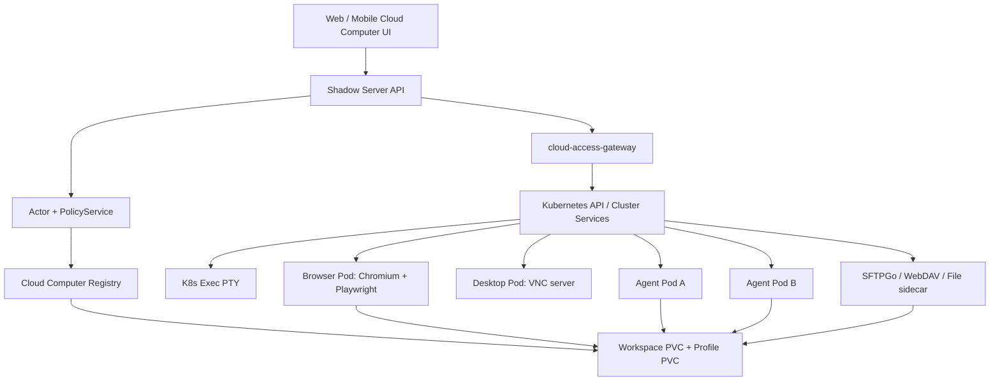

# Cloud Computer Runtime 接入方案

> Status: Implementation In Progress
> Date: 2026-06-27
> Scope: Web SaaS Cloud 部署、Cloud Buddy runtime、`apps/cloud`、`apps/server`、Web/Mobile Cloud 管理界面
> Goal: 在现有 Cloud SaaS 部署能力上补齐终端、文件、浏览器、VNC 远程桌面和服务器工作区挂载，并为“云部署升级为云电脑、一个云电脑承载多个 Cloud Buddy”做架构准备。

相关治理方案：Cloud Computer 的运行时健壮性、长期残留、SystemOOM、CrashLoop、自愈和清理策略见
[`Cloud Runtime 健壮性与性能治理方案`](./cloud-runtime-resilience-governance-plan.zh-CN.md)。

## 0. 当前落地状态

截至 2026-06-27，本方案已进入实现阶段：

- `shadowob workspace webdav` 已把 Shadow server workspace API 封装成 WebDAV 服务，可供本地开发机、CI、云电脑 sidecar 和第三方 WebDAV 客户端复用。
- Web 文件管理器已抽象 `WorkspaceFileSource`，服务器工作区与云电脑容器文件共享同一套 UI 行为。
- `/api/cloud-computers` 已作为 Cloud SaaS deployment 的产品层 API 暴露，Web 与 OS mode 已新增云电脑管理入口，原 Cloud SaaS 页面继续作为开发者选项保留。
- 容器文件 API 已支持 tree、stats、search、upload、preview signed URL、create/update/delete/clone/paste 等工作区兼容操作，路径受 `/workspace` 等 root policy 限制。
- 交互式终端已通过 Socket.IO + `node-pty` + `kubectl exec -it` 落地，Web 前端使用 xterm.js。
- 远程桌面已通过 noVNC + 短期签名 session + raw WebSocket gateway + `kubectl port-forward` 落地；配置 `CLOUD_COMPUTER_DESKTOP_IMAGE` 后 session API 可自动 apply desktop Deployment/Service。
- 远程浏览器已切换为 browser-native CDP surface；配置 `CLOUD_COMPUTER_BROWSER_IMAGE` 后 session API 可自动 apply headless Chrome/Chromium Deployment/Service/profile PVC，并通过截图、导航、点击、输入和按键接口操作。浏览器用于用户手动完成登录、MFA 和人类验证，不做验证码破解。
- 服务器工作区挂载已提供 `POST /api/cloud-computers/:id/workspace-mounts`，以 `shadowob workspace webdav` sidecar 形式创建内部 WebDAV runtime；token 通过 Kubernetes Secret 引用注入，不把完整用户 token 写入 workload。
- TypeScript SDK、Python SDK、API 文档和 focused tests 已同步。

后续增强重点：生产镜像矩阵验证、access session 持久化、云电脑暂停/恢复/删除的终端用户 UI、workspace 双向 sync sidecar、浏览器 profile 生命周期策略和更细粒度 NetworkPolicy。

## 1. 背景与产品方向

当前 Cloud SaaS 的核心对象是一次 Cloud deployment，适合开发者理解 Kubernetes namespace、模板、日志、销毁、重新部署等概念。面向小白用户时，这个模型过于工程化。后续推荐把默认产品入口升级为“云电脑”：

- 一个云电脑对应一个已经部署好的容器环境，是用户可理解的长期运行环境，包含共享工作区、浏览器会话、远程桌面、文件管理、终端入口和备份。
- 云电脑不是 Buddy。云电脑里可以运行多个 agent，agent 通过 connector 与 Shadow Buddy 建立连接；这种“云端 agent + connector + Buddy”的组合在产品上称为 Cloud Buddy。
- 本地电脑也可以通过 connector 与 Shadow Buddy 建立连接；这种“本地电脑 + connector + Buddy”的组合在产品上称为本地 Buddy。
- 现有 Cloud SaaS 页面继续保留，作为“开发者选项”，用于查看底层 deployment、namespace、模板快照、Pod、日志、成本和诊断信息。
- 新用户默认从云电脑管理 Cloud Buddy，不需要先理解 Kubernetes 或 deployment history。
- Cloud Computer 是用户体验层和产品聚合层；底层仍复用原有 Cloud deployment、namespace、PVC、exposure、backup 和 cloud-worker 能力，避免重建一套平行基础设施。
- Cloud Computer 是 facade，不是只读记录表：创建云电脑时由 Cloud Computer API 生成简化输入并驱动底层 Cloud deployment；已有 deployment 也按云端环境反投影为云电脑。
- 对外 API 和 UI 统一围绕 Cloud Computer 组织，但开发者选项仍能下钻到原始 deployment / Pod / template 视图。

本文的目标是完整可用交付，不是最小可演示版本。可以分工作包落地，但最终验收必须覆盖真实用户能长期使用云电脑的完整闭环：

- 用户能创建、启动、暂停、恢复、删除云电脑，并在 Web、OS mode 和 Mobile 中看到一致状态。
- 每台云电脑能管理多个 runtime agent；agent 通过 connector 连接到 Buddy 账户后，在产品上显示为 Cloud Buddy。runtime agent 之间有共享工作区和私有目录隔离。
- 终端、文件、浏览器、远程桌面和服务器工作区挂载都能通过统一授权网关使用，不暴露内部端口。
- 文件管理 UI 复用工作区体验，支持树、预览、上传、下载、编辑、重命名、移动、删除、搜索和冲突提示。
- `shadowob-cli` 能把 Shadow workspace API 封装为 WebDAV，云电脑、本地开发机、Desktop、CI 和第三方 WebDAV 客户端都可复用。
- 浏览器支持用户手动接管登录、MFA 和人类验证；不提供自动破解验证码或规避风控能力。
- 审计、权限、备份、恢复、配额、超时、重连、错误提示、移动端基础入口和安全检查都纳入交付范围。

产品对象建议这样分层：

```text
Shadow Server / Space
  -> Cloud Computer
       -> Shared workspace PVC
       -> Browser profile store
       -> Desktop session
       -> File manager
       -> Terminal sessions
       -> Agents[]
            -> connector session
            -> private agent workspace
            -> Buddy binding
            -> channel/server bindings
```

因此列表页、图标和详情入口必须以云电脑为主对象展示，一台云电脑只出现一次；Cloud Buddy、本地 Buddy、agent 和 connector 都是云电脑详情里的子资源或连接状态，不能反过来成为云电脑列表的主对象。

## 2. 外部组件调研结论

原则是：前端 UI 和通用协议尽量复用成熟开源组件，Shadow 只做授权、审计、路由、策略、状态和产品编排。

| 能力 | 可选成熟组件 | 推荐选择 | 判断 |
| --- | --- | --- | --- |
| Web 终端 UI | xterm.js、term.js、ttyd 内置 UI | `@xterm/xterm` + addon | xterm.js 仍活跃，是 VS Code 等 Web 终端常见底座；term.js 更偏旧项目，不建议作为新实现首选。 |
| 终端后端 | Kubernetes Exec/Attach、ttyd、node-pty、SSH | Kubernetes Exec/Attach；ttyd 作为隔离 sidecar 备选 | 云电脑里的目标已经是 Pod/容器，不需要再引入 SSH。K8s exec 能获得真实 PTY，支持 vim、top、tmux 等交互程序。 |
| 文件管理 | SFTPGo、File Browser、Filestash、rclone serve WebDAV、Shadow 自研 API | Shadow Files Gateway + SFTPGo/WebDAV sidecar + 统一文件 UI adapter | 文件路径必须受 Cloud policy 约束。SFTPGo/WebDAV 适合挂在 PVC 上，Shadow 网关负责登录态和资源授权。第三方 UI 只作为诊断或开发者选项，默认用户体验由 Shadow 统一文件管理器承载。 |
| 浏览器自动化 | Playwright、Chrome DevTools Protocol、Browserless | Browser-native CDP surface + Chromium profile；Browserless 作为集群化备选 | 仓库已有 Playwright/Chromium 基础。用户登录、人类验证和 MFA 通过远程浏览器截图/点击/输入接口手动接管完成，不做自动绕过验证码或打码服务。 |
| 远程桌面 | noVNC、websockify、TigerVNC、KasmVNC、Apache Guacamole | 前端 noVNC；后端 KasmVNC 或 TigerVNC + websockify | 用户已指定 noVNC。Guacamole 能做 RDP/VNC/SSH 聚合，但对当前 Web SaaS 嵌入较重。 |
| 工作区持久化 | Kubernetes PVC、VolumeSnapshot、restic、rclone mount/WebDAV、Syncthing | PVC 作为云电脑 POSIX 工作区；Shadow Workspace Sync sidecar + `shadowob-cli workspace webdav` 挂载服务器工作区 | 不能绕过 Shadow 应用授权直接挂 MinIO。服务器工作区通过 Shadow API/SDK 同步或 WebDAV 适配；FUSE/rclone 能力实现后由产品开关控制开放范围。 |

组件使用边界：

- 终端、VNC、文件、浏览器 CDP 都不能直接暴露公网端口，必须经过 Shadow Cloud Gateway。
- 容器里不能持有 Cloudflare tunnel token、完整用户 token 或可管理任意 server 的长期凭据。
- 浏览器“处理登录和人类验证”只支持用户手动接管并完成自己有权访问的网站验证；不设计自动破解、绕过验证码、批量规避风控或第三方打码链路。
- Browser profile、cookie、下载文件、终端输出都按 `secret` 或 `cloud-secret` 级别处理，不进入普通日志。

## 3. 目标架构

推荐新增 Cloud Computer 控制面，并复用现有 Cloud deployment / exposure / backup 能力。



### 3.1 关键组件

| 组件 | 职责 |
| --- | --- |
| `cloud_computers` | 用户可见的长期云电脑实例。绑定 owner、server/space、cluster、namespace、套餐、状态、自动暂停策略。 |
| `cloud_computer_agents` | 云电脑内的 agent runtime 记录。绑定 runner image、资源配额、connector session、Buddy 身份、频道绑定和私有工作区路径。 |
| `cloud_access_sessions` | 终端、VNC、文件、浏览器接管等短期会话。记录 actor、资源、能力、过期时间、审计信息。 |
| `cloud-access-gateway` | WebSocket/HTTP 统一接入层。把用户会话代理到 K8s exec、VNC、文件服务、Browser CDP 或内部 service。 |
| `shadowob-cli webdav` | 把 Shadow workspace API 封装成本地或容器内 WebDAV 服务，供云电脑、桌面、本地开发机和第三方工具复用。 |
| `cloud-desktop pod` | 可按需启动的远程桌面容器，包含窗口管理器、VNC server、Chromium、基础工具。 |
| `cloud-files sidecar` | 挂载同一个 workspace PVC，通过 WebDAV/SFTP/HTTP API 暴露允许目录。 |
| `shadow-workspace-sync sidecar` | 使用 Shadow SDK 以 agent actor 同步服务器 workspace 到云电脑 POSIX 目录，并把变更回写到 Shadow workspace API。 |

### 3.2 Kubernetes 资源模型

一个云电脑建议对应一个 namespace。当前 Cloud SaaS 已经有“用户 + 集群 + namespace”唯一确定实例的规则，云电脑可以沿用这个边界：

```text
namespace: cc-<cloudComputerId>

PVC:
  workspace-pvc       -> /workspace
  profiles-pvc        -> /profiles, 可合并到 workspace-pvc 的 /workspace/.shadow/profiles

Pods:
  buddy-<buddyId>     -> OpenClaw / runner / tools
  desktop             -> VNC + browser GUI, 按需启动
  files               -> SFTPGo/WebDAV, 按需或常驻
  workspace-sync      -> Shadow workspace sync, 可 sidecar 或独立 job

Services:
  desktop-vnc         -> ClusterIP only
  files-webdav        -> ClusterIP only
  browser-cdp         -> ClusterIP only, 默认只给 agent/gateway 访问

NetworkPolicy:
  default deny ingress
  default limited egress
  only cloud-access-gateway can reach desktop/files/browser services
  buddy pods can reach Shadow Server and approved plugin endpoints
```

建议目录约定：

```text
/workspace/shared
/workspace/buddies/<buddyId>
/workspace/server-workspaces/<serverId>
/workspace/server-apps/<appKey>/source
/workspace/server-apps/<appKey>/dist
/workspace/server-apps/<appKey>/state
/workspace/.shadow/browser-profiles/<profileId>
/workspace/.shadow/sync-state
```

Buddy 默认只能写自己的私有目录和显式授权的 shared/state 目录。需要跨 Buddy 协作时，由 Cloud Computer policy 授权 shared 目录或特定 server workspace mount。

## 4. 统一接入网关

终端、文件、VNC 和浏览器都应该经过同一个产品边界，而不是分别做公网暴露。

```text
Browser
  -> /api/cloud-computers/:id/access/*
  -> Shadow auth + PolicyService
  -> short-lived access token
  -> cloud-access-gateway
  -> Kubernetes API / ClusterIP Service / Pod
```

### 4.1 会话协议

| 会话类型 | 传输 | 目标 | 说明 |
| --- | --- | --- | --- |
| `terminal.v1` | WebSocket | K8s exec/attach PTY | 支持 resize、binary stream、exit status、idle timeout。 |
| `files.v1` | HTTPS/WebDAV 或 Shadow JSON API | file sidecar / workspace PVC | 支持 tree、upload、download、rename、delete、edit、search。 |
| `vnc.v1` | WebSocket | VNC server / RFB | 前端 noVNC，gateway 做 token 校验和目标解析。 |
| `browser.control.v1` | WebSocket/HTTP | Playwright/CDP broker | 给 Buddy/自动化使用；用户接管优先级高于自动化。 |
| `browser.desktop.v1` | VNC over WebSocket | desktop pod | 给用户手动登录、MFA、验证码、人类验证和 GUI 操作。 |

当前实现状态：

- `terminal.v1` 已在 Web/Server 落地：前端使用 `@xterm/xterm`，后端使用现有 Socket.IO 认证通道和 `node-pty` 包装 `kubectl exec -it`。
- `files.v1` 已以 Shadow JSON API 形式落地：`/api/cloud-computers/:id/files/*` 暴露 workspace-compatible 容器文件 API，前端复用工作区文件管理 UI。
- `vnc.v1` 已完成 Web/Server 接入骨架：Web 使用 `@novnc/novnc`，Server 通过短期 desktop session token、raw WebSocket gateway 和 `kubectl port-forward` 桥接到命名空间内 VNC service。
- `browser.control.v1`、`browser.desktop.v1` 的 Playwright broker、profile 管理和自动化/用户接管锁仍按本方案的完整交付标准推进，不能以占位 UI 作为验收完成。

### 4.2 Access Token

Access token 必须短期、单用途、可撤销：

```json
{
  "sub": "user_or_agent_id",
  "actorKind": "user",
  "cloudComputerId": "cc_...",
  "sessionId": "cas_...",
  "kind": "terminal.v1",
  "target": {
    "namespace": "cc-...",
    "pod": "buddy-...",
    "container": "runner"
  },
  "capabilities": ["read", "write", "resize"],
  "expiresAt": "2026-06-27T12:00:00Z"
}
```

不要把 Shadow 主站 cookie、用户 JWT 或完整 PAT 透传到容器。容器内 CLI 继续使用部署范围、短期、最小权限的 agent actor。

## 5. 功能方案

### 5.1 连接终端

推荐实现：

- 前端：`@xterm/xterm`，配合 `@xterm/addon-fit`。后续按需增加 search、web-links、unicode11 等 addon。
- 后端：现阶段通过 Shadow Server 的 Socket.IO 登录态启动 `node-pty`，由 PTY 包装 `kubectl exec -it`；后续可平滑迁入独立 `cloud-access-gateway`。
- 默认 shell 允许 `/bin/sh`、`/bin/bash`、`/usr/bin/bash`、`/usr/bin/zsh`，不在 allowlist 内时 fallback 到 `/bin/sh`。
- 目标选择：云电脑、Buddy、Pod、container、工作目录和 shell profile。
- 支持交互式终端程序：vim、nano、top、htop、tmux、pnpm dev、REPL、TUI installer。
- 支持 resize、Ctrl+C、Ctrl+D、鼠标事件、alt screen、CJK 输入和粘贴确认。

不建议优先把 SSH 暴露给用户。SSH 会带来额外凭据、端口和主机信任问题，而 K8s exec 已经能覆盖容器内维护场景。

安全要求：

- 终端 session 必须有明确 actor、resource、action、scope 和 data class。
- 现阶段只允许 user session 开启交互式终端；agent token 不能借用户身份开 shell。
- 默认不记录完整 PTY 内容，只记录 session start/end、target、exit code、时长、来源 IP 和是否提升权限。需要录像/审计回放时必须显式启用，并标记为 secret log。
- 禁止普通用户 exec 到不属于自己云电脑的 namespace。
- Terminal Gateway 的 service account 只能 exec/attach 到被 Cloud Computer registry 授权的 Pod。
- 空闲超时、最大会话时长、并发 session 数和粘贴大块内容都要有限制。

### 5.2 连接文件

文件管理要分清三类路径：

| 路径类型 | 示例 | 完整交付策略 |
| --- | --- | --- |
| 云电脑工作区 | `/workspace/shared`、`/workspace/buddies/<id>` | 通过 file sidecar 管理，读写受 Cloud Computer policy 控制。 |
| App/Buddy 状态 | `/workspace/server-apps/<appKey>/state` | 可查看、备份、恢复；删除/覆盖需要危险操作确认。 |
| 容器镜像层/系统路径 | `/usr`、`/etc`、`/home/shadow` | 默认只读或不可见；需要调试时走终端，不通过文件 UI 任意改。 |

完整文件能力必须包含：

1. 云电脑 namespace 内启动 `files` Pod 或 sidecar，挂载同一个 workspace PVC。
2. `files` Pod 内运行 SFTPGo/WebDAV 或轻量文件 API，仅暴露 ClusterIP。
3. Shadow workspace API 到 WebDAV 的适配优先封装在 `shadowob-cli`，例如 `shadowob workspace webdav <server-id> --root <nodeId> --listen 127.0.0.1:PORT`。这样云电脑、本地开发机、Desktop、CI job 和第三方 WebDAV 客户端都能复用同一个能力。
4. Web/Mobile 通过 Shadow Files Gateway 访问文件树，不直接访问 sidecar 登录页。
5. 文件管理器前端 UI 抽象自现有 workspace UI：树、面包屑、预览、上传、重命名、移动、删除、搜索、Monaco 文本编辑器和媒体预览尽量共用公共组件，只替换数据源 adapter。
6. Cloud Computer 文件 adapter 面向 `/workspace` PVC；Shadow workspace adapter 面向 `/api/servers/:serverId/workspace/*`；WebDAV adapter 面向 `shadowob-cli webdav`。三者共享同一套 UI 行为和空状态。
7. 大文件上传/下载走分片或预签名中转，但权限判断仍在 Shadow API。
8. 支持拖拽上传、目录上传、批量操作、进度/取消、失败重试、文本编辑保存、图片/音视频/PDF 预览和二进制文件下载。
9. 支持基于能力的危险操作确认：删除目录、覆盖文件、恢复备份、导出 secret 路径都要有审计和明确提示。
10. 服务端返回结构化错误码，前端把权限不足、文件冲突、磁盘不足、超限、连接断开和会话过期展示为可恢复状态。

当前落地：

- Web 已新增 `WorkspaceFileSource`，Cloud Computer 文件入口复用工作区 `WorkspacePage`。
- Server 已提供 `/api/cloud-computers/:id/files/*` 容器文件 API：tree、stats、search、folder/file CRUD、upload、clone、paste、media-url、signed raw read。
- 文件根目录按 `CLOUD_COMPUTER_FILE_ROOT` 或 `/workspace`、`/workspaces`、`/home/shadow`、`/state` 探测，所有路径都限制在根目录下。
- 文本保存走普通 Shadow media upload，再由 Cloud Computer files API 把内容写回容器文件。
- 容器内 ZIP/归档下载尚未作为可用能力暴露；待归档工具链和大文件流式读取稳定后再开启 `downloadZip`。

生产前需要确认：

- SFTPGo 社区版是 AGPLv3；SFTPGo、File Browser、Filestash 等组件的 license、维护状态、权限粒度和 SaaS 分发适配性都要在上线前 review。
- 如果直接嵌入第三方文件 UI，必须禁用其自带公开登录、分享链接、用户管理和任意 path 配置，让 Shadow 成为唯一授权入口。

### 5.3 管理浏览器

浏览器能力拆成两个入口：

| 入口 | 使用者 | 用途 |
| --- | --- | --- |
| 远程浏览器桌面 | 用户 | 手动登录、MFA、验证码、人类验证、检查页面状态。 |
| Playwright/CDP broker | Buddy/Agent | 自动化已授权网站操作、截图、抓取 DOM、表单填写、测试。 |

推荐运行模型：

```text
desktop/browser pod
  -> Chromium headful
  -> profile: /workspace/.shadow/browser-profiles/<profileId>
  -> VNC: user manual takeover
  -> Playwright/CDP: automation broker
```

关键约束：

- 不做自动绕过验证码、自动打码、批量规避网站风控或违反站点规则的自动登录。
- 用户可以通过 noVNC 接管浏览器，亲自完成登录、MFA、人类验证或授权确认。
- 用户接管时，自动化 broker 必须暂停或进入只读观察模式，避免用户和 Buddy 同时操作一个页面。
- Browser profile 是敏感数据。cookie、localStorage、下载目录和截图都必须按 `secret` 或 `cloud-secret` 处理。
- Agent 使用浏览器能力前，需要清楚记录目标站点、动作、数据范围和授权来源。
- CDP/WebSocket endpoint 不能向公网暴露，也不能让容器内任意进程拿到长期连接地址。

浏览器首版交付即使用 Playwright 管理 Chromium，并保留升级到 Browserless 或自研 browser pool 的接口边界。只要启用浏览器能力，就必须同时具备 profile 持久化、会话锁、用户接管、自动化暂停、截图/下载保护、审计和过期清理。

### 5.4 远程桌面

用户明确要求前端通过 noVNC 完成。推荐：

- 前端：Cloud Computer 页面内嵌 noVNC canvas，移动端提供触摸板模式、缩放、软键盘和快捷键面板。
- 后端：KasmVNC 或 TigerVNC + websockify；VNC 服务只监听 Pod 内或 ClusterIP。
- Gateway：把 `/api/cloud-computers/:id/desktop/ws` 转换到对应 VNC WebSocket/RFB 流。
- Desktop 容器：最小窗口管理器、Chromium、终端、文件管理器、可选 VS Code/OpenVSCode 或 code-server 作为开发者选项。

远程桌面应按需启动：

1. 用户点击“连接桌面”。
2. Server 校验 `cloud_computer:manage` 或 `cloud_computer:desktop` 能力。
3. cloud-worker 确保 desktop pod Ready。
4. Gateway 创建短期 VNC session。
5. 空闲超时后断开；长时间无连接可暂停 desktop pod，保留 workspace/profile PVC。

当前落地：

- `POST /api/cloud-computers/:id/desktop/session` 校验 user session 和 deployment owner access，返回短期 noVNC `websocketUrl`。
- WebSocket `/api/cloud-computers/:id/desktop/ws?token=...` 验证签名 token，重新确认 deployment owner access，通过 `kubectl port-forward` 连接 `CLOUD_COMPUTER_DESKTOP_SERVICE` 的 VNC 端口。
- Web Cloud Computer 窗口的 Desktop 子视图已使用 noVNC RFB 客户端连接上述 gateway。
- 默认服务名为 `cloud-computer-desktop`，默认 VNC 端口为 `5900`。配置 `CLOUD_COMPUTER_DESKTOP_IMAGE` 后，session API 会自动 apply desktop Deployment/Service；未配置时默认连接 namespace 内已有 ClusterIP VNC service。

### 5.5 挂载服务器工作区

这里必须区分两个概念：

- 云电脑 POSIX 工作区：容器里真实可读写的 `/workspace`，由 PVC 提供。
- Shadow Server workspace：Shadow 产品里的文件树、权限、内容引用、频道可见性和 MinIO 私有对象。

不能让云电脑直接挂载 MinIO bucket 或绕过 `/api/servers/:serverId/workspace/*` 授权。API 同步型挂载和 WebDAV/FUSE 型挂载都纳入完整交付，区别只在默认开放策略和安全开关。

完整交付一：Shadow Workspace Sync sidecar

```text
Shadow workspace API
  -> shadow-workspace-sync
  -> /workspace/server-workspaces/<serverId>
  -> Buddy / terminal / desktop / files UI
```

同步策略：

- 使用 agent actor，绑定 cloudComputerId、serverId、allowedRootNodeIds、read/write capability。
- 初次挂载时拉取 workspace tree 和文件内容到本地目录。
- 用 manifest 保存 `workspaceNodeId`、contentRef、hash、mtime、local path 和版本信息。
- 本地变更通过 Shadow workspace upload/update/delete API 回写。
- 冲突时保留 `.conflict-<timestamp>` 文件，并在 UI 中提示用户选择。
- 大文件和二进制文件默认按需下载；文本和小文件可预取。
- 私密频道绑定的 workspace 节点必须继续执行频道访问检查。

完整交付二：WebDAV/rclone mount

- `shadowob-cli` 提供 WebDAV server：背后调用 workspace service，使用普通 Shadow SDK 鉴权和 PolicyService 授权，不直接访问 MinIO。
- 云电脑内可运行 `shadowob-cli workspace webdav` sidecar，然后用 rclone mount 到 `/workspace/server-workspaces/<serverId>`，获得更接近 POSIX 的体验。
- 本地开发机也可以运行同一个 CLI 命令，把 Shadow server workspace 挂到 Finder、Explorer、VS Code、rclone、Cyberduck 等支持 WebDAV 的工具里。
- rclone/FUSE 需要额外能力和安全评估。能力应实现并通过测试，但默认是否对普通用户开放由产品开关和安全策略控制。

`shadowob-cli workspace webdav` 命令契约：

```bash
shadowob workspace webdav <server-id> \
  --listen 127.0.0.1:8765 \
  --root <workspace-folder-node-id> \
  --auth-token "$SHADOWOB_WEBDAV_TOKEN"
```

- 默认监听 `127.0.0.1:8765`，支持 `--listen <port>` 或 `--listen <host>:<port>`。
- 如果监听非 loopback 地址，必须提供 `--auth-token` 或 `SHADOWOB_WEBDAV_TOKEN`，WebDAV 客户端可用 Bearer token 或 Basic auth password 连接。
- 默认支持读写；`--read-only` 可用于 CI、调试或只读挂载。
- 支持 `PROPFIND`、`GET`、`HEAD`、`PUT`、`DELETE`、`MKCOL`、`MOVE`、`OPTIONS`。
- `PUT` 新建文件；覆盖现有文件时，先通过 Shadow upload API 上传替换内容，再删除旧节点并把新节点重命名回目标文件名。
- 路径只按 workspace node 解析，拒绝 `..`、空段和 root 删除；所有文件读写仍走 Shadow workspace API 与 PolicyService。
- `--max-file-bytes` 限制单次 `PUT` 大小，`--max-propfind-nodes` 限制单次目录遍历规模。
- rclone 示例：`rclone mount :webdav: /workspace/server-workspaces/<serverId> --webdav-url http://127.0.0.1:8765 --webdav-vendor other`。

当前落地：

- `POST /api/cloud-computers/:id/workspace-mounts` 已校验 cloud deployment owner access 和目标 server membership。
- 配置 `CLOUD_COMPUTER_WORKSPACE_MOUNT_IMAGE`、`CLOUD_COMPUTER_WORKSPACE_MOUNT_SERVER_URL`、`CLOUD_COMPUTER_WORKSPACE_MOUNT_TOKEN_SECRET_NAME/KEY` 后，server 会 apply WebDAV sidecar Deployment/Service。
- 返回值包含 deterministic service name、内部 WebDAV URL、建议 mountPath 和 `runtimeEnsured`；不会返回 token 值。
- FUSE/rclone mount 仍由 runtime image 和集群安全策略控制，默认交付 WebDAV sidecar 形态，避免要求所有集群开启 privileged/FUSE。

备份：

- 云电脑 workspace PVC 通过 VolumeSnapshot/restic 做基础备份。
- Shadow server workspace 的权威数据仍在 Shadow workspace service。sync sidecar 的本地 mirror 可以恢复，但不能替代 Shadow 数据库和对象存储备份。
- 任何 destroy 云电脑前，都要明确是否删除 PVC、是否已有最新备份、是否保留同步回 Shadow 的文件。

## 6. API 与 Policy 设计

新增 API 必须满足 Actor/Policy 模型。建议资源与能力如下：

| API | Actor | Resource | Action | Required scope/capability | Data class |
| --- | --- | --- | --- | --- | --- |
| `GET /api/cloud-computers` | user/pat/oauth | `cloud_computer:*` | `read` | `cloud:read` + owner/member access | server-private |
| `POST /api/cloud-computers` | user | `server:{id}` + `cloud_computer` | `deploy` | `cloud:deploy` + server manage/cloud grant | server-private |
| `POST /api/cloud-computers/:id/buddies` | user/agent | `cloud_computer:{id}` | `manage` | `cloud:manage` + buddy create grant | server-private |
| `POST /api/cloud-computers/:id/access/terminal` | user/pat | `cloud_computer:{id}/pod:{pod}` | `manage` | `cloud:terminal` or `cloud:manage` | secret |
| `POST /api/cloud-computers/:id/access/files` | user/pat/oauth | `cloud_computer:{id}/workspace` | `read/write` | `cloud:files` + path policy | secret |
| `POST /api/cloud-computers/:id/access/desktop` | user | `cloud_computer:{id}/desktop` | `manage` | `cloud:desktop` | secret |
| `POST /api/cloud-computers/:id/access/browser` | user/agent | `cloud_computer:{id}/browser_profile:{id}` | `read/write` | `cloud:browser` + profile grant | cloud-secret |
| `POST /api/cloud-computers/:id/workspace-mounts` | user/agent | `server:{id}/workspace` + `cloud_computer:{id}` | `write` | `workspaces:read/write` + server access | channel-private/secret |
| `POST /api/cloud-computers/:id/pause` | user/system | `cloud_computer:{id}` | `manage` | `cloud:manage` or system lifecycle | server-private |
| `POST /api/cloud-computers/:id/backups` | user/system | `cloud_computer:{id}` | `manage` | `cloud:backup` | secret |

PolicyService 校验必须同时包含：

- Actor 是否有全局 scope/capability。
- Actor 是否能访问目标 server/space/cloud computer。
- Actor 是否能访问目标 Buddy、workspace node、browser profile 或 Pod。
- 目标路径是否落在 allowlist，例如 `/workspace`、`/state`、`/tmp`、`/home/shadow`，不能任意 host path。
- 目标操作是否会导出 secret 数据，例如浏览器 profile、SSH key、API key、`.env`、Cloud provision state。

## 7. Web 与 Mobile 体验

新能力不能只做 Web。建议：

Web：

- `/app/cloud-computers` 作为默认入口。
- 云电脑详情页包含：Overview、Buddies、Terminal、Files、Browser、Desktop、Workspace Mounts、Backups、Activity。
- 新增一个 Cloud Computer 管理 UI，和原 Cloud SaaS 页面并存。普通入口展示云电脑；开发者入口展示原 deployment / namespace / pod / template 细节。
- OS mode 增加内置应用 `cloud-computers`。打开后显示云电脑管理窗口；每个云电脑是一个可双击的图标对象，双击进入该云电脑窗口。
- 云电脑窗口内提供 Files、Terminal、Browser、Desktop、Buddies、Workspace Mounts、Backups、Activity 等子视图。管理骨架只能作为开发中间态，不能作为验收完成标准；完成标准是每个子视图接入真实 access session 或真实资源状态。
- Cloud SaaS 原页面保留到 Developer Options，显示 namespace、deployment attempts、pods、logs、cost/token 和 raw template。
- Terminal 和 Desktop 支持全屏、分屏和 reconnect。

Mobile：

- 提供云电脑列表、启停、Buddy 管理、文件浏览/上传下载、终端基础模式、远程桌面触摸模式。
- 对复杂 TUI/VNC 操作提供“打开桌面端继续”的提示，但不能缺少查看和管理能力。
- 移动端所有固定文案进入 i18n，不硬编码。

## 8. 交付工作包

### 工作包 A：控制面建模

- 增加 Cloud Computer registry，但不改变现有 deployment 行为。
- 现有 deployment 可以被包装成 Cloud Computer 的底层 runtime，不强制迁移，也不复制一套 Kubernetes 编排。
- 为 access session、workspace mount、browser profile、desktop state 建表和 policy。
- 完成 API 文档、TypeScript SDK、Python SDK 同步。
- 为 `shadowob-cli workspace webdav` 设计 CLI/API 契约，覆盖缓存、分片、冲突处理、认证和错误码。

### 工作包 B：统一接入能力

- Terminal：xterm.js + K8s exec Gateway。
- Files：workspace PVC 文件管理；前端复用 workspace UI 公共组件和 adapter。
- Desktop：noVNC + VNC server，手动打开。
- Browser：Chromium profile + browser-native CDP 截图/导航/点击/输入/按键接口。
- Backups：复用现有 PVC backup/restore 文档和能力。
- OS mode：新增 Cloud Computer 内置应用和图标式管理入口。
- Mobile：同步云电脑列表、状态、文件、基础终端和桌面触摸入口。

### 工作包 C：云电脑产品化

- 一个云电脑可以创建、暂停、恢复、删除多个 agent；agent 通过 connector 连接到 Buddy 后，在产品上显示为 Cloud Buddy。
- Buddy 共享 `/workspace/shared`，私有目录隔离。
- server workspace sync sidecar 支持读写同步。
- 计费从单 deployment 逐步过渡到云电脑套餐 + Buddy/资源增量。
- Developer Options 保留原 Cloud SaaS 页面，并能从云电脑详情下钻到底层 deployment、namespace、Pod、日志、模板和成本信息。

### 工作包 D：默认用户入口

- Web/Mobile 默认创建云电脑。
- DIY Cloud 生成结果从“单个模板部署”变成“云电脑 + Buddies + workspace mounts + browser profiles”计划。
- Cloud SaaS 页面下沉到 Developer Options。
- OS mode 内置 Cloud Computer 应用成为普通用户的默认管理入口：云电脑作为图标对象展示，双击进入窗口，窗口内完成日常管理。

## 9. 测试与验收

测试遵循现有 Cloud 决策：涉及容器/K8s/进程的流程使用真实 kind/K8s，不用 mock 替代关键路径。

完整验收：

- Terminal E2E：创建云电脑，打开 runner 容器终端，执行 `pwd`、`stty size`，运行 `vim`/`top` 类交互程序，resize 后显示正常。
- Files E2E：上传、下载、重命名、删除、编辑文本文件，确认 Buddy pod 内能看到同一 PVC 变更。
- Desktop E2E：noVNC 连接成功，画面非空，键盘和鼠标可用，断线后可重连。
- Browser E2E：用户通过 CDP surface 打开远程 Chromium，profile 持久化；截图、导航、点击、输入和按键接口可用。
- Human verification boundary：测试中只验证“用户手动接管完成登录/验证”的会话流程，不引入自动验证码绕过。
- Workspace mount E2E：Shadow server workspace 文件同步到 `/workspace/server-workspaces/<serverId>`；本地修改能通过 API 回写；权限不足时不可见。
- Security tests：跨用户 namespace exec 被拒绝；访问未授权 path 被拒绝；browser profile 下载被拒绝；access token 过期后 WebSocket 断开。
- Mobile smoke：移动端能查看云电脑、打开文件、执行基础终端命令、连接桌面触摸模式。

需要更新或新增：

- API 集成测试：access session、policy、workspace mount、browser profile grant。
- Playwright E2E：Web Cloud Computer 页面。
- Playwright E2E：OS mode 打开 Cloud Computer 应用、双击云电脑图标、进入云电脑窗口。
- CLI 集成测试：`shadowob-cli workspace webdav` 能把 workspace API 暴露为 WebDAV，基础 `PROPFIND`、`GET`、`PUT`、`DELETE` 行为正确走 Shadow 权限。
- Mobile E2E：云电脑基础管理、文件和终端。
- `pnpm check:security-pr`：新增规则检查禁止直接暴露 VNC/CDP/terminal service、禁止注入完整用户 token、禁止直接 MinIO workspace mount。

## 10. 风险与决策点

| 风险 | 影响 | 建议 |
| --- | --- | --- |
| 终端能力过强 | 用户可读写敏感文件、执行危险命令 | 严格 path/namespace/pod policy，默认非 root，日志审计，资源配额。 |
| Browser profile 泄露 | Cookie/token 泄露 | profile 按 cloud-secret 处理，禁止普通下载，备份加密，访问审计。 |
| VNC/CDP 暴露 | 远程桌面被接管 | ClusterIP only，短期 token，gateway 统一代理，NetworkPolicy default deny。 |
| Workspace 双向同步冲突 | 用户文件丢失 | manifest + hash + conflict file，不静默覆盖。 |
| 第三方组件 license/维护风险 | SaaS 分发或长期维护受限 | 上线前做 license review；组件保持可替换，Shadow API 是稳定边界。 |
| 移动端体验弱 | 新功能 Web-only | 交付时同步保留移动端查看、文件、基础终端、桌面触摸模式。 |
| 成本失控 | 桌面/browser 常驻耗资源 | Desktop/browser 按需启动，空闲暂停；Buddy 资源 quota；云电脑级预算。 |

## 11. 推荐下一步任务

1. 建 Cloud Computer / Access Session / Workspace Mount 的持久化数据模型和审计表，把当前 product-layer wrapper 升级为长期实例模型。
2. 补齐 Mobile Cloud Computer 基础入口：列表、文件查看、终端只读/触摸输入、浏览器/桌面触摸模式。
3. 增加云电脑创建、暂停、恢复、删除的一体化 UI，并继续保留原 Cloud SaaS 开发者选项。
4. 生产化 browser/desktop runtime 镜像矩阵，覆盖 Chromium/Firefox、KasmVNC/TigerVNC、profile PVC、下载目录、空闲暂停和升级兼容。
5. 设计并实现 Shadow Workspace Sync sidecar，覆盖初次同步、双向同步、冲突处理、回写和审计。
6. 为 access session、workspace mount、browser profile、desktop state 增加后台清理和生命周期控制。
7. 增加 E2E：Web/OS mode 双击进入云电脑，文件操作、终端、浏览器、桌面、workspace mount 全链路。
8. 继续扩展 security-pr 检查规则，防止 VNC/CDP/terminal 直接公网暴露、完整用户 token 注入、MinIO 直挂和 FUSE 越权配置。

## 12. 参考资料

- xterm.js: https://xtermjs.org/
- xterm.js security guide: https://xtermjs.org/docs/guides/security/
- noVNC: https://github.com/novnc/noVNC
- websockify: https://github.com/novnc/websockify
- ttyd: https://github.com/tsl0922/ttyd
- Kubernetes `kubectl exec`: https://kubernetes.io/docs/reference/kubectl/generated/kubectl_exec/
- Kubernetes Persistent Volumes: https://kubernetes.io/docs/concepts/storage/persistent-volumes/
- Kubernetes Volume Snapshots: https://kubernetes.io/docs/concepts/storage/volume-snapshots/
- Kubernetes JavaScript client: https://github.com/kubernetes-client/javascript
- SFTPGo: https://github.com/drakkan/sftpgo
- File Browser: https://github.com/filebrowser/filebrowser
- Filestash: https://www.filestash.app/docs/
- Playwright `BrowserServer` / `connect`: https://playwright.dev/docs/api/class-browsertype
- Chrome DevTools Protocol: https://chromedevtools.github.io/devtools-protocol/
- Browserless: https://docs.browserless.io/
- KasmVNC: https://www.kasmweb.com/kasmvnc
- Apache Guacamole: https://guacamole.apache.org/
- rclone mount: https://rclone.org/commands/rclone_mount/
- rclone WebDAV server: https://rclone.org/commands/rclone_serve_webdav/
- Syncthing: https://syncthing.net/
- WebDAV RFC 4918: https://www.rfc-editor.org/rfc/rfc4918
