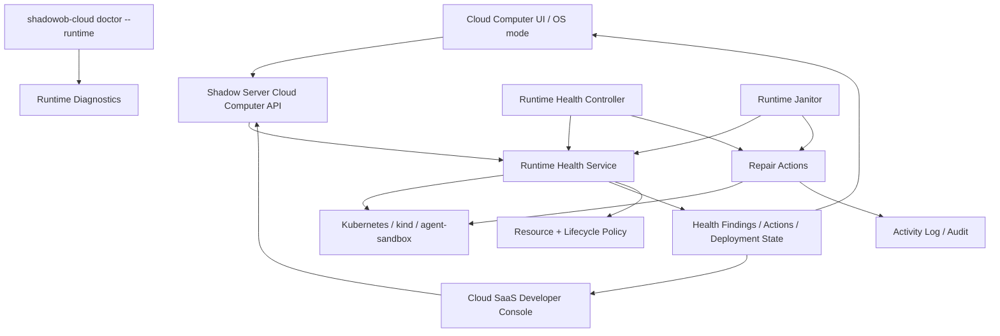

# Cloud Runtime 健壮性与性能治理方案

> Status: Architecture Draft
> Date: 2026-06-27
> Scope: Cloud Computer、Cloud SaaS deployment、agent-sandbox、本地 kind 开发集群、browser/desktop/workspace-mount 等运行时组件
> Goal: 把“资源失控、长期残留、CrashLoop、SystemOOM、接口变慢、人工排查”治理成一套可观测、可恢复、可演进的运行时健康系统。

## 1. 背景

本次本地 CPU 异常的直接现象是：`agent-sandbox` kind 集群长期运行 47 天，存在多个残留或 CrashLoop 的 agent、browser、CSI、controller Pod，事件中连续出现 `SystemOOM`，随后 kubelet、apiserver、containerd 和浏览器容器把 CPU 拖高。

这个问题不能只理解成“某个容器坏了”。真正暴露的是运行时治理缺口：

- 长期运行环境没有明确生命周期，残留资源不会自然退出。
- 常驻组件如果缺少资源预算，浏览器、桌面、sidecar 或 controller 都可能拖垮本地/小规格节点。
- CrashLoop、OOMKilled、SystemOOM、Pending 过久等信号没有被归一成产品可理解的状态。
- 修复路径依赖人工经验，没有进入统一的诊断、恢复和审计链路。
- Cloud Computer 是用户体验层 facade，但底层 Cloud deployment、agent-sandbox、Pod、Service、PVC 的健康没有形成闭环。

因此，本方案不是再加几个零散检查，而是建立一套 Cloud Runtime Health Governance：从资源准入、生命周期、健康采集、异常分类、恢复动作、用户可见状态和开发者诊断形成闭环。

## 2. 目标与非目标

### 2.1 目标

- 所有长期运行 workload 都必须有资源预算、健康探针、owner 标签和生命周期策略。
- Cloud Computer、Cloud Buddy、browser、desktop、workspace mount、agent-sandbox controller 的异常能被统一识别和解释。
- 运行时健康能映射到用户可理解的状态：正常、变慢、需要修复、正在恢复、已暂停、残留、失败。
- 系统能自动执行低风险恢复动作，并对高风险动作给出明确建议或需要确认的操作。
- 本地 kind 开发环境也纳入治理，避免长时间运行后积累残留资源和事件。
- Cloud SaaS 开发者控制台保留底层细节；OS mode / Cloud Computer UI 只暴露少量清晰动作。

### 2.2 非目标

- 不在本方案里一次性重写 Kubernetes 后端。
- 不把所有故障都自动删除或自动重建；破坏性动作必须有锁、审计、回滚或用户确认。
- 不把 `doctor` 当作唯一治理手段；`doctor` 是人工诊断入口，长期要有后台控制循环。
- 不把 Cloud Computer 做成平行基础设施；它仍然是底层 Cloud deployment / namespace / PVC / agent-sandbox 的 facade。

## 3. 设计原则

### 3.1 Budget by Default

任何长期运行组件默认必须有资源预算。没有 requests/limits 的 workload 不能进入默认生产路径。

适用对象：

- runner agent
- browser runtime
- desktop runtime
- workspace mount / WebDAV sidecar
- exposure sidecar
- sync sidecar
- controller / janitor / health collector
- 未来新增的 runtime component

资源策略不能散落在 manifest 里手写。最终应由统一 `RuntimeResourcePolicy` 生成：

```text
component kind -> resource profile -> requests/limits -> quota admission -> manifest
```

### 3.2 Lifecycle is Finite

Cloud runtime 不是无限期后台进程。每个 runtime 必须有：

- owner
- purpose
- createdAt
- lastActiveAt
- idle policy
- retention policy
- cleanup policy
- protected flag

本地 kind 集群也要有生命周期概念。开发集群可以长期保留镜像和卷，但控制平面容器、残留 Pod、旧 namespace 不应无限运行。

### 3.3 Health is Product State

Kubernetes 的底层状态不能原样丢给用户，也不能被 UI 隐藏。

底层信号应归一成两层状态：

- `runtimeFinding`: 细粒度诊断事实，例如 `SystemOOM`、`CrashLoopBackOff`、`BrowserCdpUnavailable`。
- `cloudComputerHealth`: 产品状态，例如 `healthy`、`degraded`、`repairable`、`recovering`、`paused`、`orphaned`、`failed`。

### 3.4 Observe, Decide, Act, Record

所有自动恢复都必须遵守控制循环：

```text
observe -> classify -> decide -> act -> record -> surface
```

不能直接在请求路径里偷偷做重型修复。用户访问接口应该尽量轻量；修复、安装、重启、清理进入明确动作和任务流。

### 3.5 Reduce Entropy

新增治理能力必须减少概念数量，而不是制造新孤岛。

推荐复用：

- Cloud deployment namespace 作为云电脑底层环境边界。
- Cloud Computer facade 作为用户入口。
- Cloud SaaS 控制台作为开发者诊断入口。
- `doctor` 作为本地/人工诊断入口。
- 现有 operation lock、activity log、backup、pause/resume 能力作为恢复动作底座。

## 4. 目标架构



### 4.1 Runtime Workload Contract

所有 Cloud workload 都必须满足同一个 contract：

| 要求 | 说明 |
| --- | --- |
| owner labels | 标识 deployment、cloudComputerId、component、agentId、managedBy。 |
| resource profile | 使用统一 profile 生成 requests/limits。 |
| probes | startup/readiness/liveness 或明确声明无需探针的理由。 |
| lifecycle policy | idle、pause、delete、retain、backupBeforePause。 |
| access boundary | 不暴露公网端口，只允许 gateway 或控制面访问。 |
| state boundary | 明确哪些目录/PVC 是持久化，哪些是 ephemeral。 |
| repair capability | 声明支持哪些恢复动作，例如 restart、repair、recreate、pause、cleanup。 |

contract 的目标不是增加开发负担，而是让 runtime 组件默认安全、默认可诊断。

### 4.2 Runtime Health Controller

后台控制循环，周期性观察运行时状态，并写入标准 finding。

输入信号：

- Kubernetes Pod phase、container waiting reason、lastState terminated reason。
- restart count、probe failure、ready replicas、desired replicas。
- Events：`SystemOOM`、`OOMKilling`、`FailedScheduling`、`BackOff`、`Unhealthy`。
- Node pressure：MemoryPressure、DiskPressure、PIDPressure。
- agent-sandbox：SandboxClaim / Sandbox / Ready condition / replicas。
- Cloud DB：deployment status、operation lock、lastActiveAt、backup status。
- access gateway：terminal/browser/files/desktop 的 latency、connect failure、idle sessions。
- kind/Docker：control-plane age、restart count、restart policy、container status。

输出：

```text
RuntimeFinding {
  id
  scope: cloudComputer | deployment | namespace | pod | node | kindCluster
  severity: info | warning | critical
  reason
  message
  firstSeenAt
  lastSeenAt
  count
  suggestedActions[]
  autoActionEligibility
}
```

### 4.3 Runtime Janitor

Janitor 负责清理和收敛，不负责诊断所有问题。

职责：

- 发现没有 owner 或 owner 已不存在的 namespace / Pod / Service / PVC。
- 发现长期 `failed`、`destroying`、`cancelling`、`pending` 的 deployment。
- 发现长期未活跃的 browser/desktop/workspace-mount component。
- 发现本地 kind 集群超过 TTL 或存在大量异常事件。
- 以 dry-run 形式生成 cleanup plan。
- 对低风险残留执行自动清理；对有状态资源要求备份、确认或保留。

Janitor 的核心是“先证明是残留，再删除”，不能用隐藏失败代替修复。

## 5. 状态模型

### 5.1 Cloud Computer Health

| 状态 | 用户含义 | 典型底层信号 | 默认动作 |
| --- | --- | --- | --- |
| `healthy` | 可正常使用 | workload ready，最近无 critical finding | 无 |
| `degraded` | 可用但变慢或不稳定 | restart count 上升、probe timeout、node pressure | 提示，允许修复 |
| `repairable` | 某功能不可用但可修 | browser service missing、desktop pod unavailable | 显示安装/修复 |
| `recovering` | 系统正在修复 | repair task running、resume running | 展示进度 |
| `paused` | 已暂停，状态保留 | replicas=0 或 Sandbox paused | 允许恢复 |
| `orphaned` | 底层资源和记录不一致 | owner missing、DB missing、namespace leftover | 开发者入口清理 |
| `failed` | 核心环境失败 | deployment failed、PVC broken、repeated critical findings | 引导恢复/备份 |
| `needs_admin` | 用户不能自行恢复 | cluster unavailable、SystemOOM flood、quota exhausted | 管理员处理 |

### 5.2 Finding Severity

| Severity | 标准 | 示例 |
| --- | --- | --- |
| `info` | 不影响使用，但值得记录 | 自动暂停、低频重启 |
| `warning` | 可能变慢或局部不可用 | Pending 超过阈值、restart count 增长、probe timeout |
| `critical` | 已影响核心功能或节点稳定 | SystemOOM、CrashLoopBackOff、OOMKilled、控制面不可达 |

## 6. 恢复动作分级

### 6.1 自动允许的低风险动作

- 清理过期 access session。
- 停止长期 idle 的 browser/desktop component。
- 标记 cloud computer degraded / repairable。
- 对无状态 component 执行 rollout restart。
- 对本地 `doctor` 输出非破坏建议。

### 6.2 需要任务锁的动作

- repair browser/desktop/workspace mount。
- resume / pause cloud computer。
- redeploy cloud deployment。
- restart agent-sandbox Sandbox。
- 删除已确认无 owner 的无状态资源。

### 6.3 需要用户或管理员确认的动作

- 删除 namespace。
- 删除 PVC / backup。
- 删除本地 kind cluster。
- 清理长期残留但仍有 owner 的资源。
- 在 SystemOOM 后批量停止多个运行时。

### 6.4 禁止的动作

- 在普通用户访问请求里自动删除有状态资源。
- 在没有 backup/retention 判断时删除 PVC。
- 静默隐藏 failed deployment 或 failed cloud computer。
- 为了让 UI 变绿而改状态，不修复根因。

## 7. Resource Policy

第一阶段可以保留当前 env override，但最终应收敛到 profile：

```text
tiny-agent
light-agent
heavy-runner
browser
desktop
workspace-mount
controller
sync-sidecar
```

每个 profile 包含：

- cpu request
- memory request
- cpu limit
- memory limit
- ephemeral storage request/limit
- concurrency hint
- allowed node class
- whether overcommit is allowed

命名空间级别建议同步生成：

- `ResourceQuota`
- `LimitRange`
- optional `PriorityClass`
- optional node selector / affinity

验收标准：

- 新增长期 workload 如果没有 profile，测试失败。
- 生成 manifest 中不能出现没有 resources 的常驻容器。
- Browser/desktop 这类重组件默认不随 session 请求自动启动无限实例。

## 8. Lifecycle Policy

Cloud Computer 应统一维护 `lastActiveAt`。来源包括：

- 用户打开云电脑窗口。
- terminal 输入/输出。
- files API 读写。
- browser screenshot/navigate/click/type/key。
- desktop VNC connect/disconnect。
- Buddy connector heartbeat。
- workspace mount 活跃连接。

默认策略建议：

| 资源 | 默认策略 |
| --- | --- |
| browser component | idle 30 分钟后停止，profile PVC 保留。 |
| desktop component | idle 30 分钟后停止，workspace 保留。 |
| terminal session | idle 10 分钟断开，进程策略按 shell session 配置。 |
| workspace mount | idle 60 分钟可停止，需要时重建。 |
| agent runtime | 按用户计划运行；可配置自动暂停。 |
| local kind cluster | doctor 超过 7 天 warning，超过 30 天 fail；不自动删除。 |

自动暂停前如果涉及用户数据，应先检查 backup policy。暂停不等于删除；删除必须走明确 retention。

## 9. Cloud Computer UI / API 体验

面向终端用户：

- 只显示云电脑状态和少量动作：打开、恢复、修复、暂停、备份、设置。
- 功能不可用时显示原因和可执行动作，而不是只显示 Not Found / Retry。
- 不展示 Pod、namespace、agent-sandbox、Runtime Agent 等底层概念。
- Buddy 管理仍在云电脑内完成，新增 Buddy 背后创建 runtime agent 并绑定 connector。

面向开发者：

- Cloud SaaS 页面展示底层 deployment、namespace、Pod、Events、findings、actions。
- 支持查看 cleanup dry-run plan。
- 支持导出诊断包，包含 bounded logs、events summary、resource usage、recent actions。

API 建议分层：

```text
GET  /api/cloud-computers/:id/health
POST /api/cloud-computers/:id/repair
POST /api/cloud-computers/:id/components/:component/repair
POST /api/cloud-computers/:id/components/:component/restart
GET  /api/cloud-computers/:id/findings
GET  /api/cloud-computers/:id/actions
```

后续具体接口、schema、权限和 SDK 类型另行补充。

## 10. 本地 kind 治理

本地开发环境的目标不是生产级自动修复，而是及早发现风险。

`shadowob-cloud doctor --runtime` 应覆盖：

- kind control-plane 容器是否长期运行。
- Docker restart count 和 restart policy。
- Kubernetes 是否可达。
- CrashLoopBackOff / OOMKilled / ImagePullBackOff / Pending 过久 Pod。
- `SystemOOM` 事件。
- agent-sandbox controller 是否 Ready。
- 残留 namespace / orphaned workload。

建议新增安全命令：

```text
shadowob-cloud doctor --runtime
shadowob-cloud doctor --runtime --json
shadowob-cloud runtime cleanup --dry-run
shadowob-cloud runtime cleanup --kind <cluster> --confirm
```

`cleanup` 默认只 dry-run。真正删除 kind cluster、PVC 或 namespace 必须显式确认。

## 11. 后台控制循环

推荐按三个 worker 拆分，避免一个 worker 过宽：

### 11.1 Health Collector

只采集和归一化，不做破坏性动作。

频率：

- active cloud computer：30-60 秒。
- idle cloud computer：5-15 分钟。
- local/dev doctor：手动或 CI 调用。

### 11.2 Recovery Controller

消费 finding，执行允许的修复动作。

要求：

- action 必须幂等。
- 必须使用 operation lock。
- 必须写 activity log。
- 必须有 cooldown，避免 CrashLoop 式自愈风暴。

### 11.3 Janitor

负责残留资源收敛。

策略：

- 先 dry-run。
- 先清无状态资源。
- 有状态资源必须检查 owner、backup、retention。
- 对无法证明安全的资源只生成 finding，不自动删除。

## 12. 数据与审计

建议最少持久化三类记录：

```text
runtime_health_findings
runtime_repair_actions
runtime_cleanup_plans
```

`runtime_health_findings` 用于 UI 状态和诊断历史。`runtime_repair_actions` 用于审计和任务进度。`runtime_cleanup_plans` 用于开发者确认残留清理。

所有记录需要关联：

- actor
- cloudComputerId
- deploymentId
- namespace
- component
- resource type/id
- severity
- reason
- action
- before/after summary

不要把完整日志、token、cookie、browser profile 内容写入 finding。日志只保存摘要和 bounded references。

## 13. 安全与权限

治理能力本身也需要权限边界：

- 普通用户可以查看自己的 Cloud Computer 健康摘要和执行低风险修复。
- 管理员可以查看集群级 finding、SystemOOM、node pressure 和 cleanup plan。
- 系统 worker 可以执行自动恢复，但必须通过 `system` actor 和 policy。
- 删除、备份恢复、namespace cleanup 必须有 manage/deploy/delete 能力。
- VNC、CDP、terminal、files 的 access session 仍保持短期签名和单用途。

高风险动作必须可审计，不允许由 UI 静默触发。

## 14. 可观测性

最低可用指标：

- cloud computer API latency p50/p95/p99。
- component repair success/failure count。
- browser CDP connect latency。
- desktop VNC connect failure count。
- files tree/list latency。
- Pod restart count by component。
- SystemOOM count by cluster/node。
- orphaned resource count。
- janitor dry-run cleanup item count。

最低日志规范：

- 每个 finding 有 stable reason。
- 每个 repair action 有 action id。
- 每个 gateway session 有 session id，但不记录 token。
- 每个 destructive plan 有 dry-run summary。

## 15. 分阶段落地

### Phase 0：止血护栏

状态：已开始。

- Browser/desktop/workspace mount 增加资源预算和探针。
- Cloud Computer 热路径避免重型 runtime apply。
- `doctor --runtime` 增加本地 kind / K8s 异常检查。

### Phase 1：统一 Runtime Workload Contract

- 抽象 `RuntimeResourcePolicy`、`RuntimeProbePolicy`、`RuntimeLifecyclePolicy`。
- 把散落在 Cloud Computer handler、apps/cloud infra、plugin sidecar 的 resources/probes 收敛到统一 builder。
- 增加 manifest contract tests：无 resources/probes/owner labels 直接失败。

### Phase 2：Health Finding 模型与 API

- 增加 finding/action 数据模型。
- 增加 Cloud Computer health API。
- Cloud Computer UI 显示 health summary 和明确恢复入口。
- Cloud SaaS 开发者页面显示底层 finding。

### Phase 3：Health Collector

- 后台采集 Kubernetes、agent-sandbox、gateway、DB 状态。
- 归一化 CrashLoop、OOMKilled、SystemOOM、Pending、probe timeout、orphaned。
- 本阶段只记录和展示，不自动删除。

### Phase 4：Recovery Controller

- 支持低风险自动恢复：restart stateless component、mark repairable、stop idle browser/desktop。
- 支持任务锁、cooldown、activity log。
- 高风险动作只生成建议。

### Phase 5：Janitor 与 Cleanup Plan

- 生成 orphaned namespace / Pod / Service / PVC dry-run plan。
- 支持管理员确认清理。
- 本地 kind cleanup 提供 dry-run 和显式 confirm。

### Phase 6：Quota 与成本治理

- namespace 级 ResourceQuota / LimitRange。
- 按 Cloud Computer 汇总资源占用、idle 时长和成本。
- 超预算时自动降级非核心组件，例如停止 idle browser/desktop。

## 16. 验收标准

架构层验收：

- 任意 Cloud Computer 的“慢/坏”都能落到明确 finding，而不是只有接口报错。
- 任意常驻 runtime component 都能追溯 owner、资源预算、探针和生命周期策略。
- UI 不隐藏失败；失败必须能解释，并给出下一步。
- 清理残留必须先有 dry-run plan。
- 本地 kind 长期运行和 SystemOOM 能被 `doctor --runtime` 检出。

工程层验收：

- 新增长期 workload 如果没有 resources/probes/labels，单测失败。
- Cloud Computer 六大功能不可用时，API 返回标准 `componentStatus` 和 repair capability。
- Repair action 幂等，重复点击不会创建多份资源。
- CrashLoop/OOM/SystemOOM 不会只在日志里出现，必须进入 finding。
- P0 自动恢复动作有 cooldown 和 audit。

## 17. 待补充技术细节

后续需要单独补充：

- DB schema 与迁移。
- `RuntimeResourcePolicy` TypeScript API。
- Health Collector 查询 Kubernetes 的具体实现。
- Finding reason 枚举。
- Cloud Computer health API schema。
- SDK 同步策略。
- UI 信息架构和 i18n key。
- Janitor dry-run plan schema。
- CI/contract test 清单。
