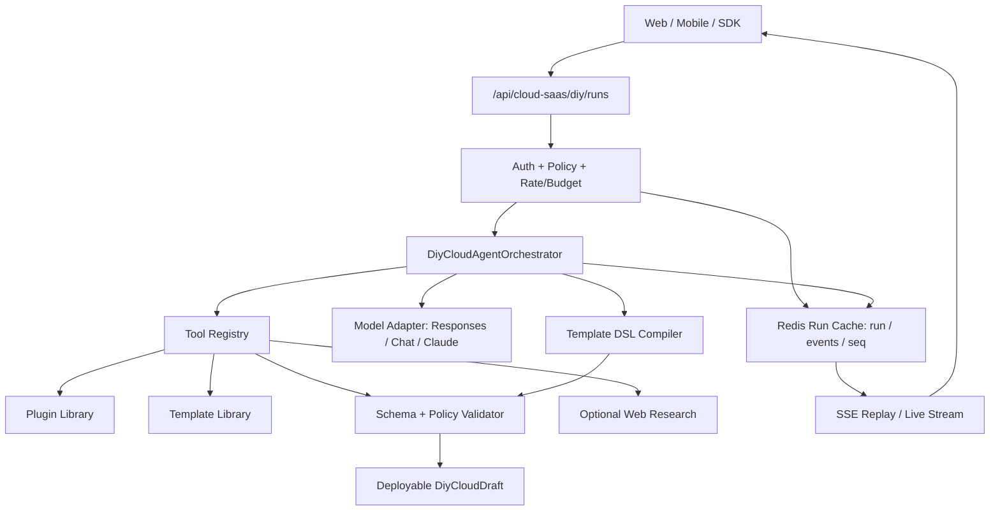

# DIY Cloud Agent 化重构方案

> 目标：把 DIY Cloud 从“固定步骤的模板生成器”升级为“可流式观察、可审计、可恢复、由模型做核心判断的 Cloud Agent 编排系统”。
>
> 实现状态：当前实现已切到 `@earendil-works/pi-agent-core` 的 `Agent` 事件循环，后端拆分为 `diy-cloud-agent/{prompts,skills,tools,model-stream,dsl,events,planner}.ts`。`apps/server/src/services/diy-cloud.service.ts` 只保留门面导出。

## 1. 背景与判断

当前 DIY Cloud 已经具备可用的生成链路：

- 后端入口在 `apps/server/src/handlers/cloud-saas.handler.ts`，提供 `/api/cloud-saas/diy/runs` 与 `/api/cloud-saas/diy/runs/:runId/stream`。
- 生成主体在 `apps/server/src/services/diy-cloud.service.ts`，固定执行 `think`、`search`、`generate`、`validate`、`review` 五步。
- Agent run、事件和最终 draft 只缓存在 Redis，按 24 小时 TTL 自动过期，SSE 可按 `seq` 回放。
- Web 页面在 `apps/web/src/pages/diy-cloud.tsx`，能消费 SSE 事件并展示进度。
- SDK 已同步暴露 TypeScript 与 Python 的 DIY Cloud 生成和流式接口。

现有实现的问题不是“没有流式”，而是 Agent 化不彻底：

- 步骤、目录、UI 面板和 SDK step type 都固定为五步，模型不能动态组织流程。
- 插件/模板选择仍有关键词白名单、黑名单和本地 deterministic planner 兜底，模型只是参与部分 JSON 草案。
- 前端默认只展示阶段摘要，结构化输出和原始模型/工具结果主要藏在 `debug=true`。
- 模型调用本身不是 token / tool-call / decision 级流式；用户看到的是阶段完成后的结果。
- 模板生成仍由服务端固定骨架主导，通常只能生成单 Buddy、固定 namespace 形态。
- Mobile 端没有对等 DIY Cloud 流程，后续新产品能力会出现 Web-only。

重构方向：让模型负责理解、计划、选择、解释和生成候选方案；让服务端负责工具执行、策略边界、密钥处理、模板编译、校验和部署。

## 2. 外部资料依据

本方案只引用官方或一手资料作为架构依据：

- OpenAI Streaming docs：模型响应可以通过 Server-Sent Events 增量返回；同时官方提醒生产环境流式输出会增加内容审核难度，需要单独设计 moderation/guardrail。参考 [Streaming API responses](https://developers.openai.com/api/docs/guides/streaming-responses)。
- OpenAI Responses API：Responses 可统一处理文本、工具、内置 web/file search、MCP tools、function tools 和 structured output。参考 [Create a model response](https://developers.openai.com/api/reference/resources/responses/methods/create)。
- OpenAI Structured Outputs：严格 JSON Schema 可提升结构化输出和 function calling 的可靠性；对 DIY Cloud 这种“模型生成配置草案、服务端再编译校验”的场景，应优先使用 strict schema，而不是只靠 prompt 约束。参考 [Structured Outputs](https://openai.com/index/introducing-structured-outputs-in-the-api/)。
- OpenAI Agents SDK tracing：Agent 运行需要记录 LLM generations、tool calls、handoffs、guardrails 和 custom events，便于调试和生产观测；同时敏感数据是否写入 trace 必须可配置。参考 [Agents SDK Tracing](https://openai.github.io/openai-agents-python/tracing/)。
- Anthropic streaming/tool-use docs：流式可以返回 thinking/tool_use/tool_result 等不同事件形态；工具结果必须严格接回对应 tool use，这说明我们自己的 provider adapter 也要统一抽象工具调用生命周期。参考 [Claude streaming](https://platform.claude.com/docs/en/build-with-claude/streaming) 与 [Claude tool use](https://docs.anthropic.com/en/docs/agents-and-tools/tool-use/implement-tool-use)。
- MCP Tools specification：工具应可由模型根据上下文选择，但产品需要清楚展示哪些工具暴露给模型、什么时候调用，并在人审/危险动作上保留用户确认。参考 [MCP Tools](https://modelcontextprotocol.io/specification/draft/server/tools)。
- Pi Agent Core：`Agent` 原生提供 `message_update`、`tool_execution_start`、`tool_execution_end` 等事件，适合把模型文本、工具调用和工具结果统一转成 DIY Cloud 的 V2 event log。参考 [earendil-works/pi packages/agent](https://github.com/earendil-works/pi/tree/main/packages/agent)。

结论：DIY Cloud 应采用“模型可控工具 + 严格结构化输出 + 事件流 + guardrail + trace”的组合，而不是把复杂判断写成关键词匹配。

## 3. 设计原则

### 3.1 暴露决策依据，不暴露不可审计的隐藏思维

用户希望看到模型的“思考和决策依据”。产品上应返回的是公开、可审计、可落库的 reasoning summary，而不是模型内部逐字 chain-of-thought。

每个关键决策都要结构化返回：

- 模型理解到的目标和约束
- 使用了哪些工具和资料
- 候选方案有哪些
- 为什么选择 A
- 为什么拒绝 B/C
- 哪些事实来自用户输入、插件库、模板库、校验器或部署环境
- 置信度和需要用户确认的风险

### 3.2 模型决策，代码守边界

模型可以决定：

- 需要哪些步骤
- 是否需要检索插件、模板、文档、网络资料
- 选择哪些插件和 Buddy 角色
- 生成几个频道、几个 Buddy、哪些运行时能力
- 哪些密钥是必须、可选或可跳过
- 哪些方案需要二次确认

代码必须决定：

- 用户是否有 `cloud:diy_generate`、`cloud:deploy` 等能力
- 输入 JSON byte/depth/key/array 限制
- 模板策略 allowlist
- SSRF、网络、runtime env reserved key、secret redaction
- 钱包、部署、退款和 Ledger 边界
- 真实部署前的人审确认

### 3.3 工具是 Agent 的能力边界

不要让模型凭空“知道”插件和模板。服务端应暴露明确工具：

- `search_plugins`
- `inspect_plugin`
- `search_templates`
- `inspect_template`
- `validate_template_dsl`
- `compile_template_dsl`
- `collect_required_keys`
- `estimate_runtime_cost`
- `check_user_cloud_context`
- `web_research`，仅用于明确需要联网信息的场景

工具入参必须有 JSON Schema，输出必须做脱敏、裁剪和来源标记。

### 3.4 所有 UI copy 走 i18n

Web 和 Mobile 新增用户可见文案都必须进各端 i18n。模型生成内容本身可以按 locale 生成，但固定 UI 标签不能硬编码。

## 4. 目标架构

推荐新增一层 `DiyCloudAgentOrchestrator`，把现在的“大函数生成”拆成 Agent run。



### 4.1 模型适配层

新增 `DiyCloudModelClient`，不要把 provider 细节散落在 service 里。

```ts
export interface DiyCloudModelClient {
  streamAgentTurn(input: DiyCloudModelTurnInput): AsyncIterable<DiyCloudModelEvent>
  generateStructured<T>(input: DiyCloudStructuredInput<T>): Promise<T>
}
```

适配层职责：

- 统一 OpenAI-compatible Chat Completions、OpenAI Responses、Claude Messages 的事件格式。
- 支持流式 text delta、reasoning summary delta、tool call delta、structured output delta。
- 支持 strict JSON schema；不支持 strict schema 的 provider 必须走服务端校验和 retry。
- 标准化 tool call id、tool name、arguments、tool result。
- 统一超时、取消、重试、token usage 和错误码。

### 4.2 Agent 编排层

`DiyCloudAgentOrchestrator` 只做编排，不直接写插件选择规则：

1. 创建 run。
2. 让模型输出动态 plan。
3. 根据模型工具调用执行工具。
4. 每次工具结果回灌模型。
5. 收集模型 decision events。
6. 让模型生成 Template DSL，而不是直接写最终 Cloud config。
7. 服务端编译 DSL 并强制校验。
8. 输出 draft。

### 4.3 Template DSL

让模型直接生成完整 Cloud config 风险大，而且容易和安全策略耦合。建议引入中间 DSL：

```ts
type DiyTemplateDsl = {
  title: string
  description: string
  space: {
    servers: Array<{
      name: string
      channels: Array<{ name: string; purpose: string }>
    }>
  }
  buddies: Array<{
    name: string
    role: string
    systemPrompt: string
    skills: string[]
    channelBindings: string[]
  }>
  integrations: Array<{
    pluginId: string
    purpose: string
    required: boolean
    requiredKeys: string[]
    skipBehavior: string
  }>
  review: {
    assumptions: string[]
    risks: string[]
    openQuestions: string[]
  }
}
```

服务端 compiler 负责：

- 生成稳定 id、slug、namespace。
- 注入 `model-provider`、`shadowob` 等基础能力。
- 生成 `deployments.agents`。
- 处理 `agent-pack`、provider profile、runtime resources。
- 丢弃 DSL 中不允许的字段。
- 调用 `validateCloudSaasConfigSnapshot` 和 `assertCloudTemplatePolicy`。

## 5. V2 事件协议

现有 `progress` 事件可以保留兼容，但新前端应消费 V2 event log。

```ts
type DiyCloudRunEvent =
  | RunCreatedEvent
  | StepCreatedEvent
  | StepDeltaEvent
  | ToolCallEvent
  | ToolResultEvent
  | DecisionEvent
  | ArtifactPatchEvent
  | GuardrailResultEvent
  | DraftCompletedEvent
  | RunFailedEvent
```

核心字段：

```ts
type BaseRunEvent = {
  schemaVersion: 2
  seq: number
  runId: string
  eventId: string
  timestamp: string
}
```

### 5.1 Step 事件

```ts
type StepCreatedEvent = BaseRunEvent & {
  type: 'step.created'
  stepId: string
  parentStepId?: string
  title: string
  intent: string
  order: number
  iconHint?: 'think' | 'search' | 'build' | 'validate' | 'review' | 'deploy'
}

type StepDeltaEvent = BaseRunEvent & {
  type: 'step.delta'
  stepId: string
  channel: 'summary' | 'rationale' | 'status'
  delta: string
}
```

`step.delta.channel = "rationale"` 只能承载公开推理摘要，例如“我正在比较 Google Workspace 与 Notion，因为用户要求读取 Drive 文档”。不要发送隐藏 chain-of-thought。

### 5.2 Tool 事件

```ts
type ToolCallEvent = BaseRunEvent & {
  type: 'tool.call'
  stepId: string
  callId: string
  toolName: string
  args: Record<string, unknown>
  risk: 'read' | 'write' | 'deploy' | 'bill' | 'external_network'
}

type ToolResultEvent = BaseRunEvent & {
  type: 'tool.result'
  stepId: string
  callId: string
  toolName: string
  ok: boolean
  summary: string
  resultRefs: Array<{
    kind: 'plugin' | 'template' | 'doc' | 'validation' | 'web'
    id: string
    title: string
  }>
  redacted: boolean
}
```

### 5.3 Decision 事件

```ts
type DecisionEvent = BaseRunEvent & {
  type: 'decision'
  stepId: string
  decisionId: string
  title: string
  selected: string
  basis: {
    observations: string[]
    constraints: string[]
    evidence: Array<{
      source: 'user' | 'plugin' | 'template' | 'validator' | 'web' | 'policy'
      ref: string
      summary: string
    }>
    rejectedOptions: Array<{
      option: string
      reason: string
    }>
    confidence: number
    needsUserReview: boolean
  }
}
```

### 5.4 Artifact 与验证结果

```ts
type ArtifactPatchEvent = BaseRunEvent & {
  type: 'artifact.patch'
  stepId: string
  artifact: 'templateDsl' | 'cloudConfig' | 'guidebook' | 'requiredKeys'
  patch: unknown
}
```

模板结构、策略和凭证检查不再作为独立兼容事件输出；Agent 会通过 `progress`
事件持续说明验证依据，并在 `draft.completed.validation` 与
`draft.completed.agentReport.validationChecks` 中返回最终可审查结果。

### 5.5 Run 结束事件

```ts
type DraftCompletedEvent = BaseRunEvent & {
  type: 'draft.completed'
  draft: DiyCloudDraft
}

type RunFailedEvent = BaseRunEvent & {
  type: 'run.failed'
  error: string
  code?: string
  retryable: boolean
}
```

## 6. API 设计

DIY Cloud 生成只保留 Agent run V2 API，历史生成入口已删除。

| Method | Endpoint | 用途 |
|--------|----------|------|
| `POST` | `/api/cloud-saas/diy/runs` | 创建 Agent run，返回 `runId` |
| `GET` | `/api/cloud-saas/diy/runs/:runId` | 读取 run 当前状态、事件摘要和最终 draft |
| `GET` | `/api/cloud-saas/diy/runs/:runId/stream` | 按 `seq` 回放并继续 SSE 直播 |
| `POST` | `/api/cloud-saas/diy/runs/:runId/cancel` | 取消运行 |
| `POST` | `/api/cloud-saas/diy/runs/:runId/feedback` | 在已有 run 上追加用户反馈并派生新 run |

SSE 支持 `Last-Event-ID` 或 `?afterSeq=`，避免刷新后重复展示。

## 7. 临时运行缓存

DIY Cloud run 是一次性生成工作流，不进入 PostgreSQL。服务端只使用 Redis 保存 24 小时 TTL 的临时状态：

| Key | 内容 |
|-----|------|
| `diy-cloud:v2:run:{runId}` | run 基本信息、输入摘要、状态、最终 draft、错误信息 |
| `diy-cloud:v2:run:{runId}:events` | append-only V2 event JSON list |
| `diy-cloud:v2:run:{runId}:seq` | 单 run 内递增 sequence |
| `diy-cloud:v2:run:{runId}:claim` | 防止同一个 pending run 被多个 SSE 连接重复执行 |

事件和 draft 只保留用户可见证据、模型决策摘要、最终 Cloud config 和 guidebook。工具原始返回、模型 raw transcript、文档 excerpt、密钥字段和 SQL/内部错误不会进入 Redis，也不会通过 SSE 返回给用户。

## 8. 后端实施细节

### 8.1 目录建议

```text
apps/server/src/services/diy-cloud/
  agent-orchestrator.ts
  event-log.ts
  model-client.ts
  tool-registry.ts
  tools/
    plugin-tools.ts
    template-tools.ts
    validation-tools.ts
    research-tools.ts
    user-context-tools.ts
  template-dsl.ts
  template-compiler.ts
  guardrails.ts
```

现有 `diy-cloud.service.ts` 中的 planner/generator 逻辑应逐步拆进 orchestrator、tools 和 compiler；外部 API 不再直接暴露旧生成函数。

### 8.2 工具执行策略

每个工具都声明：

- `name`
- `description`
- `inputSchema`
- `risk`
- `requiredCapability`
- `maxBytes`
- `timeoutMs`
- `redactOutput`

工具执行前统一检查：

- actor kind：普通用户发起，系统执行工具
- resource：DIY run、Cloud template、Cloud plugin library
- action：`read` / `generate` / `deploy` / `bill`
- scope/capability：`cloud:diy_generate`
- data class：`server-private`、`cloud-secret` 等

### 8.3 联网研究工具

联网研究只在这些情况启用：

- 用户显式要求接入某个当前变化快的外部平台。
- 模型判断本地插件/模板库信息不足，并产出 `needsWebResearch=true`。
- 研究目标是公开文档，不抓取用户私有资源。

输出只保留摘要、URL、检索时间、引用片段 id，不把整页内容塞进 draft。对供应商价格、API 限制、OAuth scope 等易变信息，要在 UI 上标注“外部资料时间”。

### 8.4 Guardrails

至少需要这些 guardrail：

- prompt/input JSON limits
- model token budget
- tool call count / depth limit
- web research domain allow/deny 策略
- URL SSRF guard
- template policy allowlist
- reserved env key collision
- secret-like text redaction
- wallet/ledger 边界
- deploy 前用户确认

失败策略：

- `failed + blocksRun=true`：停止 run，返回可读错误。
- `warning + blocksRun=false`：继续，但必须展示在 Review。
- repair 后通过：记录 repair notes 和原始失败原因。

## 9. 前端体验方案

### 9.1 Web

Web 不再依赖固定 `STEP_ORDER`。改成 event reducer：

```ts
type DiyRunViewState = {
  runId: string
  steps: Array<StepViewModel>
  eventsByStep: Record<string, DiyCloudRunEvent[]>
  decisions: DecisionViewModel[]
  artifacts: Partial<Record<'templateDsl' | 'cloudConfig' | 'guidebook' | 'requiredKeys', unknown>>
  draft?: DiyCloudDraft
}
```

页面结构：

- 左侧 Timeline：模型动态创建的步骤。
- 中间 Live Step：当前步骤的摘要流、工具调用、工具结果、决策卡。
- 右侧 Artifact Preview：模板 DSL、频道/Buddy 预览、密钥清单、校验状态。
- 底部 Review Bar：评分、必填项、部署前风险、继续部署按钮。

默认展示：

- 当前模型公开推理摘要
- 每个工具调用和返回摘要
- 每个关键决策的 selected/rejected/basis
- guardrail 结果

折叠展示：

- Raw JSON
- redacted model events
- tool result refs
- template patch

### 9.2 Mobile

Mobile 需要同等能力，但布局换成单列：

- 顶部 prompt / run status
- 垂直 timeline
- 当前步骤展开卡
- 决策依据以 accordion 展示
- 最终 Review 和 Deploy wizard 与 Web 共享字段语义

实现上建议抽出跨端模型：

- `packages/sdk` 定义事件类型。
- Web `useDiyCloudRunStream` 与 Mobile `useDiyCloudRunStream` 共享 reducer 逻辑。
- UI 文案分别进 `apps/web/src/lib/locales/*` 和 `apps/mobile/src/i18n/locales/*`。

## 10. SDK 与文档同步

API 变化必须同步：

- `website/docs/en/platform`
- `packages/sdk/src/types.ts`
- `packages/sdk/src/client.ts`
- `packages/sdk-python/shadowob_sdk/client.py`
- `packages/sdk/__tests__/client.test.ts`
- `packages/sdk-python/tests/test_client.py`

TypeScript SDK 建议新增：

```ts
createDiyCloudRun(input): Promise<{ runId: string }>
getDiyCloudRun(runId): Promise<{ run: DiyCloudRun }>
streamDiyCloudRun(runId, options?: { afterSeq?: number }): Promise<Response>
cancelDiyCloudRun(runId): Promise<{ ok: boolean }>
```

Python SDK 建议新增对应 iterator：

```py
def create_diy_cloud_run(...)
def get_diy_cloud_run(run_id: str)
def stream_diy_cloud_run(run_id: str, after_seq: int | None = None) -> Iterator[dict[str, Any]]
def cancel_diy_cloud_run(run_id: str)
```

旧接口直接移除，SDK 只暴露 run 创建、读取、流式回放和取消方法。

## 11. 安全与权限

本重构涉及 AI 生成配置、联网资料、Cloud 部署和密钥提示，属于安全敏感改动。

必须保持：

- Auth middleware 只负责认证，服务层接收明确 Actor 或调用 PolicyService。
- 新 route 标注 actor kind、resource、action、scope/capability、data class。
- OAuth/PAT scope 不能替代 resource access。
- AI 生成模板入库和部署前必须服务端重新校验。
- 任何 wallet 变更仍走 LedgerService。
- 不允许用户 env 覆盖 reserved runtime env。
- 不允许生成/注入 `SHADOWOB_USER_TOKEN` 等完整用户 token。
- 运行时 secret、provider key、provision state 都要 redaction 后才能 trace/落库。

上线前必须跑：

- focused unit/integration tests
- DIY Cloud SSE replay tests
- SDK tests
- Web E2E
- Mobile E2E
- `pnpm check:security-pr`

## 12. 测试计划

### 12.1 Unit

- event reducer 顺序、去重、断线恢复
- model adapter event normalization
- tool registry schema validation
- Template DSL compiler
- guardrail blocking/warning
- redaction

### 12.2 Integration

- `POST /diy/runs` 创建 run
- `GET /diy/runs/:id/stream?afterSeq=...` 回放并继续
- tool call -> tool result -> model continuation
- invalid DSL repair
- policy violation blocks run
- cancellation

### 12.3 E2E

- Web：生成、断线恢复、查看决策依据、反馈再生成、部署向导。
- Mobile：同样流程，验证 i18n 与跨端 session。
- 安全：敏感 key 不出现在事件、DB、日志和 trace。

## 13. 分阶段落地

### Phase 0：评审与协议冻结

- 确认 V2 event schema。
- 确认 Template DSL。
- 确认旧接口删除范围和迁移窗口。
- 确认是否需要 DB 持久化还是先 Redis Stream。

### Phase 1：事件日志与 V2 API

- 新增 run/event store。
- 新增 `/diy/runs` API。
- SDK 增加 V2 类型和方法。

### Phase 2：Agent Orchestrator 与工具注册

- 新增 model client。
- 新增 tool registry。
- 把 plugin/template/validation/search 封装为工具。
- 先保留旧 deterministic planner 作为异常兜底，但 UI 标注 `fallbackPlanner=true`。

### Phase 3：模型主导决策

- 插件选择改为模型在候选工具结果上输出 `decision`。
- 本地关键词逻辑降级为搜索召回增强，不再作为最终选择依据。
- 模板生成改为 Template DSL + compiler。

### Phase 4：Web 动态 Timeline

- 去掉固定 `STEP_ORDER` UI 依赖。
- 默认展示 decision basis。
- Raw JSON 进入折叠详情。
- 支持断线恢复和 `afterSeq`。

### Phase 5：Mobile 对等体验

- 新增移动端 DIY Cloud 页面/流程。
- 复用事件 reducer 和 SDK 类型。
- 补齐移动端 i18n。

### Phase 6：观测、安全和 CI

- trace run、tool、guardrail、token usage、latency。
- 加 secret redaction assertions。
- 跑 security PR check。
- 补远端 CI 验证。

## 14. 需要评审的问题

1. V2 run event 是否直接落 DB，还是先用 Redis Stream 过渡？
2. 是否接受 Template DSL 作为长期稳定抽象，而不是让模型生成完整 Cloud config？
3. Web research 是否默认关闭，仅在模型请求且用户确认后启用？
4. 是否允许模型动态创建多 Buddy / 多服务器结构，还是第一阶段只开放多频道单 Buddy？
5. Agent trace 是否只保留 redacted payload，还是开发环境允许 opt-in 保存完整 trace？
6. 移动端入口放在 Cloud 页面、Discover 玩法，还是 prompt deep link？

## 15. 建议结论

建议采用“V2 事件协议 + Agent Orchestrator + 工具注册 + Template DSL + 服务端强校验”的方案。

这样可以让 DIY Cloud 真正利用模型能力：模型动态规划、调用工具、比较候选、解释取舍、生成方案；同时服务端仍然保留 Shadow Cloud 的安全边界、部署边界和审计能力。对用户来说，生成过程不再只是进度条，而是一条可恢复、可追踪、可复核的 Agent 工作流。
