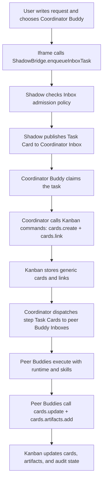
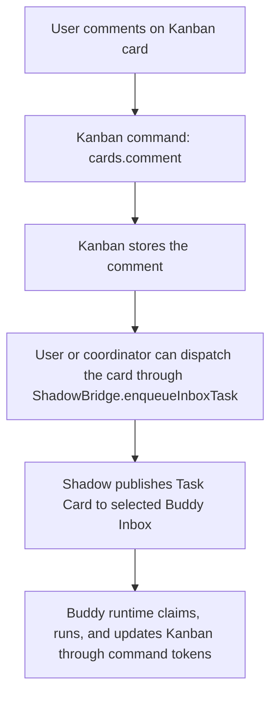
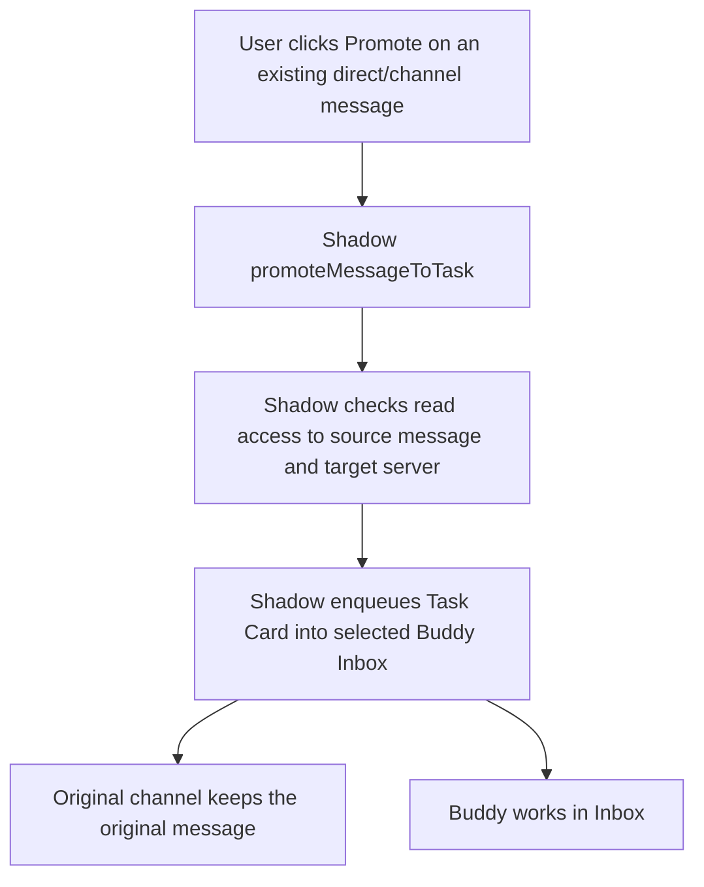
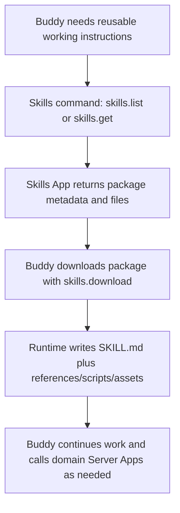

# Multica 能力复刻：Buddy Inbox + Server App 方案

调研日期：2026-05-26

Multica 的原理、runtime、skills、autopilot、squad 细节保留在 [Multica 深度调研：任务流、Runtime 与 Skills](./multica-deep-research.zh-CN.md)。本文只保留 Shadow 的实现方案、当前进度和本轮收敛后的边界。

## 结论

Shadow 不需要在核心里内置 Kanban、Issue、Task Queue 等业务模型。用现有 **channel + message cards + Server App command** 可以覆盖 Multica 的用户可见能力：

- **Inbox 是特殊 channel**：Buddy Inbox 是 private server channel，用 topic marker 标识用途。
- **任务是 Task Card**：状态、进度、claim、source resource 都记录在 message `metadata.cards[]` 的 `kind='task'` card。
- **领域对象属于 Server App**：Kanban card、GitHub issue、Linear issue、CRM ticket 等都由 Server App 自己实现。
- **Skills 是独立 Server App**：技能库不放进 Kanban；`skills` 负责发布、读取、导出和安装记录。
- **定时任务不进入 Kanban**：Multica 的 Autopilot 本质是 schedule/webhook/manual trigger。Shadow MVP 不保留 `autopilot` 概念；后续若需要，用 automation/scheduler app 投递普通 Inbox Task Card。

复刻 Multica 的关键不是复制表结构，而是复刻这条链路：业务事件 -> Server App outbox -> Buddy Inbox Task Card -> Buddy runtime claim -> 执行 -> 回写 card status/progress。

## 当前进度

已落地：

- Buddy Inbox 使用 private server channel，不新增 inbox/task queue 表。
- 统一 `metadata.cards[]`，新增 `task` card。
- Task Card 支持 `source.resource`、`data.idempotencyKey`、`claim`、`capability`、`progress`。
- Server App command 统一通过 `shadow.protocol === "shadow.app/1"` + `shadow.outbox.inboxTasks` 声明 Inbox 投递，Shadow 自动投递到 Buddy Inbox。
- Connector 会把指向当前 Buddy 的 active task card 视为显式触发，即使普通频道是 mention-only。
- Connector 执行前 claim task，开始时标记 `running`，成功后标记 `completed`，失败后标记 `failed`。
- Web 和 mobile 都能看到 Inbox 与 Task Card。
- Web Inbox 已从普通频道列表中分离，显示为 **Buddy Inbox** 区块。
- Inbox 仍保留普通聊天输入框；Task Card 从输入框左侧 `+` 菜单创建，避免任务投递占掉所有对话场景。
- Web Task Card 已改成任务卡片布局：Buddy avatar、状态 badge、来源、优先级、时间、进展和动作区分层展示；含 Task Card 的消息不再重复渲染普通 message 正文。
- Mobile Task Card 已去掉重复正文，并补充 Buddy avatar/assignee 信息。
- Buddy 在 Inbox 中回复任务时，server 会优先按 `replyToId` 精确完成对应 Task Card；没有 reply target 时回退到最近一个分配给该 Buddy 的 active task。
- Task Card UI 已去掉“重新开始/重新打开”。失败或完成后的二次尝试应创建新 Task Card，并可用 `source` / `data.retryOf` 关联旧任务。
- Kanban 只保留通用 board/card/issue 状态能力；任务投递通过 Shadow Bridge / Server App outbox 写入 Buddy Inbox，由协调 Buddy 负责拆分、派发和验收。
- Skills 已拆成独立 `skills` Server App，并改为 Vite + React + TanStack Query 前端。
- Skills App 按完整 skill package 存储，不再把技能当单文件：`SKILL.md` 是入口，`references/`、`scripts/`、`assets/`、`examples/` 是一等文件。
- Kanban 中的 Autopilot 与技能库命令已删除。
- Trainer 已改成 Vite + TanStack Router 的多页面 Server App：`/problems`、`/submissions`、`/import`、`/problems/$challengeId`、`/problems/$challengeId/submissions/$submissionId`。
- Trainer 已验证 “提交代码 -> Strategy Buddy Inbox task -> Buddy 调 Server App command 获取提交 -> Buddy 写回分析 -> 前端实时显示结果”。
- Skills App 当前命令收敛为 `skills.list`、`skills.get`、`skills.download`、`skills.upload`、`skills.install`，安装通过 Inbox 给指定 Buddy 派发下载 zip 并安装的任务。
- Skills App 的搜索已改为 TanStack Query 按搜索词隔离缓存，输入框 debounce 后才触发请求，避免逐字请求和旧结果串到新搜索词。
- `skills.search` 不再只依赖本地快照：有搜索词时会先查 server library，不足时调用 `npx skills find <query>` 动态发现更多 skills.sh 结果，并把结果按完整 package 元数据持久化到 server library。
- Server App 通信协议已收敛到 SDK：iframe 端用 `new ShadowBridge({ appKey })` 调 `command()`、`inboxes()`、`enqueueInboxTask()`；Web host 和 Mobile WebView host 用 `buildShadowServerAppInboxTaskRequest()` / `buildShadowServerAppInboxDelivery()` 统一完成 bridge fulfillment；服务端 command 用 `new ShadowServerAppOutbox().enqueueInboxTask(task).attachTo(result)` 产生 `shadow.outbox.inboxTasks`。Shadow Server 只消费 `shadow.outbox.inboxTasks`，投递结果回填到 `shadow.outbox.deliveries/errors`，应用层不再散落 `shadowInbox*` 顶层字段。
- Buddy Inbox 协议已抽到 shared/SDK：topic marker、Task Card 状态机、admission policy、Server App realtime event 常量都有统一定义；TS SDK、Python SDK、CLI 已覆盖 list/ensure/enqueue/claim/update/retry/promote。
- Inbox 入站投递已支持 admission policy：`allow`、`deny`、`first_time`、`every_time` 通过 Inbox channel-specific agent policy 保存；Task Card claim/update/retry 已收紧到目标 Buddy、claim holder、Buddy owner 或 server admin。
- Inbox admission policy 已有 Web 管理入口：Buddy Inbox item 旁的授权按钮可设置默认策略、添加放行规则、批准或拒绝 pending delivery。
- Server App command token 已支持 task binding：Buddy claim Task Card 后调用 command 可携带 `messageId/cardId/claimId`，Shadow 会校验 active claim holder，并把 `shadow.task` 写入 OAuth2 bearer introspection。
- OpenClaw connector 已按 Task Card 拆分 session key，并把 message/card/claim/workspace 注入任务 prompt。Hermes connector 也会把 task binding CLI flags 与 workspace id 写进任务 prompt。
- Skills install 任务已注入 runtime 信息：Buddy 通过 `skills.download` 下载完整 zip package，再安装到自己的 runtime；如果目标 Inbox 需要审批，安装结果返回 pending delivery 而不是误判失败。
- Skills directory crawler 已加并发保护和失败状态保留：同一时间只跑一个 skills.sh snapshot，失败会记录 `lastError`，不会清空上一次成功索引。
- Canonical API 文档见 [Buddy Inbox Protocol](../api/buddy-inbox.md)。

后续增强，不阻塞当前 Multica 能力复刻：

- 超时释放、失败重试视图、死信视图。
- Skills 版本 diff、审核流、签名/审计评分。
- provider 原生 skills 目录的自动写入仍在 runner 侧逐步完善；当前先通过 Inbox prompt + task-bound command token 保证下载和安装链路可执行。

## Inbox 前端定位

Inbox 不是“另一个聊天频道”，而是 **Buddy 的任务投递和执行状态面板**。

当前 UX 约定：

- 左侧导航把 Inbox 放在独立 **Buddy Inbox** 区块，不再混入普通 text channels。
- Inbox item 用 Buddy avatar 作为主视觉，显示 unread/open/not-ready 状态。
- 进入 Inbox 后，顶部显示任务队列 badge。
- 底部保持普通聊天 composer；任务创建入口放进左侧 `+` 菜单。
- Task Card 是任务信息的唯一主视图；message content 只作为传输 fallback/通知摘要，前端不重复展示。

这样保留了 channel 的实时、权限、消息历史能力，同时避免用户把 Inbox 理解成普通讨论频道。

## Task Card 约定

统一名称使用 **Task Card**，不使用 `queueCard`。队列只是 runtime 处理方式，产品语义是任务。

核心语义：

- `status`：`queued`、`claimed`、`running`、`completed`、`failed`、`canceled`、`transferred`。
- `assignee`：目标 Buddy 的 agent/user 标识。
- `source`：任务来源，可以是 user、agent、server_app。
- `source.resource`：业务对象引用，例如 Kanban card、issue、message。
- `claim`：runtime 领取信息和过期时间。
- `capability`：task-scoped 能力声明，后续绑定更严格 token。
- `progress`：状态流和备注。
- `data`：Server App 可扩展元数据，包含幂等 key、外部资源 id、retryOf 等。

Shadow 核心只理解这些协议字段，不理解 Kanban/issue 的业务字段。

## 权限模型

权限分为两层：

- **入站投递权限**：谁可以向 Buddy Inbox 投递 Task Card。
- **出站执行权限**：Buddy claim 后可以对 source resource 做什么。

当前实现：

- Inbox 复用 private channel 可见性。
- Buddy owner 或 server admin 可以 ensure Inbox。
- Inbox admission policy 已支持 `allow`、`deny`、`first_time`、`every_time`，存储在 Inbox channel-specific agent policy config。
- Server App command 先走 Shadow 的 command permission、approval、grant。
- Server App 返回 `shadow.outbox.inboxTasks` 后，由 Shadow 解析目标 Buddy 并投递。

Admission policy 不需要新任务模型，只是在 Inbox channel 之上增加规则：

- `allow`: 某个 Server App / Buddy / user 可直接投递。
- `first_time`: 第一次投递需要 owner 批准，之后放行。
- `every_time`: 每次投递都需要 owner 批准。
- `deny`: 明确拒绝某个来源。

关键边界：

- Owner 可见 Buddy Inbox，但不等于绕过 source resource 权限。
- Task Card 不保存 secret，只保存摘要、状态和 resource 引用。
- financial、secret、cloud-secret 默认应要求显式审批。
- Buddy 调 Server App command 仍走 Server App grant/approval，不因 task capability 自动绕过。

## Server App Outbox

Server App 不需要调用 Buddy Inbox 专用接口。它只要在 command 结果里返回：

```json
{
  "shadow": {
    "protocol": "shadow.app/1",
    "outbox": {
      "inboxTasks": [
        {
          "title": "Ask Strategy Buddy for launch risks",
          "body": "Review this Kanban card and propose next steps.",
          "assigneeLabel": "Strategy Buddy",
          "idempotencyKey": "kanban:card:card_bot:dispatch:strategy-buddy",
          "resource": {
            "kind": "kanban.card",
            "id": "card_bot",
            "label": "Ask Strategy Buddy for launch risks"
          }
        }
      ]
    }
  }
}
```

Shadow Server 会在 command 成功后完成：

- 按 `agentId`、`agentUserId` 或 `assigneeLabel` 解析 Buddy。
- 确认 Buddy 属于当前 server。
- 用 idempotency key 去重。
- 投递 Task Card 到 Buddy Inbox。
- 在 command 响应中回填 `shadow.outbox.deliveries/errors`。

这让 Kanban、Issue、CRM、CI、scheduler app 都能用同一种底层出站协议。

## Kanban App 边界

Kanban 仍是普通 Server App，不进入 Shadow 核心。它只提供通用 Kanban card graph 命令：

- `boards.get`
- `cards.get`
- `cards.create`
- `cards.update`
- `cards.link`
- `cards.move`
- `cards.assign`
- `cards.comment`
- `cards.rerun`
- `cards.artifacts.add`

覆盖的 Multica 入口：

- **人类提交复杂需求**：iframe 通过 `ShadowBridge.inboxes()` 选择服务器内 Buddy，再用 `ShadowBridge.enqueueInboxTask()` 把需求交给协调 Buddy。
- **协调 Buddy 拆分任务**：Buddy claim Task Card 后，用 task-bound command token 多次调用 `cards.create` 并用 `cards.link` 建立依赖、父子或相关关系。
- **协调 Buddy 派发任务**：协调 Buddy 根据服务器 Buddy 能力，把步骤作为 Inbox Task Card 投递给对应 Buddy。
- **执行 Buddy 回写结果**：执行 Buddy 调 `cards.update` 和 `cards.artifacts.add` 写入状态、workspace artifact reference 和审计轨迹。

不再由 Kanban 承担：

- 技能库：由 `skills` Server App 承担。
- 定时任务：由未来 automation/scheduler app 投递普通 Task Card。
- 业务流水线：业务拆解、工具调用、runtime 执行和最终验收都属于 Buddy / runtime / skills，不写死在 Kanban。

## Skills App 边界

`skills` 是独立 Server App，负责：

- `skills.list`：列出技能。
- `skills.get`：读取技能 package 元数据与文件。
- `skills.download`：下载完整 zip 包，供 Buddy/runtime 安装。
- `skills.upload`：上传完整 zip 包或单个 markdown 技能。
- `skills.install`：向指定 Buddy Inbox 派发安装任务，由 Buddy 通过 command 下载 zip 并安装。

Skills App 不需要知道 Kanban；Kanban 也不需要知道 Skills。Buddy 可以在执行 Kanban Task Card 时，按权限读取 Skills App 的技能，并按普通 Server App command 调用 Kanban。

技能结构参考 Anthropic Agent Skills：

- 一个 skill 是目录包，不是单个 prompt。
- `SKILL.md` 负责触发描述、渐进披露和主要工作流。
- `references/` 承载较长背景文档。
- `scripts/` 承载可执行 helper。
- `assets/` 承载模板、图片、字体等输出资源。
- `examples/` 承载样例输入输出。

Shadow 的 Skills App 当前支持前端搜索、查看 package 文件、上传 zip/markdown、下载 zip，并把安装请求投递到指定 Buddy Inbox。

当前搜索/安装链路：

- 前端输入只更新本地状态；400ms debounce 后才更新 URL search 和 TanStack query key。
- TanStack query key 使用 `['skills', debouncedQuery]`，不同搜索词的请求和缓存隔离。
- `skills.search` 会先返回 server library 中的命中项；如果结果不足，会调用 `npx skills find <query>`，解析 `owner/repo@skill`、install count 和 skills.sh URL，并写入本地 library。
- `skills.install` 不直接修改 Buddy runtime 文件系统，而是向目标 Buddy Inbox 投递 Task Card。Buddy 需要通过 `skills.download` 下载 zip，再安装完整 package。

## Trainer App 验证

`trainer` 是对 Multica “issue 分配给 agent 后执行并回写”的一个业务 App 验证：

- 问题列表、提交列表、导入源、题目详情、提交详情各自是 TanStack Router route。
- 用户在题目详情里选择 Buddy 和 review focus 后提交代码。
- `submissions.create` 返回 `shadow.outbox.inboxTasks`，Shadow 投递 Task Card 到 Buddy Inbox。
- Buddy 通过 `submissions.get` 拉取提交和题目，用沙箱/推理完成评审后调用 `submissions.analyze`。
- 前端通过 Server App event stream 和 Query invalidation 更新提交详情。

本轮本地验证：

- 在 `http://localhost:3000/app/servers/shadow-plays/apps/trainer` 提交 Two Sum 到 Strategy Buddy。
- 生成提交 `sub_9pj3huu`。
- Strategy Buddy 已回写分析，状态为 `analyzed`，结果为 `incomplete`，分数 `0/100`。
- 前端主要按钮路径已验证：Problems、Submissions、Import、provider filter、problem row、console tabs、Reset、Submit、submission detail。
- Trainer dev 模式下 Monaco worker 和 font asset 已修复，不再因跨源 worker 或 `/@fs` 字体 404 导致按钮点击时报错。

## 流程图

### 协调 Buddy 创建并推进 Kanban Issue



### 评论 @Buddy



### 从普通消息 promote 为任务



说明：Promote 是显式动作，用来把普通聊天消息转成任务。`general` 里出现的 `Promote smoke ...` 是本地验证时创建的测试消息，不是默认产品行为。

### Skills 独立调用



## Multica 功能覆盖

| Multica 用户能力 | Shadow 映射 | 当前状态 |
| --- | --- | --- |
| 分配 issue 给 agent | Coordinator Buddy -> Inbox Task Card | 通过 Bridge / outbox 投递，不由 Kanban 写死 |
| 添加卡片并交给 agent | Coordinator Buddy calls `cards.create` / `cards.link`, then dispatches Task Cards | Kanban 只存通用 card/link/status |
| 评论里 `@Agent` | Server App comment command -> Inbox Task Card | Kanban `cards.comment` |
| 直接聊天 | 普通 channel/DM | 已有 |
| 把聊天变任务 | Explicit promote -> Inbox Task Card | 后端协议已实现 |
| agent_task_queue | Inbox channel + Task Card + claim | 已实现 MVP |
| daemon/runtime claim | connector claim card -> running/completed/failed | 已实现 MVP |
| progress messages | Task Card progress + Inbox reply/thread | 已实现 card progress |
| skills | 独立 Skills Server App，多文件 package，可 search/upload/download/install | 已实现 MVP：支持 skills.sh 快照、`npx skills find` 动态搜索、zip 下载、Inbox 安装派发、pending approval 和 task-bound 下载 |
| 定时触发 | automation/scheduler app -> Inbox Task Card | 不放入 Kanban，后续做独立 app |
| squads | leader Buddy Inbox 或 group Inbox | 可用同一协议扩展 |

未完全覆盖的 Multica 能力：

- **Daemon workspace 生命周期**：Task Card 已生成 `workspaceId`，OpenClaw 已按 task session 隔离，Hermes/OpenClaw prompt 会暴露 workspace id；还缺统一 GC、provider 原生上下文文件和运行记录归档。
- **Task-scoped token**：Server App command token 已绑定 active claim；后续还需要把 task scopes 映射到更细的 resource action policy。
- **Skills runtime 注入**：Skills App 已能存储、搜索、下载完整 zip，并通过 Inbox 派发安装；当前由 Buddy 使用 task-bound `skills.download` 安装，后续再把 Claude/Codex/Copilot/OpenClaw 等 provider 的目录写入统一自动化。
- **Autopilot UI**：Shadow 不把 Autopilot 放进 Kanban；需要时应新增 automation/scheduler Server App，将 schedule/webhook/API/manual trigger 统一投递到 Inbox Task Card。
- **Squad 编排**：协议可用 leader Buddy Inbox/group Inbox 扩展，但尚未实现 squad 成员、leader 路由、子任务分发和汇总 UI。
- **Inbox admission policy UI**：基础配置和 pending approval 已有；后续需要补更细的审计日志、批量规则和风险提示。

## Kanban 协调者 E2E 验收记录（2026-06-06）

本轮使用新 Server `kanban-polish-e2e-pol30e2e` 和云端 Buddy 团队验证一句话任务：

> 请基于 https://www.capcut.com/ 生成一支面向小团队增长和内容营销人的可发布营销视频。

验收结果：

- 协调者 Buddy 自行发现 Server 内 Buddies，创建并推进 5 张通用 Kanban 卡片：调研、脚本、渲染、QA、交付准备。Kanban 仍只保存通用 card/link/comment/status/artifact 引用，视频只是本次场景。
- 最新 Workspace 视频 artifact 为 `artifact_aohu6jf`，Workspace file id 为 `ab7e7ec9-a6ff-4c1c-a59a-37d7ae476d8d`，文件名 `CapCut_营销视频_v2.mp4`。
- `ffprobe` 验证结果：`video/mp4`，15,863,793 bytes，35 秒，H.264 1080x1920，AAC 音频。
- Chrome 打开 Shadow 内嵌 Kanban 验证：Backlog/Todo/In Progress/In Review 均为 0，Done 为 5；页面中原生 `<select>` 数量为 0，Buddy 选择器为 React `role="combobox"`。
- 验收截图保存到 `.tmp/screenshots/kanban-pol30-chrome-done.png`。

本轮补强的通用机制：

- `cards.update` 和 `cards.move` 增加状态单调性保护。`done` 卡片不能被普通 running/queued 更新降级；已有 Workspace artifact 且处于 review/completed 的卡片不能被过期进度更新打回 running。显式重跑必须走 `cards.rerun`。
- `cards.artifacts.add` 在运行中的已派发卡片收到 Workspace artifact 后，自动把卡片推进到 review，并把 Buddy 状态标记为 completed，减少 Worker 依赖额外 `cards.update` 顺序的风险。
- 依赖门控同时支持两种通用语义：`dependency` 表示 source 是上游、target 是下游；`depends_on` 表示 source 依赖 target。上游进入 done，或进入 review 且已有 Workspace artifact 后，下游才可派发。
- `.tmp/setup-kanban-buddy-e2e-polish.js` 中的协调者模板要求 Kanban 管理的 Worker 派发优先走 `cards.dispatch`，禁止直接 Inbox enqueue 后手写 running 状态，除非明确降级并留下评论。

本轮验证命令：

```bash
rtk pnpm -C integrations/kanban exec vitest run src/data.test.ts src/client/react-select.test.tsx
rtk pnpm -C integrations/kanban typecheck
rtk pnpm -C integrations/kanban build
rtk pnpm biome check integrations/kanban/src/data.ts integrations/kanban/src/data.test.ts integrations/kanban/src/server.ts integrations/kanban/src/outbox.ts integrations/kanban/src/client/react-select.tsx integrations/kanban/src/client/react-select.test.tsx integrations/kanban/src/client/main.tsx integrations/kanban/src/client/styles.css
```

结论：Multica 的用户可见工作流可以覆盖。Shadow 的取舍是：不复制 Multica 的业务表，不把 Kanban/Issue/Autopilot 固化到核心，只把执行入口统一成 Inbox Task Card。
