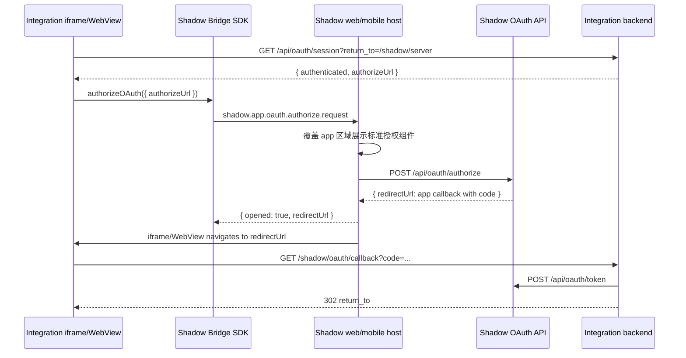

# Server App Bridge OAuth 最佳实践

状态：作为 integrations 迁移的目标实践使用。Kanban 和 Flash 是当前参考实现。

## 背景

Integration app 是独立应用，不应该把 iframe bridge 当作登录、鉴权或业务数据读写的基础协议。App 后端仍然拥有自己的 OAuth callback、token exchange、app session 和业务权限。Bridge 只负责嵌入 Shadow web/mobile 时的宿主体验增强。

OAuth 授权是 Bridge 适合承载的宿主体验：用户在 Shadow 内打开 app 时，授权页面应该由 Shadow 宿主覆盖当前 app webview/iframe，而不是让 app iframe 跳转到 Shadow，也不是打开新的浏览器窗口。

## 为什么不用 iframe 跳转或弹窗

- Shadow OAuth 授权页属于 Shadow 安全边界，不应被第三方 app iframe 直接承载。生产环境的 CSP、`frame-ancestors`、sandbox、第三方 cookie 策略都会让这个模式不稳定。
- `window.open` 会制造上下文切换，移动端和内嵌 WebView 体验更差，也容易被浏览器拦截或在完成页留下空白状态。
- 弹窗完成页需要 `opener.postMessage`、轮询窗口关闭、纯文本错误页等补丁逻辑，导致每个 integration 重复造轮子。
- 拒绝授权时，iframe 不应该被导航到 `Authorization denied: access_denied` 这类中间页。拒绝是一次可恢复的 UI 状态，不是 app 导航目标。

## 推荐模型

Bridge OAuth 是宿主授权代理，而不是新的 token 协议。



关键边界：

- App 只通过 `shadowApp.authorizeOAuth({ authorizeUrl })` 请求宿主进入授权模式。
- Host 校验请求来自当前 active app frame，并校验 `authorizeUrl` 是 Shadow 的 OAuth authorize URL。
- Host 在父页面或 native 宿主层渲染统一授权组件。授权组件覆盖当前 app 区域，而不是浏览器弹窗。
- 用户同意后，Host 使用 Shadow 的一方登录态调用 `/api/oauth/authorize`，拿到 integration callback 的 `redirectUrl`。
- Host 只把 app iframe/WebView 导航到 integration callback，不把 app iframe 导航到 Shadow OAuth 页面。
- 用户拒绝后，Host 关闭授权组件并通过 Bridge 返回 `access_denied`。App 留在自己的授权门禁页，显示可重试状态。

## Integration 客户端要求

客户端应该使用 SDK 的标准能力：

```ts
import { createShadowServerAppClient } from '@shadowob/sdk'

const shadowApp = createShadowServerAppClient()

await shadowApp.authorizeOAuth({ authorizeUrl }, { timeoutMs: 10 * 60 * 1000 })
```

实现规则：

- 从 app 后端读取 OAuth 状态，例如 `GET /api/oauth/session?return_to=/shadow/server`。
- `authorizeUrl` 必须由 app 后端生成，客户端不要拼接 `client_id`、`redirect_uri`、`state`。
- 嵌入 Shadow 且需要 OAuth 时，自动触发一次 `authorizeOAuth`，让用户直接进入宿主授权模式。
- 自动触发必须有去重。对同一个 `authorizeUrl` 只自动启动一次，拒绝后不要循环弹出授权组件。
- 用户拒绝后，展示 app 自己的可恢复状态和重试按钮，不要 fallback 到 `window.open`。
- 只有在 `authorizeOAuth` 返回 `{ opened: false }` 或 Bridge 不可用，并且当前是独立访问模式时，才允许当前页面导航到 `authorizeUrl`。
- 不要使用 `popup=1`、`window.open`、`opener.postMessage`、弹窗关闭轮询或纯文本完成页。
- 成功授权后，iframe 会短暂进入 app callback。callback 必须立即 redirect 回 `return_to`，客户端用 loading/auth gate 覆盖这段过程，避免露出只有文字的中间页。

建议 UI 状态：

- `loading`：读取 OAuth session 或等待 Bridge 授权结果。
- `requires_oauth`：显示授权门禁，嵌入时自动进入授权模式一次。
- `denied`：用户拒绝授权，停留门禁页并提供重试。
- `authenticated`：加载 app 数据。
- `misconfigured`：OAuth client、redirect URI、server URL 等配置缺失。

## Integration 服务端要求

每个 integration 后端保留自己的 OAuth 边界：

- `/api/oauth/session` 返回配置状态、当前 app session、用户摘要和 `authorizeUrl`。
- `/shadow/oauth/callback` 校验 `state`，交换 `code`，写入 app session cookie，然后 `302` 回安全的 `return_to`。
- `error=access_denied` 或其他 OAuth 错误也应该 `302` 回安全的 `return_to`，并通过 query 或短期 server-side 状态告诉客户端失败原因。
- callback 不返回纯文本错误页，不返回弹窗完成 HTML，不依赖 `window.opener`。
- `return_to` 只能是 app 内部路径。不要允许任意外部 URL。
- `state` 必须签名、短期有效，并绑定 `return_to`、Shadow server context、client id 和 redirect URI。
- token exchange、refresh token、app session 都只在 app 后端保存。不要把 client secret、refresh token、完整 Shadow user token 暴露给 iframe、localStorage、Buddy runtime 或第三方 worker。

Cookie 注意事项：

- 如果 app 和 Shadow 不同站点，并且 app session 依赖 iframe cookie，生产环境需要 `SameSite=None; Secure`。
- 对第三方 cookie 限制更严格的浏览器或 WebView，应优先评估后续的 launch-bound grant handoff，减少对 iframe cookie 的依赖。

## Shadow Host 要求

Web 和 mobile 宿主都应该实现同一个 Bridge capability：`oauth.authorize`。

Host 行为：

- 只在实际支持宿主授权 UI 时，通过 capability 暴露 `oauth.authorize`。
- 收到 `shadow.app.oauth.authorize.request` 后，校验请求来源、appKey、active frame 和 `authorizeUrl`。
- 授权 UI 覆盖 app webview/iframe 区域，背景可以保持 app 当前画面但不可交互。
- 同意授权时调用 Shadow OAuth authorize API，并把返回的 integration callback URL 交给当前 app frame。
- 拒绝授权时返回 Bridge failure，错误码使用 `access_denied`，关闭覆盖层，不导航 app frame。
- loading、失败和重试状态都在宿主授权组件内处理，integration 不需要复制 Shadow 授权 UI。

Host 不应该：

- 让 integration iframe 直接打开 Shadow OAuth authorize 页面。
- 调用 `window.open` 创建授权窗口。
- 把 OAuth code、access token 或 refresh token 通过 Bridge 发给 integration 客户端。
- 在拒绝授权时把 iframe 导航到错误文本页。

## 安全边界

Bridge OAuth 只解决授权 UI 承载位置，不改变 OAuth 和 app 权限模型。

- Shadow OAuth scope 只表示 token 能调用哪些 Shadow API，不等于用户对某个 server、channel、Buddy 或 app 资源有访问权。
- App 后端的敏感操作仍要检查 app session、Shadow 资源权限和 app 自有业务权限。
- Buddy、worker、cloud runtime 不应拿到完整用户 OAuth token。需要回写 app 数据时，使用 task-scoped token、Shadow task claim 或 app 后端可 introspect 的短期凭证。
- App 的长期 UI 数据应保存 app-owned snapshot，不要持久化 Shadow signed media URL。
- OAuth 回调和 webhook 入口要做输入限制、签名/状态校验、重放保护和审计。

## 迁移清单

改造现有 integration 时逐项检查：

1. 删除 `window.open(authorizeUrl)`、popup close polling、`opener.postMessage` 和 popup completion HTML。
2. `/api/oauth/session` 不再接受或生成 `popup=1` 模式。
3. 客户端统一调用 `createShadowServerAppClient().authorizeOAuth({ authorizeUrl })`。
4. 嵌入 Shadow 时自动启动授权一次，拒绝后停止自动重试，保留手动重试入口。
5. Bridge 不可用时，只在独立访问模式用当前页面跳转作为 fallback。
6. `/shadow/oauth/callback` 成功和失败都 redirect 回 app 内部 `return_to`，不输出纯文本中间页。
7. i18n 文案移除“弹出的窗口中完成 OAuth”这类描述，改为“连接 Shadow”或“授权应用”。
8. Web 和 mobile 都验证 `oauth.authorize` capability，确保同一 app 行为一致。
9. 覆盖同意、拒绝、关闭授权层、刷新页面、HTTPS、path-mounted runtime、mobile WebView 等路径。
10. 保留 app 后端 OAuth session 和业务权限测试，不把 Bridge 测试当作鉴权测试的替代品。

## 验收标准

一个 integration 迁移完成后，应满足：

- 在 Shadow 内打开 app，未授权时自动进入宿主授权模式，没有浏览器新窗口。
- 授权 UI 看起来属于 Shadow，而不是 integration 自己复制的 Shadow 页面。
- 同意后不会露出只有文字的 callback 页面，最终回到 app 的原目标路径。
- 拒绝后不离开 app，不出现 `Authorization denied: access_denied` 页面，可手动重试。
- 在独立浏览器直接打开 app 时，仍然可以完成标准 OAuth redirect flow。
- App API、数据写入、Buddy dispatch、media snapshot 等业务路径不依赖 Bridge。

## 后续方向：Launch-bound Grant Handoff

如果要进一步减少 iframe callback 和第三方 cookie 依赖，可以演进为 launch-bound grant handoff：

1. App iframe 发起 `oauth.authorize`。
2. Host 完成 Shadow OAuth consent。
3. Shadow 后端把授权结果绑定到当前 app launch/install/session id。
4. App 后端用 launch token 或一次性 handoff code 向 Shadow 后端换取 app session 或 OAuth grant。
5. iframe 不再经历浏览器级 callback 导航。

这个方向能让“站内授权”更接近 native capability，但需要新的服务端协议、撤销语义、审计模型和跨端一致实现。在此之前，Bridge OAuth broker 加 app callback redirect 是默认迁移基线。
