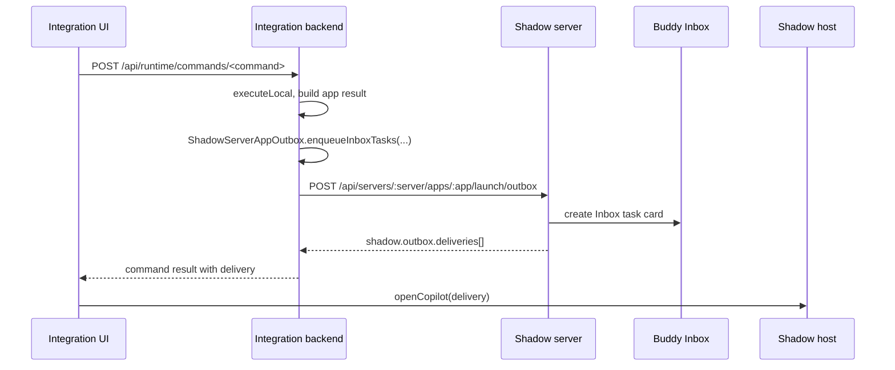

# Server App Buddy 派任务最佳实践

状态：作为所有 integration 给 Buddy 创建 Inbox 任务卡的默认实践使用。Kanban 是参考实现，Skills 已按此模型迁移。

先读总入口：[Server App 开发手册](./server-app-development-guide.zh-CN.md)。本文只覆盖 Buddy Inbox 任务派发。

## 核心原则

Buddy 派任务是业务操作，不是 iframe bridge 消息。Integration 必须先调用自己的 app backend command，由 backend 生成 Shadow App outbox，再通过 launch token 交给 Shadow server 创建 Inbox 任务卡。Bridge 只做宿主体验增强，例如打开 Buddy 创建器、刷新 Buddy 列表、打开 Copilot。

正确链路：



不要做：

- 不要让浏览器直接请求 Shadow `/launch/outbox`。这会遇到 CORS、旧宿主兼容、重复投递和 token 暴露边界问题。
- 不要把 iframe bridge 当作任务 transport。Bridge 请求不能替代 app backend command。
- 不要在没有 `messageId`、`cardId` 或 pending approval 的情况下显示“已发送成功”。
- 不要用固定的 `skill + buddy` 作为每次手动派发的幂等 key，否则用户重试可能被旧任务卡吞掉。

## 客户端实践

使用 runtime client。它会自动处理 path-mounted runtime，例如 `/skills/shadow/server` 下会请求 `/skills/api/runtime/...`。

```ts
import { createShadowServerAppRuntimeClient } from '@shadowob/sdk/bridge'

const shadowApp = createShadowServerAppRuntimeClient()
```

发送任务时：

```ts
const result = await shadowApp.command('skills.install', {
  skillId,
  targetBuddyAgentId,
  targetBuddyUserId,
  targetBuddyLabel,
  targetInboxChannelId,
})

const delivery = shadowApp.inboxDeliveries(result)[0]
const pending = delivery?.pendingId
if (delivery?.messageId && delivery.cardId) {
  await shadowApp.openCopilot(delivery).catch(() => undefined)
} else if (pending) {
  showPendingApproval(delivery)
} else {
  showError('没有创建 Inbox 任务卡')
}
```

客户端规则：

- `createShadowServerAppRuntimeClient()` 是嵌入式 app 派任务的默认 client。
- `createShadowServerAppClient()` 仍可用于只读、本地 demo 或历史 local route，但新增派任务功能优先用 runtime client。
- 不要设置 `deliverLaunchOutboxFromBrowser: true`，除非是明确的 standalone demo，并且 Shadow API 已允许浏览器跨源请求。生产和嵌入式 app 不应使用它。
- 发送前调用 `ensureBuddyTaskGrant({ agentId, reason })`。如果 bridge 不可用，它会安全跳过；真正的授权仍由 backend outbox 投递时校验。
- Buddy picker 打开时调用 `listBuddyInboxes({ refresh: true })`，新增 Buddy 后再次 refresh，并根据新增 agent id 自动选中。
- 旧宿主可能不认识新字段，例如 `targetInboxChannelId`。客户端可以在收到 `invalid_input` 且 issue path 为 unknown property 时去掉该字段重试，但不能吞掉其它错误。

## 服务端实践

Integration backend 要暴露 runtime route，并在同一个请求内完成 outbox 投递：

```ts
app.get('/api/runtime/inboxes', launchInboxes)
app.post('/api/runtime/commands/:commandName', runtimeCommand)

async function runtimeCommand(c: Context) {
  const name = commandName(c.req.param('commandName'))
  const body = await c.req.json().catch(() => ({}))
  const result = await shadowApp.executeLocal(name, body.input ?? {}, localContext(name), commands)
  const bodyWithDeliveries = await deliverLaunchOutbox(c, name, result)
  return c.json(bodyWithDeliveries, result.status)
}
```

`deliverLaunchOutbox` 必须从 `X-Shadow-Launch-Token` 读取 token，然后由 app backend 请求 Shadow server：

```ts
async function deliverLaunchOutbox(c: Context, commandName: string, result: { body: unknown }) {
  const token = c.req.header('X-Shadow-Launch-Token') ?? ''
  if (!token || !hasShadowServerAppPendingOutbox(result.body)) return result.body
  return deliverLaunchOutboxToShadow(token, commandName, result.body)
}
```

服务端规则：

- backend 使用 `SHADOW_SERVER_URL` 调 Shadow API。浏览器只请求 integration 自己的 same-origin API。
- command handler 返回业务结果加 `new ShadowServerAppOutbox().enqueueInboxTasks(tasks).attachTo(result)`。
- `task.agentId` 是主要目标。`task.channelId` 可以作为已知 Inbox channel 的精确目标，但旧宿主和旧 manifest 要能 fallback 到 `agentId`。
- 每次手动点击发送应生成新的幂等 key，例如 `app:action:resource:agent:manual:<requestId>`。只有同一次网络重试才复用同一个 request id。
- `required: true` 表示没有创建任务卡就是 command 失败，不应静默降级。
- `data.copilotMode = true`，并把后续回写命令、资源 id、安装命令等 Buddy 需要的信息放进 `data`。
- `requirements` 要描述 Buddy 需要的工具和能力。来自 `npx skills` 的技能应要求 Buddy 用 `npx skills` 安装；只有社区内自定义包才要求调用 app download command 获取 zip。

## 任务卡和完成状态

Inbox delivery 只代表任务卡创建成功，不代表任务完成。

- 派发成功：command response 里有 `shadow.outbox.deliveries[]`，并且包含 `messageId` 和 `cardId`。
- 等待授权：delivery 里有 `pendingId`。UI 应显示 pending 状态，不要打开 Copilot 当作已创建任务卡。
- 任务完成：Buddy 必须调用 `shadowob inbox update <message-id> <card-id> --status completed --note ...`。
- 对“Buddy 最终回复即完成”的任务，app 可以显式设置：

```ts
outputContract: {
  completionPolicy: {
    mode: 'reply_terminal',
    status: 'completed',
  },
}
```

不要全局从普通聊天回复推断任务完成。只有带上述 completion policy 的任务，才允许 message service 把 terminal reply 转成任务状态。

## 错误处理

常见错误和处理：

- `invalid_input` + unknown property：宿主 manifest 或服务器旧，去掉新字段重试一次。
- `Failed to fetch`：通常是浏览器跨源请求、app backend 不可达、旧 bundle 仍在运行。检查是否误用了 `deliverLaunchOutboxFromBrowser`，并确认 runtime route 是 same-origin。
- `没有创建 Inbox 任务卡`：command 返回了业务结果但没有 delivery 或 pending approval。检查 backend 是否调用了 `deliverLaunchOutbox`，以及 `SHADOW_SERVER_URL` 是否指向当前 Shadow API。
- 重复发送没有新卡：检查 `idempotencyKey` 是否固定。手动发送必须有新的 request id。
- Buddy 新建后列表不更新：新建成功后 refresh inboxes，不要只依赖 query cache。

## 验收清单

新增或修改派 Buddy 任务功能时，至少验证：

1. UI 使用 `createShadowServerAppRuntimeClient()`。
2. app backend 有 `/api/runtime/commands/:commandName` 和 `/api/runtime/inboxes`。
3. command handler 返回 outbox，并由 backend 调 `/launch/outbox` 得到 delivery。
4. 浏览器网络请求中没有直接访问 Shadow `/launch/outbox`。
5. 成功 toast 只在有 `messageId/cardId` 后出现。
6. 成功后调用 `openCopilot(delivery)`，失败或 pending 不误开。
7. 同一个技能或卡片连续发送两次，会创建两张不同任务卡。
8. 旧宿主 unknown property fallback 只针对明确字段，不吞其它错误。
9. Buddy 新增后 picker 自动 refresh 并选中新 Buddy。
10. 任务完成状态通过 `shadowob inbox update` 或显式 completion policy 流转。

推荐本地验收方式：

```bash
pnpm -C integrations/<app> typecheck
pnpm -C integrations/<app> build
pnpm biome check integrations/<app>/src --diagnostic-level=error
```

再用真实 launch token 或宿主页面触发一次 command，确认返回：

```json
{
  "shadow": {
    "outbox": {
      "deliveries": [
        {
          "channelId": "...",
          "messageId": "...",
          "cardId": "..."
        }
      ]
    }
  }
}
```
