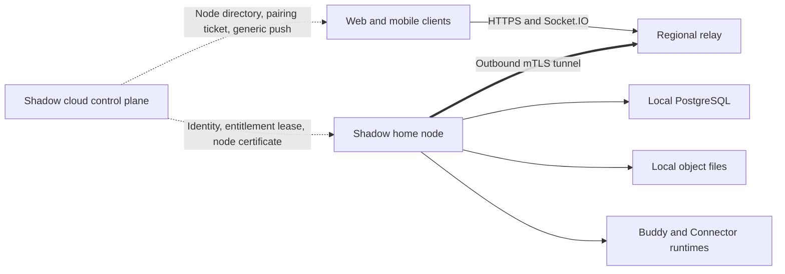

# Shadow Home Edition: Architecture and Delivery Plan

> **Status:** Proposed
> **Date:** 2026-07-13
> **Scope:** Desktop-packaged local Shadow server, remote mobile access, subscription licensing, and consumer-grade operations

## Executive Summary

Shadow Home Edition is feasible, but it should be designed as a **local data plane with a cloud control plane**, not as the current Docker Compose deployment wrapped in Electron.

The recommended product contract is:

- Messages, channels, files, workspaces, Buddy state, and local membership records remain on the customer's computer.
- A Shadow subscription provides account federation, node registration, remote relay access, push delivery, signed software updates, and operational support.
- Installation does not require Docker, a command line, router configuration, or a public IP address.
- The host computer must remain powered on and awake for remote access to work.
- Cancellation disables subscription-backed remote services at the end of the paid period, but never locks local access, backup, export, or deletion.

The initial release should support one home node, one private Shadow server, and up to six family members. Public communities, commerce, rentals, Kubernetes-based Cloud features, and cloud computers should remain outside the first release.

## 1. Current Repository Assessment

Shadow currently consists of:

- A Hono API and Socket.IO server in `apps/server`.
- PostgreSQL accessed through Drizzle and `postgres-js`.
- Optional Redis-backed transient features.
- MinIO-backed media and workspace objects.
- React web, Electron desktop, and Expo mobile clients.
- Commerce, public discovery, OAuth platform, model proxy, and Cloud/Kubernetes features mounted into the same server runtime.

Relevant implementation facts:

- The complete service topology is documented in [`../ARCHITECTURE.md`](../ARCHITECTURE.md).
- Database initialization is currently tied to `postgres-js` in [`../../apps/server/src/db/index.ts`](../../apps/server/src/db/index.ts).
- Redis already degrades gracefully when `REDIS_URL` is not configured in [`../../apps/server/src/lib/redis.ts`](../../apps/server/src/lib/redis.ts).
- Media storage is tied directly to MinIO in [`../../apps/server/src/services/media.service.ts`](../../apps/server/src/services/media.service.ts); uploads are disabled when MinIO is unavailable.
- Product, Cloud, commerce, discovery, and administration routes are mounted unconditionally in [`../../apps/server/src/app.ts`](../../apps/server/src/app.ts).
- Cloud configuration, scheduled jobs, and the deployment processor start from the main server entry point in [`../../apps/server/src/index.ts`](../../apps/server/src/index.ts).
- Mobile already supports a configurable server URL, but stores one global endpoint and one global token set in [`../../apps/mobile/src/lib/server-url.ts`](../../apps/mobile/src/lib/server-url.ts) and [`../../apps/mobile/src/lib/api.ts`](../../apps/mobile/src/lib/api.ts).
- Desktop currently packages the Connector as an extra resource, but not a local server, database, web bundle, or tunnel client; see [`../../apps/desktop/forge.config.ts`](../../apps/desktop/forge.config.ts).

These constraints make a Home runtime profile and consumer-grade process supervisor necessary. Requiring users to run the current PostgreSQL, Redis, MinIO, server, and web Docker stack would not meet the intended installation experience.

## 2. Product Definition

### 2.1 Initial offer

The first Home plan should provide:

- One registered home node.
- One private server created during onboarding.
- Up to six federated family accounts.
- Desktop, web, iOS, and Android access.
- Remote access through a managed relay.
- Generic mobile push notifications.
- Automatic application and server updates.
- Local backup, restore, and full export.

### 2.2 Availability contract

Home Edition is not a hosted availability product. The product must communicate the following clearly:

- Remote access works only while the home computer, local Shadow server, and outbound internet connection are available.
- Closing the main window keeps the node running in the tray.
- Explicitly quitting Shadow stops the node.
- Sleep, shutdown, firewall changes, disk exhaustion, or a failed local database can make the node unavailable.
- The desktop application should detect sleep-prone configurations and explain the impact without changing system power settings silently.

### 2.3 Cancellation contract

Subscription expiry should never make customer-owned data inaccessible.

At the end of the paid period:

- Managed relay access stops after the configured grace period.
- Cloud push and other subscription-backed control-plane services stop.
- Local desktop and optional LAN access continue.
- Backup, restore, export, and deletion continue.
- The customer can renew and reconnect the existing node without re-importing data.

This contract makes the subscription pay for recurring infrastructure and operations rather than acting as a decryption key for locally owned data.

## 3. Target Architecture



### 3.1 Local data plane

The home node owns:

- Users mapped from Shadow cloud identities.
- Private server membership and roles.
- Channels, threads, messages, reactions, and mentions.
- Workspace metadata and file contents.
- Buddy configuration, task history, and Connector state.
- Local notification records.
- Backup manifests and restore history.

### 3.2 Cloud control plane

The hosted Shadow service owns only what is necessary to operate the subscription:

- Shadow account identity.
- Billing provider and canonical plan state.
- Home node ownership and family membership mapping.
- Node public key, version, health, region, and last-seen timestamp.
- Relay assignment and connection metadata.
- Short-lived pairing tickets and signed entitlement leases.
- Push tokens and privacy-minimized notification routing metadata.

The control plane must not receive or persist message bodies, workspace files, Buddy history, or local database backups unless the customer later opts into a separate encrypted backup product.

## 4. Home Runtime Profile

Add an explicit runtime profile rather than a growing collection of independent environment switches:

```ts
type ShadowRuntimeProfile = 'hosted' | 'home'

interface RuntimeCapabilities {
  publicDiscovery: boolean
  commerce: boolean
  cloudDeployments: boolean
  cloudComputers: boolean
  modelProxy: boolean
  liveVoice: boolean
  homeDataPlane: boolean
  homeControlPlane: boolean
}
```

The initial environment entry point can be:

```env
SHADOWOB_RUNTIME_PROFILE=home
```

Route registration, scheduled jobs, worker startup, public configuration, and UI navigation should derive from the resolved capability object. Individual handlers should not read the profile directly.

### 4.1 Home features to retain

- Authentication and local token issuance.
- Server, membership, invitation, and permission flows.
- Channels, DMs, threads, messages, attachments, and search.
- Workspace and local media delivery.
- Buddy, task, and Connector flows that can execute locally.
- In-app notifications and generic remote push routing.
- API tokens needed by local integrations.

### 4.2 Features to exclude initially

- Public Discover and public community hosting.
- Shops, wallets, recharge, settlement, paid files, rentals, and marketplace flows.
- Shadow Cloud SaaS, Kubernetes deployments, exposure gateway, and cloud computers.
- The public OAuth developer platform.
- Hosted model billing.
- Live voice channels that depend on hosted third-party infrastructure.
- The standalone administration dashboard.

Voice messages can remain because they behave as ordinary local media objects. Live voice can be added later with an explicit disclosure that its transport may use third-party cloud infrastructure.

## 5. Local Runtime Packaging

### 5.1 Process model

Electron should supervise the following child processes and resources:

```text
Shadow Desktop
├── home server
├── bundled PostgreSQL
├── relay client
├── local web assets
└── Buddy / Connector runtimes
```

The server must listen on a random loopback port or a reserved loopback port. It must not bind to `0.0.0.0` by default. The relay client connects only to that loopback endpoint.

Desktop responsibilities include:

- Initializing the data directory.
- Generating and protecting node secrets.
- Starting dependencies in order and checking health.
- Restarting failed processes with bounded backoff.
- Keeping the node alive when the window is closed.
- Stopping processes during an explicit application quit.
- Collecting redacted diagnostics.
- Coordinating safe updates, migrations, and rollback.

Store runtime data under an application-managed Home directory below Electron's `userData` location. Store node private keys and control-plane refresh credentials with the operating system keychain or Electron `safeStorage`, not in plaintext configuration files.

### 5.2 Database choice

The recommended first production implementation is a platform-specific bundled PostgreSQL distribution containing at least:

- `initdb`
- `postgres`
- `pg_ctl`
- `pg_dump`
- `pg_restore`

This preserves the behavior of existing PostgreSQL migrations and queries without requiring Docker.

PGlite is a worthwhile time-boxed spike because Drizzle officially supports persistent PGlite databases in Node.js. It should not become the default until it passes the complete Shadow migration and integration suite. The current repository uses PostgreSQL-specific extensions and advisory locks, including `pg_trgm` and Cloud deployment locks. Even if Cloud routes are disabled, migration compatibility, search behavior, transaction semantics, backup recovery, and concurrent access must be proven. See the [Drizzle PGlite integration guide](https://orm.drizzle.team/docs/connect-pglite).

SQLite is not recommended. Converting the current PostgreSQL schema and query behavior would create a long-term dual-dialect maintenance burden.

### 5.3 Redis

Home mode should not start Redis. The runtime must verify that all retained Home features have correct single-process fallbacks for:

- Rate limiting.
- Presence.
- Temporary authentication state.
- Voice state retained in scope.
- Pub/sub behavior.

Any retained feature that currently requires Redis should receive a bounded in-memory implementation or be removed from the Home capability set.

### 5.4 Object storage

Refactor media persistence behind an object-store contract:

```text
ObjectStore
├── MinioObjectStore       hosted runtime
└── FilesystemObjectStore  home runtime
```

The filesystem implementation must provide:

- Validated object keys with traversal protection.
- Atomic writes through a temporary file and rename.
- Byte-range reads for audio, video, and large downloads.
- Content type and content length metadata.
- Streaming reads and writes without buffering complete files in memory.
- Deletion and orphan cleanup.
- Backup enumeration and integrity hashing.

Existing authorization and signed-media rules should remain above the storage adapter so that changing persistence does not weaken access control.

### 5.5 Web application

The Home server should serve the production web application under `/app` from packaged static assets. Desktop can continue loading the selected Shadow application URL, but Home onboarding should select the local loopback origin automatically.

The public website and developer documentation do not need to be bundled into the Home installer.

## 6. Remote Access

### 6.1 Recommended initial relay

Use a self-operated regional relay with frp as the first transport implementation.

Each home node receives a stable address such as:

```text
https://<node-id>.home.shadowob.com
```

Required controls:

- The home node initiates all connections outbound.
- frpc and frps use mTLS or OIDC client credentials.
- An frp server plugin validates `Login`, `NewProxy`, and reconnect operations.
- The plugin binds a credential to one node ID, assigned region, hostname, protocol, and bandwidth policy.
- Clients cannot select arbitrary subdomains, ports, or upstream targets.
- Relay credentials are short-lived, revocable, and rotated automatically.
- The gateway and node enforce request size, connection, and rate limits.
- The relay exports connection and byte counters without logging application payloads.

frp currently supports token and OIDC authentication as well as server plugins that can accept, reject, or rewrite login and proxy operations. See the official [frp authentication documentation](https://gofrp.org/en/docs/features/common/authentication/) and [server plugin documentation](https://gofrp.org/en/docs/features/common/server-plugin/).

### 6.2 Connection strategy

Deliver connectivity in stages:

1. **MVP:** Always use the managed relay. This minimizes client complexity and establishes a measurable connection-success baseline.
2. **Beta:** Prefer a verified LAN address when the client and home node share a network.
3. **Later:** Attempt a secure direct path or NAT traversal, then fall back to the relay.

This follows the consumer-friendly pattern used by Synology QuickConnect: try local or direct connectivity first, use hole punching when possible, and use a relay as the final fallback. See the [Synology QuickConnect white paper](https://kb.synology.com/en-ca/WP/Synology_QuickConnect_White_Paper/4).

Do not enable UPnP port forwarding silently. Any direct-public-port mode must be an explicit advanced option with clear security warnings.

### 6.3 Provider abstraction

Keep the tunnel provider replaceable:

```ts
interface HomeTunnelProvider {
  start(config: HomeTunnelConfig): Promise<HomeTunnelSession>
  getStatus(): Promise<HomeTunnelStatus>
  stop(): Promise<void>
}
```

Potential providers:

- `ManagedFrpTunnelProvider` for the default regional Shadow relay.
- `CloudflareTunnelProvider` for selected overseas deployments.
- A future direct or mesh provider.
- An advanced bring-your-own Tailscale option.

Cloudflare Tunnel is operationally attractive because `cloudflared` creates outbound-only connections and proxied WebSockets are supported. It should not be the default mainland China dependency: Cloudflare's China Network is a separate Enterprise subscription and requires ICP filing and content review. See the official [Cloudflare Tunnel overview](https://developers.cloudflare.com/cloudflare-one/networks/connectors/cloudflare-tunnel/), [WebSocket documentation](https://developers.cloudflare.com/network/websockets/), and [China Network onboarding requirements](https://developers.cloudflare.com/china-network/get-started/).

Tailscale Funnel preserves end-to-end TLS through its relay, but it remains beta and currently has domain, port, platform, and non-configurable bandwidth restrictions. It is more appropriate as an advanced option than as the default product transport. See the [Tailscale Funnel documentation](https://tailscale.com/docs/features/tailscale-funnel).

### 6.4 TLS and privacy boundary

The first implementation must document its actual privacy properties precisely.

If public TLS terminates at the Shadow relay and the relay establishes a second encrypted connection to the node:

- Traffic is encrypted on both network segments.
- The relay does not need to persist payloads.
- The relay can still theoretically inspect plaintext in memory.
- The product must not claim that Shadow is cryptographically unable to access content.

Internal alpha can use this model. Before general availability, make an explicit decision between:

- Keeping relay TLS termination with a transparent privacy statement.
- Per-node public certificates and TLS passthrough.
- Application-layer encryption using a family key shared only with authorized devices.
- An embedded end-to-end mesh transport.

If "the cloud cannot read family content" is part of the launch promise, end-to-end protection is a GA blocker rather than a follow-up enhancement.

## 7. Identity and Pairing

### 7.1 Do not share hosted access tokens

The Home API should not accept ordinary Shadow cloud access tokens directly. A compromise of either environment should not automatically grant reusable access to the other.

Use a one-time federation exchange:

1. The user signs into the hosted Shadow account on mobile or desktop.
2. The client requests a pairing ticket for an owned or invited home node.
3. The control plane signs a ticket containing `jti`, `nodeId`, cloud subject, role, audience, issue time, and a short expiry.
4. The client submits the ticket to the Home node through the relay or local endpoint.
5. The Home node verifies the control-plane JWKS, audience, expiry, node binding, and one-time-use status.
6. The Home node creates or resolves a local federated identity.
7. The Home node issues its own local access and refresh tokens.

Pairing tickets should expire within approximately 60 seconds and be invalid after one successful exchange.

### 7.2 Client connection profiles

Replace the mobile singleton server configuration with a node-aware connection store:

```ts
interface HomeNodeConnection {
  nodeId: string
  displayName: string
  remoteUrl: string
  localUrl?: string
  accessToken: string
  refreshToken: string
  lastConnectedAt?: string
  lastStatus?: 'online' | 'offline' | 'incompatible'
}
```

Tokens must be namespaced by `nodeId` in secure storage. Socket, API, notification, media, OAuth, and deep-link code must resolve the active node explicitly.

Desktop onboarding should pair the owner automatically after node claim. Additional family members can join through an owner-created invite or QR code backed by a cloud identity and a one-time Home pairing ticket.

## 8. Subscription and Entitlement Model

### 8.1 Separate SaaS billing from marketplace entitlements

Existing Shadow subscription products renew by debiting the local wallet, and existing Stripe integration creates recharge PaymentIntents. Neither represents a hosted recurring Home subscription.

Create a dedicated billing model:

```ts
type HomeBillingProvider = 'stripe' | 'app_store' | 'google_play'

interface CanonicalHomeEntitlement {
  ownerUserId: string
  plan: 'home'
  status: 'trialing' | 'active' | 'grace' | 'expired' | 'revoked'
  maxNodes: number
  maxMembers: number
  remoteAccess: boolean
  push: boolean
  updates: boolean
  currentPeriodEnd: string
}
```

The provider adapter converts Stripe, App Store, and Google Play events into this canonical entitlement. Home nodes never receive provider secrets or raw billing objects.

### 8.2 Signed entitlement lease

The control plane should issue an Ed25519-signed lease containing:

- Node ID and owner ID.
- Plan and enabled capabilities.
- Member and node limits.
- Issue, expiry, and grace timestamps.
- Lease ID and signing key ID.
- Minimum required security version when necessary.

A practical starting policy is:

- Renew daily while the node is online.
- Lease validity of seven days.
- Offline grace of up to 30 days.
- Cancellation takes effect at the provider's paid-through timestamp.
- Revocation is reserved for refund fraud, credential compromise, or a security emergency and should not block local data access.

### 8.3 Billing event processing

Stripe Billing access must be driven by verified, idempotent webhooks. At minimum, handle subscription creation and updates, successful invoices, failed invoices, cancellation, pause, resume, and relevant entitlement changes. Stripe recommends tracking subscription and invoice events and updating local access state from those events; see the [Stripe subscription webhook guide](https://docs.stripe.com/billing/subscriptions/webhooks).

Use a separate webhook signing secret and event ledger from the current recharge webhook so Home subscription events cannot be confused with wallet recharge events.

### 8.4 Mobile store policy

The entitlement abstraction must be provider-neutral from the beginning.

- Apple generally requires in-app purchase when an app unlocks digital functionality or subscriptions. Multiplatform services can expose subscriptions acquired elsewhere under specific conditions, while a free companion to a paid web tool can avoid in-app purchasing only when it contains no purchase flow or external purchase call to action. Consumer and family sales require particular care. See the [Apple App Review Guidelines](https://developer.apple.com/app-store/review/guidelines/).
- Google Play generally requires Play Billing for in-app digital services, subject to program and regional exceptions. See the [Google Play Payments policy](https://support.google.com/googleplay/android-developer/answer/9858738).

Desktop and web can use Stripe for internal alpha. App Store and Play purchase handling, restore, cancellation links, and provider reconciliation should be completed before presenting purchase controls inside the mobile apps.

## 9. Push Notifications

The current server can send message content directly to the Expo Push Service. Home Edition should instead use a privacy-minimized cloud push broker.

Recommended flow:

1. The Home node produces an event containing the target cloud subject, node ID, event class, and an opaque deduplication ID.
2. The control plane resolves the registered push token.
3. The control plane sends a generic notification such as "Your home server has a new message."
4. The notification payload includes `nodeId` and a non-sensitive route hint.
5. After the user opens the notification, the app selects the correct node and fetches authorized details from the Home server.

Do not include message text, filenames, Buddy output, or family member names in the default cloud notification payload.

Expo recommends checking push receipts and deactivating tokens that return `DeviceNotRegistered`; the current notification implementation should add that lifecycle handling as part of Home push work. See the [Expo Push Service guide](https://docs.expo.dev/push-notifications/sending-notifications/).

## 10. Updates, Migrations, Backup, and Recovery

### 10.1 Update transaction

A Home update affects the application, server, database schema, and sometimes bundled runtime binaries. Treat it as an operational transaction:

1. Download and verify a signed release manifest.
2. Check disk space, supported source version, and protocol compatibility.
3. Drain or disconnect the relay.
4. Stop write traffic and child processes.
5. Create a database and object-store recovery snapshot.
6. Install the new application resources.
7. Start PostgreSQL and apply forward migrations.
8. Start the server and run health and data-integrity checks.
9. Reconnect the relay.
10. Retain the recovery snapshot until the release is considered healthy.

If startup or integrity checks fail, restore the previous application resources and the pre-migration database snapshot. Do not rely on reverse database migrations.

### 10.2 Backup format

Provide a portable, versioned Home backup containing:

```text
shadow-home-backup/
├── manifest.json
├── database.dump
├── objects/
└── checksums.json
```

Backups should support optional authenticated encryption with a customer-held recovery key. The manifest records the node ID, schema version, application version, creation time, object counts, byte totals, and checksum algorithm.

Initial backup features:

- Manual backup and restore.
- Scheduled local backups with retention.
- Export to a customer-selected directory or external drive.
- Restore verification before replacing active data.
- A documented recovery path that does not require an active subscription.

Cloud backup should be a later, opt-in product with client-side encryption. It must not be silently added to the Home subscription.

## 11. Security Requirements

The Home threat model must cover:

- Theft of node or relay credentials.
- Guessing or enumeration of node hostnames.
- A malicious client attempting to claim another node's hostname.
- Replay of pairing or lease tokens.
- Compromise of the relay or control plane.
- Host-header confusion through the reverse proxy.
- SSRF from local apps, plugins, or model providers.
- Path traversal and symlink attacks in local object storage.
- Malicious or oversized uploads exhausting home disk space.
- Supply-chain compromise of desktop, PostgreSQL, or relay binaries.
- Unsafe database migrations and rollback data loss.
- Sensitive content in crash reports or diagnostic logs.

Minimum controls:

- High-entropy, non-sequential public node IDs.
- One-time, audience-bound pairing tickets.
- Short-lived relay credentials and automatic rotation.
- mTLS between node and relay.
- Strict hostname and origin allowlists.
- Per-node request, connection, upload, and bandwidth limits.
- Loopback-only local services by default.
- Signed update manifests and checksummed bundled binaries.
- Secret storage through operating-system facilities.
- Redacted diagnostics and opt-in telemetry.
- Backup recovery tests in CI.

The relay URL is an address, not an authentication mechanism. Every Home API route must retain normal authorization even if the hostname is difficult to guess.

## 12. Compatibility and Versioning

Add a public, non-sensitive Home status endpoint that reports:

- Node online status.
- Server and schema version.
- Home protocol version.
- Minimum and maximum supported client protocol versions.
- Whether local, relay, push, and backup subsystems are healthy.
- Whether a security update is required.

Do not expose database names, filesystem paths, user counts, email addresses, or detailed failure logs through the public status response.

Mobile and desktop clients should support at least the current and previous two Home protocol versions during beta. Server changes must preserve rolling compatibility long enough for App Store and Play Store review delays.

## 13. Operational Model

### 13.1 Relay deployment

Start with one production region and one internal test region. A production design should eventually include:

- At least two relay instances per supported region.
- Health-aware node assignment.
- Reconnection to a standby relay.
- Per-node bandwidth accounting.
- Connection and error metrics without payload logging.
- Abuse controls and emergency revocation.
- Regional capacity alerts.

The relay is stateful at the tunnel-connection level. Do not assume that a generic HTTP load balancer can send a client request to any relay instance unless a routing layer knows the node-to-relay assignment.

### 13.2 Cost controls

All remotely accessed attachments pass through the relay in the MVP. Protect the service with:

- Maximum upload size.
- Per-plan monthly relay transfer allowance or fair-use policy.
- Server-side bandwidth limits.
- Byte-range streaming.
- Optional LAN-direct downloads.
- Future direct-path negotiation.

Measure real message, image, audio, and file traffic during beta before committing to unlimited relay bandwidth in pricing.

### 13.3 Mainland China compliance

Operating a unified public relay domain from infrastructure in mainland China requires a dedicated compliance review covering the responsible service entity, ICP filing or licensing, access-provider responsibilities, user-generated content, logs, and complaint handling.

Current MIIT rules state that internet information services provided in mainland China through a domain name or IP address are subject to filing requirements. See the official [Measures for the Administration of Non-commercial Internet Information Services](https://www.miit.gov.cn/zcfg/xxtxl/art/2024/art_7e48434c08c24131b4b7eecfca5b2b6c.html).

Do not assume that each family node can or should obtain an independent filing. The product, relay, domain, and access-provider model must be reviewed as one service before launch.

## 14. Delivery Plan

The following estimate assumes a focused four-person team with backend/control-plane, desktop/runtime, client, and infrastructure ownership. Re-estimate after the technical spike.

### Phase 0: Technical spike — 2 weeks

Build four end-to-end proofs:

1. A packaged desktop build starts the Home API without Docker.
2. The server applies migrations to a persistent local database and retains data after restart.
3. A phone on cellular data sends and receives a message through a real relay.
4. A signed cloud entitlement and one-time pairing ticket are verified by the Home node.

Exit criteria:

- Installation-to-ready requires no command line.
- A message round trip works over cellular data.
- Restart preserves committed messages and files.
- Invalid, expired, reused, or wrong-node tickets are rejected.
- The spike produces measured package size, idle memory, startup time, and relay latency.

### Phase 1: Internal alpha — 5 to 6 weeks

Deliver:

- Home runtime profile and capability-based route registration.
- Bundled PostgreSQL lifecycle management.
- Filesystem object storage.
- Packaged web assets and Home server resources.
- Node claim, heartbeat, lease renewal, and pairing APIs.
- Stripe test-mode subscription integration.
- One managed relay region with authentication and policy plugin.
- Mobile node connection profiles.
- Basic local backup and diagnostics.

Exit criteria:

- The owner can install, subscribe, create a node, pair mobile, invite one tester, exchange messages and files, restart, and restore a backup.
- No Home request depends on Redis, MinIO, Docker, Kubernetes, or an administrator-created configuration file.

### Phase 2: Closed beta — 4 to 6 weeks

Deliver:

- Family invitation and role flows on web and mobile.
- Generic cloud push routing.
- Safe automatic updates and recovery snapshots.
- Quotas, disk-space handling, and relay bandwidth accounting.
- Version compatibility and upgrade-required UI.
- macOS and Windows signed installers.
- iOS and Android production client paths.
- Security review and abuse controls.
- User-facing recovery, export, privacy, and availability documentation.

Exit criteria:

- Upgrade and restore tests pass across all supported source versions.
- Relay reconnects after ordinary network changes and process restarts.
- Beta users can diagnose host sleep, disk exhaustion, subscription expiry, and version mismatch without engineering access.

### Phase 3: General availability hardening — approximately 4 weeks

Deliver:

- Relay high availability and regional failover.
- Billing recovery and provider reconciliation.
- App Store and Google Play purchase compliance where mobile purchase controls are offered.
- Load, soak, chaos, and backup-recovery testing.
- Compliance review and operational runbooks.
- Support tooling with privacy-preserving diagnostics.
- A final decision and implementation for the advertised relay privacy boundary.

Linux, NAS, and headless installers should follow GA unless the technical spike shows that one of those platforms is required for acceptable always-on reliability.

## 15. Verification Strategy

Home Edition is a critical cross-platform feature, so end-to-end testing is required even though product E2E is generally optional in this repository.

### Unit tests

- Runtime capability resolution.
- Lease signing and verification.
- Pairing ticket validation and replay prevention.
- Node-bound token storage and selection.
- Filesystem object-key validation.
- Backup manifest and checksum validation.
- Billing-provider state normalization.

### Integration tests

- Real PostgreSQL migrations and schema invariants.
- Home route registration and excluded-route behavior.
- Filesystem upload, range read, delete, and restore.
- Control-plane node claim and lease renewal.
- Stripe webhook idempotency.
- frp authentication and hostname policy plugin.
- Push broker privacy-minimized payloads.

### End-to-end tests

- Clean desktop installation to ready state.
- Owner pairing and family-member invitation.
- Web and mobile messaging through a real relay.
- Host restart and automatic reconnect.
- Sleep/offline/reconnect behavior.
- Upgrade with forward migration.
- Simulated failed upgrade and recovery restore.
- Subscription cancellation, grace, and renewal.
- Full export without an active subscription.

API changes must update API documentation, the TypeScript SDK, and the Python SDK. UI changes must be implemented on web and mobile and use the repository's i18n system.

## 16. Success Metrics

Define final targets after the spike, but collect at least:

- Median and p95 installation-to-ready time.
- Relay connection success by network and platform.
- Local and relayed message latency.
- Idle and active CPU and memory usage.
- Installer and update download size.
- Node crash-recovery time.
- Update and migration success rate.
- Backup restore success and duration by data size.
- Relay bytes per active household.
- Push delivery and notification-to-node-open success.
- Support incidents caused by sleep, firewall, version skew, and disk space.

Suggested product gates:

- No Docker or terminal requirement.
- No committed-message loss in forced-restart tests.
- Successful recovery from an interrupted application update.
- Remote connectivity across ordinary home NAT and cellular networks through the relay.
- A customer can export and restore data without an active subscription.

## 17. Decisions Required Before Implementation

The following product decisions should be made before Phase 1:

1. Confirm one node, one private server, and six family members for the initial plan.
2. Confirm that subscription expiry never disables local data access or export.
3. Decide whether cryptographic relay opacity is a GA requirement or whether transparent relay TLS termination is acceptable.
4. Confirm macOS and Windows as the initial host platforms, with Linux and NAS later.
5. Decide whether live voice is excluded or offered through a separately disclosed hosted service.
6. Define the Home plan's relay transfer and storage fair-use policy.

## Recommendation

Approve the two-week technical spike before committing to the full roadmap. Do not begin broad feature integration until all four foundational paths work together:

- Docker-free local startup.
- Durable local data after restart.
- Real cellular-to-home connectivity through the relay.
- Signed subscription and one-time identity pairing.

If any one of these fails to meet a consumer-grade experience, resolve the runtime or transport choice before expanding Home UI, billing, or feature scope.
