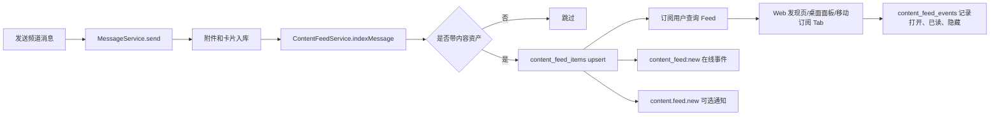

# 虾豆内容社区一期方案

## 背景

频道订阅把 Shadow 里的聊天频道扩展成可持续消费的内容源。用户订阅频道后，频道内带附件或应用卡片的消息会进入订阅时间线；Web、桌面端和移动端分别提供适合当前设备的发现、管理和消费入口。

当前代码里已经有可复用基础：

- 消息、附件和消息卡片已经是统一模型。消息表有 `metadata.cards`，附件表已记录 `contentType`、`kind`、尺寸、工作区节点等信息。
- Web 频道侧边栏已经有右键菜单和频道级通知静音能力。
- 移动端服务器首页已经支持长按频道打开底部操作 Sheet。
- 通知系统已经有账号级偏好、频道静音、站内通知、移动推送、Web Push、作用域未读等能力。
- 桌面宠物面板已有本地版 `ChannelSubscription`、`SubscriptionsPanel` 和从频道消息中抽取附件的逻辑，可作为体验原型，但不适合作为账号级 Feed 的最终数据路径。

一期目标不是做一个独立社区产品，而是在现有聊天、附件、卡片和通知体系上补齐“订阅频道、聚合内容、跨端消费”的闭环。

## 一期目标

- 默认订阅所有当前有权限访问的服务器频道；用户可以在 Web 频道右键菜单和移动端频道长按菜单中取消订阅或恢复订阅频道。
- 只有“带内容附件或应用卡片”的频道消息进入内容时间线。
- 用户可以在设置页管理订阅、查看订阅来源、调整订阅规则。
- 桌面端在展开面板里提供订阅栏目，消费来自服务端的账号级订阅时间线。
- 移动端新增“订阅”Tab，展示订阅时间线。
- Feed 一期采用订阅优先的可解释排序，保留后续推荐引擎扩展点。
- 所有接口遵守频道访问权限。用户取消频道权限后，不再看到该频道的新内容，也不能打开受保护附件。

## 已确认决策

- 本方案里的“应用卡片”特指 `message.metadata.cards[]` 中 `kind: 'space_app'` 的 Space App 卡片，可打开对应 Space App 的应用内路径。
- 普通任务卡、状态卡、操作回执卡默认不进入 Feed。
- 语音附件一期进入 Feed，和图片、HTML、PDF、普通文件一样作为内容附件处理。
- Feed 默认排序为 `最新`，即严格按发布时间倒序。`推荐` 作为可切换视图保留。

## 非目标

- 不做公开内容广场和陌生频道推荐。
- 不做算法黑盒推荐，不引入跨用户画像训练。
- 不把纯文本聊天消息转成内容。
- 不绕过现有附件授权、工作区文件授权、私有频道授权或应用卡片权限。
- 不为页面伪造 seed 数据。调试和验收数据应通过普通消息、附件上传或应用卡片发送产生。

## 内容定义

一期把“内容”定义为频道消息上的可消费资产：

- 图文：图片附件，或文本消息加图片附件。
- HTML：`text/html`、`.html`、`.htm` 附件。
- PDF：`application/pdf` 或 `.pdf` 附件。
- 普通文件：文档、Markdown、文本、压缩包等可下载附件。
- 语音：`kind = voice` 的语音附件，复用现有语音播放、转写和播放状态能力。
- 应用卡片：`message.metadata.cards[]` 中 `kind: 'space_app'` 的 Space App 卡片，必须包含 `appKey`、`title`，并通过 `action.mode = 'open_space_app'` 和可选 `action.path` 打开应用内路径。

纯文本消息默认不进入内容 Feed。

一个消息可以产生一个内容条目。条目以消息为主，附件和卡片作为条目的资产列表，避免同一条消息里多张图拆成多条刷屏。

## 卡片系统口径

当前代码里有多套消息卡片字段。内容社区一期使用以下口径：

- `metadata.cards[]`：唯一卡片主线。任务卡 `kind: 'task'`、Space App 卡片 `kind: 'space_app'`、商品/offer、付费文件和 OAuth link 卡片都在这里。内容社区只索引 `space_app`，不索引 `task`。
- `metadata.interactive`、`interactiveResponse`、`interactiveState`：临时交互块和交互结果，不是内容卡片。

后续如果要把商品、付费文件或 OAuth link 纳入内容 Feed，应作为独立内容类型评估，不借用“应用卡片”这个名称。

旧的并行卡片字段已从当前协议中移除。本项目尚未正式上线相关数据，不为旧字段保留读取 fallback 或迁移计划。

## 核心模型

### `channel_content_subscriptions`

账号级频道订阅表。

| 字段 | 说明 |
| --- | --- |
| `id` | 订阅 ID |
| `user_id` | 订阅者 |
| `channel_id` | 被订阅频道 |
| `server_id` | 冗余服务端 ID，便于列表和权限过滤 |
| `status` | `active`、`paused` |
| `include_kinds` | 内容类型规则，如 `image`、`html`、`pdf`、`file`、`voice`、`card` |
| `exclude_mime_types` | 用户排除的 MIME 类型 |
| `min_attachment_size`、`max_attachment_size` | 可选大小过滤 |
| `push_enabled` | 是否允许推送 |
| `digest_mode` | `realtime`、`daily`、`none` |
| `last_read_at` | 该订阅在 Feed 中读到的位置 |
| `created_at`、`updated_at` | 审计时间 |

唯一约束：`user_id + channel_id`。

### `content_feed_items`

频道内容索引表，按消息生成。它不是用户私有表，而是频道级内容索引。

| 字段 | 说明 |
| --- | --- |
| `id` | 内容条目 ID |
| `message_id` | 来源消息 |
| `channel_id`、`server_id` | 来源范围 |
| `author_id` | 作者 |
| `title` | 从附件文件名、卡片标题或消息摘要提取 |
| `summary` | 消息摘要或卡片摘要 |
| `content_kinds` | `image`、`html`、`pdf`、`file`、`voice`、`card` |
| `primary_attachment_id` | 首个主要附件 |
| `attachment_ids` | 该消息内所有内容附件 |
| `card_refs` | 卡片 ID、类型、标题和动作元数据摘要 |
| `score` | Feed 排序基础分 |
| `published_at` | 消息创建时间 |
| `created_at`、`updated_at` | 索引时间 |

唯一约束：`message_id`。消息更新、附件补录或卡片状态变化时重建该消息的索引摘要。

### `content_feed_events`

用户级消费状态表，只记录行为，不复制完整 Feed。

| 字段 | 说明 |
| --- | --- |
| `user_id` | 用户 |
| `feed_item_id` | 内容条目 |
| `state` | `seen`、`opened`、`saved`、`hidden`、`dismissed` |
| `last_position` | 阅读进度或打开位置，PDF/HTML 后续可用 |
| `created_at`、`updated_at` | 行为时间 |

一期 Feed 查询通过订阅表和 `content_feed_items` 联表生成，不预先 fanout 到每个订阅者。等订阅量或频道量变大，再增加物化的 `user_content_timeline_items`。

## 写入链路

1. 用户或 Buddy 向频道发送消息。
2. `MessageService.send` 创建消息、附件和卡片元数据。
3. 新增 `ContentFeedService.indexMessage(messageId)` 在消息创建成功后异步执行。
4. 索引器读取消息、附件和卡片，判断是否满足内容定义。
5. 不满足则跳过；满足则 upsert `content_feed_items`。
6. WebSocket 发送轻量事件 `content_feed:new` 到有频道访问权且未显式暂停订阅的在线用户。
7. 可选推送由通知系统处理，kind 使用 `content.feed.new`，并遵守订阅规则、通知偏好和静音配置。

一期可以先用“消息发送后 best-effort 异步索引”。失败时记录日志和指标，不阻塞发消息。后续增加队列和重试。

## Feed 查询链路

`GET /api/content-feed`

参数：

- `cursor`：基于 `published_at + id` 的游标。
- `limit`：默认 30，最大 50。
- `kinds`：可选内容类型过滤。
- `channelId`、`serverId`：可选范围过滤。
- `unreadOnly`：只看未读。
- `sort`：`latest` 或 `recommended`，默认 `latest`。

处理：

1. 读取当前用户的 active 订阅。
2. 和频道访问策略联动过滤频道。私有频道必须确认成员资格，Server 频道必须确认可访问。
3. 联表查询 `content_feed_items`。
4. 应用用户订阅规则和 `content_feed_events.hidden/dismissed`。
5. 返回稳定分页结果、来源上下文、附件摘要、卡片摘要和阅读状态。

响应条目应包含：

- `id`、`messageId`、`publishedAt`。
- `server`、`channel`、`author`。
- `title`、`summary`、`contentKinds`。
- `attachments` 摘要，打开时继续走现有受保护附件 URL。
- `cards` 摘要，动作跳转回原消息、商品页、应用页或工作区。
- `readState`：`unread`、`seen`、`opened`、`saved`。

## 性能设计

一期性能目标是让订阅 Feed 成为一次账号级分页查询，而不是客户端按订阅频道逐个拉取消息再抽附件。

服务端：

- 消息发送链路只做轻量触发。内容索引 best-effort 异步执行，不能阻塞发消息成功返回。
- `content_feed_items` 是频道级内容索引，保存可列表展示的摘要和引用 ID，不复制完整附件内容、卡片 payload 或永久文件 URL。
- Feed 使用 cursor pagination，不使用深分页 `offset`。游标采用 `published_at + id`，保证稳定翻页。
- 必备索引：
  - `channel_content_subscriptions(user_id, status, channel_id)`。
  - `channel_content_subscriptions(channel_id, status)`，用于新内容 fanout 事件查订阅者。
  - `content_feed_items(channel_id, published_at desc, id desc)`。
  - `content_feed_items(server_id, published_at desc, id desc)`。
  - `content_feed_events(user_id, feed_item_id)` 唯一索引。
  - `content_feed_events(user_id, state, updated_at desc)`，用于隐藏、保存和最近行为。
- 权限过滤必须批量化。Feed 查询以当前可访问频道为基准，再叠加用户显式订阅规则；不要对每条 Feed item 单独调用频道权限检查。
- `recommended` 排序一期只用已索引字段和用户行为聚合，不在请求路径实时读取大附件、解析 HTML/PDF 或调用模型。
- WebSocket 新内容事件只发送 `{ feedItemId, channelId, serverId, publishedAt }` 这类轻量 payload，客户端收到后按需刷新当前页。
- 本地旧桌面订阅迁移要分批执行，失败可重试，不能在启动时串行阻塞面板渲染。

客户端：

- Web 和桌面面板统一请求 `GET /api/content-feed`，禁止恢复“每个订阅频道请求最近 40 条消息”的 N+1 模式。
- 移动端订阅 Tab 使用 FlashList，图片和文件预览使用固定尺寸骨架，避免内容加载导致列表抖动。
- 移动端首屏只加载摘要和缩略图，PDF/HTML/语音详情在用户打开时再加载。
- Feed 刷新采用下拉刷新和新内容提示，不在后台高频轮询；在线增量依赖 `content_feed:new`。
- 订阅设置页列表分页加载订阅频道和未读数，避免一次性加载用户所有历史内容。

## 推荐引擎和排序

一期采用“订阅源排序”，不是全站推荐。默认视图是严格时间倒序；用户切到 `推荐` 后，才使用轻量分数微调。

基础公式：

```text
rank = recency_score
     + unread_boost
     + content_type_weight
     + author_affinity
     + channel_affinity
     - hidden_penalty
```

一期信号：

- `recency_score`：发布时间越近越高，是主导因子。
- `unread_boost`：未读内容加权。
- `content_type_weight`：PDF/HTML/Space App 卡片略高于普通文件；图片和语音按频道活跃度中性处理。
- `author_affinity`：用户打开、保存过同一作者内容则小幅加权。
- `channel_affinity`：用户最近打开过该频道内容则小幅加权。
- `hidden_penalty`：用户隐藏过同类内容或频道暂停时降低或排除。

Feed 入口提供两种排序：

- `最新`：严格按 `published_at desc`，用于可预期消费。
- `推荐`：使用上面的轻量排序，仍只在已订阅频道内排序。

后续推荐引擎演进：

- 增加内容质量信号：打开率、保存率、完读率、举报率。
- 增加去重：同一频道短时间多条同类型附件折叠。
- 增加摘要/标签：从附件 MIME、卡片类型、频道主题和消息文本抽取。
- 增加探索位：仅在用户允许时推荐“同服务器可访问频道”，不跨越权限边界。

## API 草案

### 订阅管理

- `GET /api/content-subscriptions`
- `POST /api/channels/:channelId/content-subscription`
- `GET/PATCH /api/content-subscriptions/defaults`
- `PATCH /api/content-subscriptions/:id`
- `DELETE /api/content-subscriptions/:id`

默认订阅语义：没有显式订阅行也视为 active。服务端按当前 `read` 权限返回默认订阅，`id` 使用 `default:{channelId}`，并带 `isDefault: true`。订阅表只保存用户覆盖规则，例如暂停、过滤规则、投递偏好和已读游标，避免为所有用户和频道预写大量行。

`GET` 支持 `serverId` 参数。频道菜单、服务器内频道列表这类高频 UI 必须按当前服务器过滤，避免默认订阅语义下把账号可访问的全部频道都拉到客户端；设置页才读取全量管理列表。

账号级默认规则使用 `content_subscription_preferences` 保存。频道覆盖记录只有在 `ruleCustomized = true` 时才覆盖默认内容类型和投递规则；`lastReadAt`、暂停状态这类系统或例外状态不会让频道出现在“自定义规则”列表里。

`POST` 行为：如果已存在则恢复为 active；返回订阅对象。服务端必须检查当前 actor 对频道的 `read` 权限。

`PATCH` 支持：

- `status`
- `includeKinds`
- `excludeMimeTypes`
- `pushEnabled`
- `digestMode`
- `lastReadAt`
- `resetRules`

`DELETE` 行为：不物理删除默认订阅语义，而是写入或更新一条 `paused` 覆盖记录。后续恢复订阅使用 `POST` 或 `PATCH status=active`。

`PATCH resetRules=true` 行为：保留频道订阅/已读状态，但清除频道级规则覆盖，重新使用账号默认规则。

### Feed 和行为

- `GET /api/content-feed`
- `POST /api/content-feed/:feedItemId/events`
- `POST /api/content-feed/read-scope`

事件：

- `seen`
- `opened`
- `saved`
- `hidden`
- `dismissed`

`read-scope` 支持按 `feedItemId`、`channelId`、`serverId` 或全部订阅内容标记已读。

### SDK 同步

API 落地时必须同步：

- TypeScript SDK：订阅 CRUD、Feed 查询、行为事件。
- Python SDK：同等能力。
- API 文档：权限、分页、错误码和响应结构。

## 权限和安全

- actor kind：一期主要是 `user`；未来 PAT/OAuth 访问必须有显式 scope。
- resource：`channel`、`message`、`attachment`、`content_feed_item`、`content_subscription`。
- action：订阅需要 `read`；管理自己的订阅需要 `write`；删除自己的订阅需要 `delete`。
- data class：公共频道为 `server-private` 或 `public`，私有频道为 `channel-private`，附件继承原附件或工作区文件的数据级别。
- OAuth/PAT 即便有 scope，也必须校验资源访问权。
- 取消服务器成员、频道成员或频道转私有后，Feed 查询必须即时过滤不可访问内容。
- 附件打开继续走现有授权路径，不在 Feed 返回永久公开 URL。
- HTML 内容打开要沿用应用内预览沙箱或受控 WebView，避免把频道附件当可信页面直接执行。

## Web 端交互

### 订阅入口

频道右键菜单增加一项：

- 未订阅：`订阅内容`
- 已订阅：`取消订阅内容`

位置建议放在“静音频道”附近，因为两者都是用户级频道偏好。点击后即时更新菜单状态，并 toast 反馈。

菜单二级动作不在一期展开，避免右键菜单过重；复杂规则放到设置页管理。

### 消费入口

桌面 Web 主应用保留现有频道聊天主线。订阅消费入口放在：

- Web 发现页新增 Feed 分区，默认展示用户有权限访问且未暂停订阅频道内的内容时间线。
- 桌面宠物/桌面端展开面板：新增或升级“订阅”栏目，使用服务端 `GET /api/content-feed`，替换当前本地逐频道拉消息抽附件的方式。
- Web 主界面暂不新增独立主导航项，Feed 分区整合在发现页，避免和通知、钱包、店铺争抢。

订阅条目布局：

- 来源行：服务器、频道、作者、发布时间。
- 内容主体：标题、摘要、附件类型图标或图片缩略图。
- 操作：打开、保存、隐藏、跳到原频道消息。
- 未读状态：用小圆点和加粗标题，不使用大面积高饱和状态。

### 设置页管理

Web 设置页新增“订阅”一级项，和“钱包”“我的店铺”等账号级能力同级。

内容：

- 订阅频道列表，显示服务器、频道、最近内容时间、未读数。
- 快捷开关：暂停订阅、推送开关。
- 规则：内容类型多选、排除大文件、摘要频率。
- 批量操作：全部暂停、全部恢复、全部标记已读。

所有用户可见文案都必须走 i18n。

## 移动端交互

### 订阅入口

服务器首页频道列表已支持长按频道打开 Sheet。一期在 Sheet 内增加：

- 未订阅：`订阅内容`
- 已订阅：`取消订阅内容`

长按反馈沿用现有 haptic。操作成功后关闭 Sheet，并 toast 或轻提示。

### 订阅 Tab

移动端底部 Tab 新增“订阅”，建议顺序：

1. 主页
2. 订阅
3. 通知
4. 我

移动端订阅 Tab 是主要消费入口，使用 FlashList 渲染时间线。

页面结构：

- 顶部：标题、未读数、排序切换（最新/推荐）、过滤按钮。
- Feed：按天分组或连续列表，默认连续列表。
- 条目：来源、标题、摘要、附件预览、卡片动作。
- 空状态：没有订阅时引导去服务器频道长按订阅；有订阅但无内容时展示订阅频道列表入口。

移动端打开行为：

- 图片：现有媒体预览。
- PDF/HTML/文档：优先应用内预览或 WebView 预览，无法预览则下载/分享。
- 语音：复用现有语音消息播放器、波形、转写和播放进度能力。
- 应用卡片：打开对应 Space App 路径，无法直接打开时跳转回原消息上下文。
- 原消息：深链到 `/servers/:serverSlug/channels/:channelId` 并定位消息。

### 移动端设置

`settings/notifications` 不承载订阅规则。新增 `settings/subscriptions`，避免把内容订阅和通知策略混成一个概念。

## 桌面端展开面板

桌面端当前已有本地订阅面板，建议一期改为服务端账号级数据：

- `loadSubscriptions` 和 `saveSubscriptions` 只作为迁移来源。
- 用户登录后读取 `GET /api/content-subscriptions`。
- 如果本地存在旧订阅，首次同步时调用服务端订阅接口导入，成功后标记迁移完成。
- 文件列表改为 `GET /api/content-feed`，不再对每个频道请求 `/api/channels/:id/messages?limit=40`。
- `canOpenInElectronReader` 的文件类型判断可以继续复用，但打开前仍应使用服务端授权 URL。

## 数据流



## 实施切片

### 1. 服务端和数据库

- 新增订阅、Feed 索引、用户行为表和迁移。
- 新增 `ContentSubscriptionService`、`ContentFeedService`、DAO 和 handler。
- 在消息发送成功后触发内容索引。
- 增加权限过滤、游标分页、索引查询计划和 N+1 防回归测试。

### 2. SDK 和 API 文档

- 更新 API 文档。
- 同步 TypeScript SDK。
- 同步 Python SDK。

### 3. Web

- 频道右键菜单增加订阅/取消订阅。
- 设置页新增订阅管理。
- 桌面展开面板改用服务端 Feed。
- 补齐 i18n key。

### 4. Mobile

- 频道长按 Sheet 增加订阅/取消订阅。
- 底部 Tab 增加订阅。
- 新增订阅时间线页面和设置页。
- 补齐 i18n key。

### 5. 验收和测试

- 服务端：订阅 CRUD、Feed 查询、权限过滤、索引生成、行为事件。
- Web：右键订阅、发现页 Feed、设置管理、桌面面板消费。
- Mobile：长按订阅、订阅 Tab 消费、设置管理。
- E2E：用户订阅频道，另一个用户发带 PDF/HTML/图片/卡片的消息，订阅者跨端收到并打开内容；取消权限后内容消失或不可打开。
- 性能：构造多订阅频道、多内容条目的测试数据，验证 Feed 首屏查询不随订阅数线性发起下游消息查询。
- 安全：如果改动触及权限和附件访问，运行 `pnpm check:security-pr`。

## 待确认

- 移动端底部 Tab 是否接受从 3 个增加到 4 个。
- Web 主应用入口已确定整合在发现页 Feed 分区；暂不增加独立主导航 Tab。
