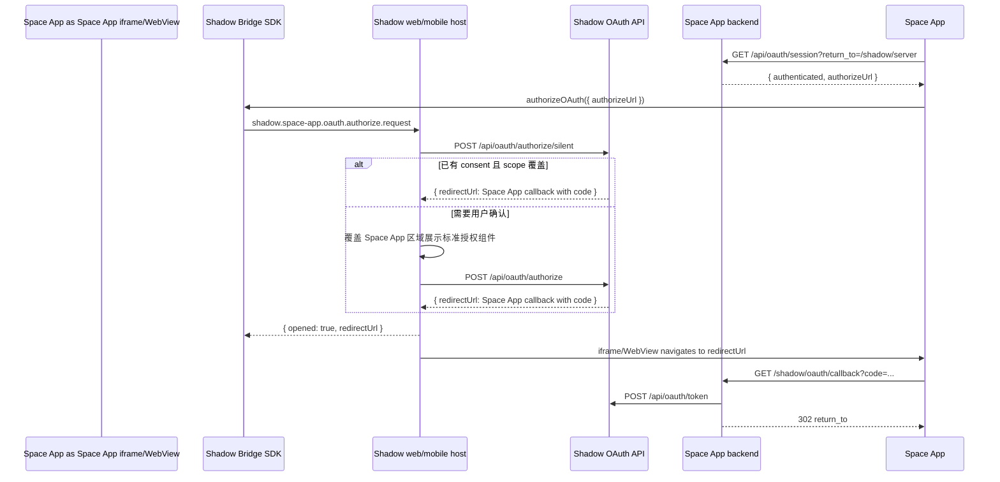

# Space App Bridge OAuth 最佳实践

状态：作为 Space Apps 迁移的目标实践使用。Kanban 和 Flash 是当前参考实现。

## 背景

Space App 是独立应用，不应该把 iframe bridge 当作登录、鉴权或业务数据读写的基础协议。Space App 后端仍然拥有自己的 OAuth callback、token exchange、Space App session 和业务权限。Bridge 只负责嵌入 Shadow web/mobile 时的宿主体验增强。

OAuth 授权是 Bridge 适合承载的宿主体验：用户在 Shadow 内打开 Space App 时，授权页面应该由 Shadow 宿主覆盖当前 Space App webview/iframe，而不是让 Space App iframe 跳转到 Shadow，也不是打开新的浏览器窗口。

## 为什么不用 iframe 跳转或弹窗

- Shadow OAuth 授权页属于 Shadow 安全边界，不应被第三方 Space App iframe 直接承载。生产环境的 CSP、`frame-ancestors`、sandbox、第三方 cookie 策略都会让这个模式不稳定。
- `window.open` 会制造上下文切换，移动端和内嵌 WebView 体验更差，也容易被浏览器拦截或在完成页留下空白状态。
- 弹窗完成页需要 `opener.postMessage`、轮询窗口关闭、纯文本错误页等补丁逻辑，导致每个 Space App 重复造轮子。
- 拒绝授权时，iframe 不应该被导航到 `Authorization denied: access_denied` 这类中间页。拒绝是一次可恢复的 UI 状态，不是 Space App 导航目标。

## 推荐模型

Bridge OAuth 是宿主授权代理，而不是新的 token 协议。



关键边界：

- Space App 只通过 `shadowSpaceApp.authorizeOAuth({ authorizeUrl })` 请求宿主进入授权模式。
- Host 校验请求来自当前 active Space App frame，并校验 `authorizeUrl` 是 Shadow 的 OAuth authorize URL。
- Host 先调用 `/api/oauth/authorize/silent`。只有已有 consent 覆盖请求的 scope 时，才静默签发 authorization code；缺少 consent 或 scope 扩大时必须进入可见授权 UI。
- Host 在父页面或 native 宿主层渲染统一授权组件。授权组件覆盖当前 Space App 区域，而不是浏览器弹窗。
- 用户同意后，Host 使用 Shadow 的一方登录态调用 `/api/oauth/authorize`，拿到 Space App callback 的 `redirectUrl`。
- Host 只把 Space App iframe/WebView 导航到 Space App callback，不把 Space App iframe 导航到 Shadow OAuth 页面。
- 用户拒绝后，Host 关闭授权组件并通过 Bridge 返回 `access_denied`。Space App 留在自己的授权门禁页，显示可重试状态。

## Space App 客户端要求

客户端应该使用 SDK 的标准能力：

```ts
import { ShadowBridge } from '@shadowob/sdk/bridge'

const bridge = new ShadowBridge({ appKey: 'kanban' })

await bridge.authorizeOAuth({ authorizeUrl }, { timeoutMs: 10 * 60 * 1000 })
```

实现规则：

- 从 Space App 后端读取 OAuth 状态，例如 `GET /api/oauth/session?return_to=/shadow/server`。
- `authorizeUrl` 必须由 Space App 后端生成，客户端不要拼接 `client_id`、`redirect_uri`、`state`。
- 嵌入 Shadow 且需要 OAuth 时，自动触发一次 `authorizeOAuth`，让用户直接进入宿主授权模式。
- 自动触发必须有去重。对同一个 `authorizeUrl` 只自动启动一次，拒绝后不要循环弹出授权组件。
- 标准 Space App 的自动触发只应用于 OAuth 阻塞核心访问的状态。可选 OAuth 绑定可以保留手动入口，但不能在 Space App 已可用时自动弹出授权层。
- 用户拒绝后，展示 Space App 自己的可恢复状态和重试按钮，不要 fallback 到 `window.open`。
- 只有在 `authorizeOAuth` 返回 `{ opened: false }` 或 Bridge 不可用，并且当前是独立访问模式时，才允许当前页面导航到 `authorizeUrl`。
- 不要使用 `popup=1`、`window.open`、`opener.postMessage`、弹窗关闭轮询或纯文本完成页。
- 成功授权后，iframe 会短暂进入 Space App callback。callback 必须立即 redirect 回 `return_to`，客户端用 loading/auth gate 覆盖这段过程，避免露出只有文字的中间页。

建议 UI 状态：

- `loading`：读取 OAuth session 或等待 Bridge 授权结果。
- `requires_oauth`：显示授权门禁，嵌入时自动进入授权模式一次。
- `denied`：用户拒绝授权，停留门禁页并提供重试。
- `authenticated`：加载 Space App 数据。
- `misconfigured`：OAuth client、redirect URI、server URL 等配置缺失。

## Space App 服务端要求

每个 Space App 后端保留自己的 OAuth 边界：

- `/api/oauth/session` 返回配置状态、当前 Space App session、用户摘要和 `authorizeUrl`。
- `/shadow/oauth/callback` 校验 `state`，交换 `code`，写入 Space App session cookie，然后 `302` 回安全的 `return_to`。
- `error=access_denied` 或其他 OAuth 错误也应该 `302` 回安全的 `return_to`，并通过 query 或短期 server-side 状态告诉客户端失败原因。
- callback 不返回纯文本错误页，不返回弹窗完成 HTML，不依赖 `window.opener`。
- `return_to` 只能是 Space App 内部路径。不要允许任意外部 URL。
- `state` 必须签名、短期有效，并绑定 `return_to`、Shadow server context、client id 和 redirect URI。
- token exchange、refresh token、Space App session 都只在 Space App 后端保存。不要把 client secret、refresh token、完整 Shadow user token 暴露给 iframe、localStorage、Buddy runtime 或第三方 worker。

Cookie 注意事项：

- 如果 Space App 和 Shadow 不同站点，并且 Space App session 依赖 iframe cookie，生产环境需要 `SameSite=None; Secure`。
- 对第三方 cookie 限制更严格的浏览器或 WebView，应优先评估后续的 launch-bound grant handoff，减少对 iframe cookie 的依赖。

## Shadow Host 要求

Web 和 mobile 宿主都应该实现同一个 Bridge capability：`oauth.authorize`。

Host 行为：

- 只在实际支持宿主授权 UI 时，通过 capability 暴露 `oauth.authorize`。
- 收到 `shadow.space-app.oauth.authorize.request` 后，校验请求来源、appKey、active frame 和 `authorizeUrl`。
- 对已有 consent 覆盖 scope 的请求，Host 应通过 `/api/oauth/authorize/silent` 静默生成 callback URL，不展示授权层。
- 授权 UI 覆盖 Space App webview/iframe 区域，背景可以保持 Space App 当前画面但不可交互。
- 同意授权时调用 Shadow OAuth authorize API，并把返回的 Space App callback URL 交给当前 Space App frame。
- 拒绝授权时返回 Bridge failure，错误码使用 `access_denied`，关闭覆盖层，不导航 Space App frame。
- loading、失败和重试状态都在宿主授权组件内处理，Space App 不需要复制 Shadow 授权 UI。

Host 不应该：

- 让 Space App iframe 直接打开 Shadow OAuth authorize 页面。
- 调用 `window.open` 创建授权窗口。
- 把 OAuth code、access token 或 refresh token 通过 Bridge 发给 Space App 客户端。
- 在拒绝授权时把 iframe 导航到错误文本页。

## 安全边界

Bridge OAuth 只解决授权 UI 承载位置，不改变 OAuth 和 Space App 权限模型。

- Shadow OAuth scope 只表示 token 能调用哪些 Shadow API，不等于用户对某个 server、channel、Buddy 或 Space App 资源有访问权。
- Space App 后端的敏感操作仍要检查 Space App session、Shadow 资源权限和 Space App 自有业务权限。
- Buddy、worker、cloud runtime 不应拿到完整用户 OAuth token。需要回写 Space App 数据时，使用 task-scoped token、Shadow task claim 或 Space App 后端可 introspect 的短期凭证。
- Space App 的长期 UI 数据应保存 Space App-owned snapshot。头像、服务器图标、Buddy 头像等身份图片使用 Shadow 返回的稳定公开 URL；附件、工作区文件等私有媒体才使用短期媒体 URL，且不要持久化短期 URL。
- OAuth 回调和 webhook 入口要做输入限制、签名/状态校验、重放保护和审计。

## 迁移清单

改造现有 Space App 时逐项检查：

1. 删除 `window.open(authorizeUrl)`、popup close polling、`opener.postMessage` 和 popup completion HTML。
2. `/api/oauth/session` 不再接受或生成 `popup=1` 模式。
3. 客户端统一通过 host bridge 调用 `authorizeOAuth({ authorizeUrl })`。
4. 嵌入 Shadow 时自动启动授权一次，拒绝后停止自动重试，保留手动重试入口。
5. Bridge 不可用时，只在独立访问模式用当前页面跳转作为 fallback。
6. `/shadow/oauth/callback` 成功和失败都 redirect 回 Space App 内部 `return_to`，不输出纯文本中间页。
7. i18n 文案移除“弹出的窗口中完成 OAuth”这类描述，改为“连接 Shadow”或“授权应用”。
8. Web 和 mobile 都验证 `oauth.authorize` capability，确保同一 Space App 行为一致。
9. 覆盖同意、拒绝、关闭授权层、刷新页面、HTTPS、path-mounted iframe、mobile WebView 等路径。
10. 保留 Space App 后端 OAuth session 和业务权限测试，不把 Bridge 测试当作鉴权测试的替代品。

## 验收标准

一个 Space App 迁移完成后，应满足：

- 在 Shadow 内打开 Space App，未授权时自动进入宿主授权模式，没有浏览器新窗口。
- 授权 UI 看起来属于 Shadow，而不是 Space App 自己复制的 Shadow 页面。
- 同意后不会露出只有文字的 callback 页面，最终回到 Space App 的原目标路径。
- 拒绝后不离开 Space App，不出现 `Authorization denied: access_denied` 页面，可手动重试。
- 在独立浏览器直接打开 Space App 时，仍然可以完成标准 OAuth redirect flow。
- Space App API、数据写入、Buddy dispatch、media snapshot 等业务路径不依赖 Bridge。
