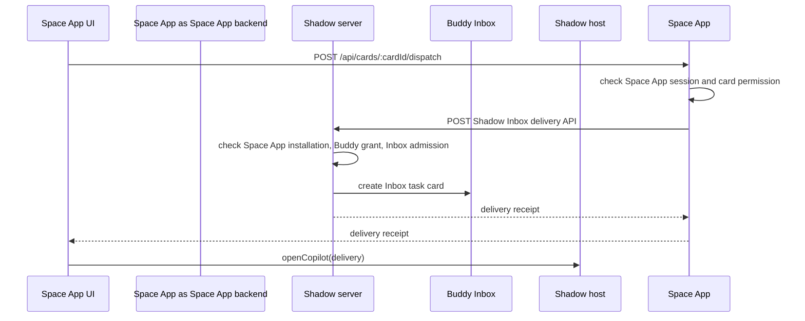

# Space App Buddy 派任务最佳实践

状态：作为所有 Space App 给 Buddy 创建 Inbox 任务卡的默认实践使用。

先读总入口：[Space App 开发手册](./space-app-development-guide.zh-CN.md)。本文只覆盖 Buddy Inbox 任务派发。

## 核心原则

Buddy 派任务是 Space App 业务操作触发的 Shadow 协作动作。浏览器先调用 Space App-owned `/api/*`，Space App backend 校验自己的 session 和业务权限，然后由 Space App backend 调 Shadow REST 创建 Inbox 任务卡。

正确链路：



不要做：

- 不要让浏览器直接请求 Shadow outbox 或 command gateway。
- 不要把 iframe bridge 当作任务 transport。
- 不要让 UI 调 Shadow command ingress。
- 不要在没有 `messageId`、`cardId` 或 pending approval 的情况下显示“已发送成功”。
- 不要用固定的 `skill + buddy` 作为每次手动派发的幂等 key，否则用户重试可能被旧任务卡吞掉。

## 客户端实践

客户端调用 Space App 自己的业务 API：

```ts
const response = await fetch(`/api/cards/${cardId}/dispatch`, {
  method: 'POST',
  headers: { 'Content-Type': 'application/json' },
  body: JSON.stringify({
    targetBuddyAgentId,
    targetInboxChannelId,
    requestId,
  }),
})

if (!response.ok) throw new Error('Failed to dispatch task')
const result = await response.json()

if (result.delivery?.messageId && result.delivery.cardId) {
  await bridge.openCopilot(result.delivery).catch(() => undefined)
} else if (result.delivery?.pendingId) {
  showPendingApproval(result.delivery)
} else {
  showError('没有创建 Inbox 任务卡')
}
```

客户端规则：

- Buddy picker 可以通过 Space App-owned `/api/buddy-inboxes` 读取后端返回的候选列表。
- Space App backend 负责向 Shadow 查询当前用户可见的 Buddy Inbox。
- 发送前可通过 host bridge 打开授权或 Buddy 创建 UI，但实际派发仍回到 Space App-owned `/api/*`。
- 成功 toast 只在有 `messageId/cardId` 后出现。
- pending approval 是等待授权，不是已创建任务。
- 同一次网络重试复用同一个 `requestId`；用户再次点击必须生成新的 `requestId`。

## 服务端实践

Space App backend 暴露 Space App-owned route：

```ts
app.post('/api/cards/:cardId/dispatch', async (c) => {
  const session = await requireAppSession(c)
  const card = await requireCardAccess(session, c.req.param('cardId'), 'dispatch')
  const body = await c.req.json()

  const delivery = await shadowClient.deliverInboxTask({
    serverId: card.serverId,
    appKey: 'kanban',
    target: {
      buddyAgentId: body.targetBuddyAgentId,
      inboxChannelId: body.targetInboxChannelId,
    },
    task: {
      title: card.title,
      body: card.prompt,
      priority: 'normal',
      idempotencyKey: `kanban:card:${card.id}:dispatch:${body.requestId}`,
      resource: { kind: 'kanban.card', id: card.id, label: card.title },
      data: {
        appKey: 'kanban',
        cardId: card.id,
        copilotMode: true,
      },
    },
  })

  return c.json({ delivery })
})
```

服务端规则：

- backend 使用 Space App session 鉴权 UI 请求。
- backend 使用 Shadow REST 调用 Inbox delivery。
- Shadow 负责校验 Space App 安装、Buddy grant、Inbox admission 和审计。
- 每次手动点击发送应生成新的幂等 key，例如 `space-app:action:resource:agent:manual:<requestId>`。
- `required: true` 表示没有创建任务卡就是 dispatch 失败，不应静默降级。
- `data.copilotMode = true`，并把后续回写命令、资源 id、安装命令等 Buddy 需要的信息放进 `data`。
- 如果 Inbox 任务需要同步源 Space App 状态，在投递 payload 的 `data.statusHooks[]` 注册声明式 hook。Shadow server 会把它下发为任务卡片内的 `data.task.cliPolicy.hooks[]`。

## 任务卡和完成状态

Inbox delivery 只代表任务卡创建成功，不代表任务完成。

- 派发成功：response 里有 `delivery.messageId` 和 `delivery.cardId`。
- 等待授权：delivery 里有 `pendingId`。UI 应显示 pending 状态，不要打开 Copilot 当作已创建任务卡。
- 任务完成：Buddy 必须调用 `shadowob inbox update <message-id> <card-id> --status completed --note ...`。
- 源 Space App 同步：如果任务卡有 `data.task.cliPolicy.hooks[]`，`shadowob inbox update` 会触发 hook event。Agent 应执行 hook event 中的 Shadow gateway command，例如 Kanban 的 `cards.complete`。

对“Buddy 最终回复即完成”的任务，Space App 可以显式设置：

```ts
outputContract: {
  completionPolicy: {
    mode: 'reply_terminal',
    status: 'completed',
  },
}
```

不要全局从普通聊天回复推断任务完成。只有带上述 completion policy 的任务，才允许 message service 把 terminal reply 转成任务状态。

## 错误处理

常见错误和处理：

- `permission_denied`：当前 Space App session 无权派发该资源，停留在 Space App UI 内提示。
- `buddy_grant_required`：Shadow 需要 owner/admin 授权 Space App 给该 Buddy 派任务，显示 pending 或打开 host 授权 UI。
- `inbox_admission_denied`：目标 Inbox 拒绝该来源，允许用户选择其他 Buddy 或请求管理员处理。
- `Failed to fetch`：检查 Space App backend 是否可达，以及浏览器是否只请求 Space App-owned `/api/*`。
- `没有创建 Inbox 任务卡`：检查 backend 是否真正调用 Shadow REST，并返回 delivery/pending。
- 重复发送没有新卡：检查 `idempotencyKey` 是否固定。手动发送必须有新的 request id。

## 验收清单

新增或修改派 Buddy 任务功能时，至少验证：

1. UI 请求是 Space App-owned `/api/*`。
2. 浏览器网络请求没有直接访问 Shadow outbox、Shadow command gateway 或 Space App `/.shadow/*`。
3. Space App backend 校验 Space App session 和业务资源权限。
4. Space App backend 调 Shadow REST 创建 Inbox task。
5. 成功 toast 只在有 `messageId/cardId` 后出现。
6. 成功后调用 host bridge `openCopilot(delivery)`，失败或 pending 不误开。
7. 同一个资源连续发送两次，会创建两张不同任务卡。
8. Buddy 新增后 picker 自动 refresh 并选中新 Buddy。
9. 任务完成状态通过 `shadowob inbox update` 或显式 completion policy 流转。
10. Browser 代码不读取 manifest command ingress path。
